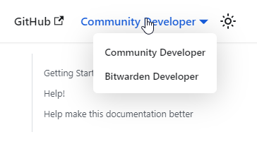

# Bitwarden Contributing Docs

This repository contains the code for the
[Bitwarden contributing docs](https://contributing.bitwarden.com/) site. The site is built using
[Docusaurus](https://docusaurus.io/) which is a static website generator. The latest version of the
documentation is available at https://contributing.bitwarden.com/.

## Install

```bash
npm ci
```

## Local Development

```bash
npm start
```

This command starts a local development server and opens up a browser window. Most changes are
reflected live without having to restart the server.

## Build

```bash
npm build
```

This command generates static content into the `build` directory and can be served using any static
contents hosting service.

## Writing

The documentation is written in Markdown and can be found in the `docs` directory. The `docs`
directory consists of three sections:

- Getting started - instructions on how to build and run the different projects.
- Contribute - information on how to contribute to the project.
- Architecture - high-level architecture documentation.

### Style guide

Please follow the following (very brief) style guide:

- Use numbered paragraphs for all instructions or procedures. Start each paragraph with a verb
  (“click”, “type”, “restart”, etc).
- Use code blocks for all commands. Don't write them in-line.
- Avoid long paragraphs - this documentation should be to-the-point and instructional.

### Conditional Content

The Contributing Docs site is used both for internal and external contributors. To this end we've
facilitated a mean to conditionally show content for either group. This is primarily to keep the
external docs simple.

As an end user you can switch the mode using the dropdown in the navigation bar. This will persist
across sessions.



In order to write content that targets different context please use the `<community>` and
`<bitwarden>` tags as demonstrated below.

```md
<community>

This content is shown only to community contributors.

</community>

<bitwarden>

This content is shown only to bitwarden contributors.

</bitwarden>
```

The technical implementation uses a custom context called `devMode` which is persisted to local
storage, and is exposed as a dropdown in the navigation bar.

It's also possible to conditionally hide pages from the navigation using `frontMatter`. This is
easiest done using the `access` property, which can be either `community` or `bitwarden`.

```yml
---
sidebar_custom_props:
  access: bitwarden
---
```
