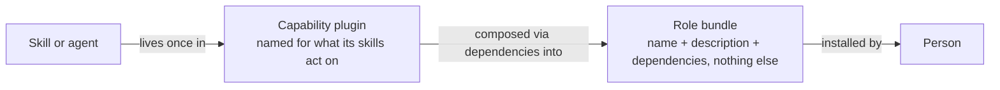
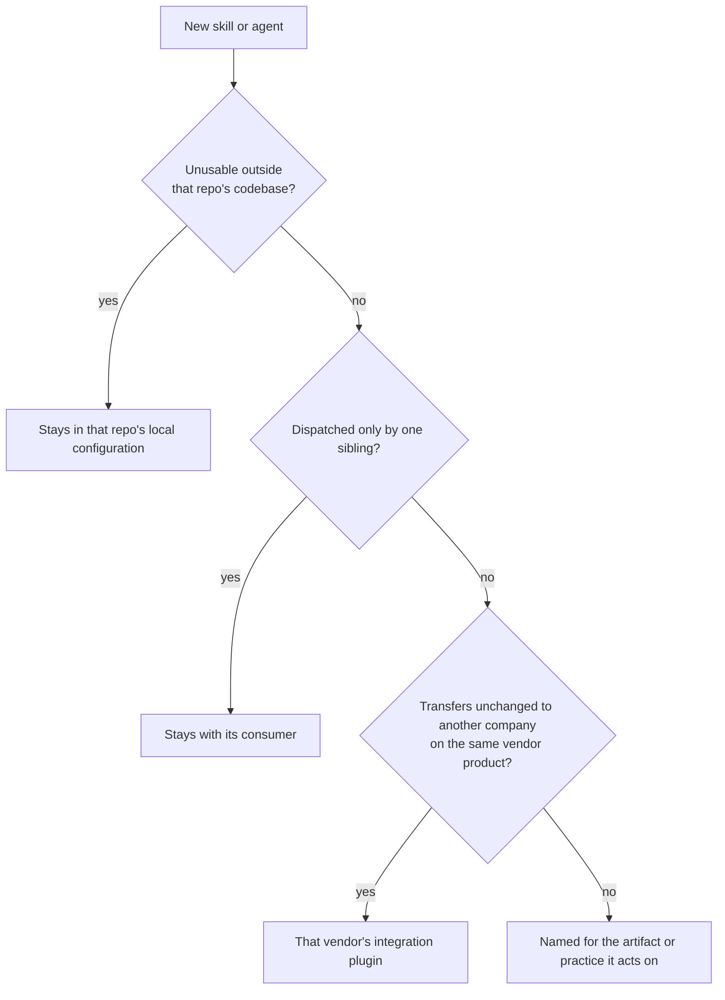
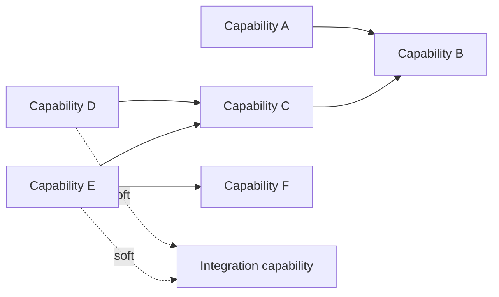
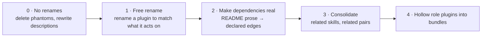

# 0035 - Adopt a taxonomy for AI skills, prompts, and agents

<AdrTable frontMatter={frontMatter}></AdrTable>

## Context and problem statement

The AI plugin marketplace publishes dozens of plugins holding many skills, agents, and commands.
There is no reliable way to decide which plugin a new skill belongs in, and the cost shows up as
duplication and churn rather than as an argument anyone wins.

The marketplace's contribution guide defines a small number of plugin families. A meaningful
fraction of plugins fit none of them cleanly: several have no family at all, and others fit only on
a technicality — named for an activity rather than a role, or named for a role but shipping no agent
and nothing but generic skills. Those are exactly the plugins whose contents are hardest to predict
from their names. A family of subject-matter skill libraries exists in practice but is undocumented,
so it has no membership test, and one plugin became the default home for anything skill-shaped that
was not a persona. It now holds several unrelated concerns behind a single name.

The absence of a rule is measurable in the tree:

- A skill has moved between plugins more than once, and its own documentation inlines a procedure
  that duplicates a separate skill sitting in a different plugin.
- Two skills covering closely related scopes live in different plugins, and each spends prose
  defining its boundary against the other.
- A single process spanning many steps is split across several plugins, producing many cross-plugin
  references that exist only because the steps were separated.
- Guidance keeps getting duplicated across persona plugins, and the copies diverge before anyone
  notices and consolidates them.

Placement is the problem to solve. Alongside it sits an opportunity: many skills serve several roles
at once, and a person joining a role currently has to read the whole catalog to work out which
entries apply. Grouping by role would answer that, but it duplicates shared skills and gives them no
single home, which is the failure already on the board. A single capability layer keeps one home per
skill and leaves the joining problem where it is.

## Considered options

- **Status quo:** a small number of families that don't cover a meaningful share of the marketplace,
  and placement settled case by case in review.
- **Role plugins with deliberate duplication:** one plugin per job function, and a skill serving two
  roles is copied into both. Other organizations use this model for their own AI plugin libraries.
- **Capability plugins only:** one home per skill, named for what its skills act on, with no
  role-level packaging. Answers placement fully and leaves discovery to a catalog page.
- **Two layers, capability plugins plus role bundles:** the same capability layer, plus bundle
  plugins that hold only dependencies and compose it. The second layer is additive: it changes
  nothing about where a skill lives.

## Decision outcome

Chosen option: **two layers, capability plugins plus role bundles**. The rules at adoption:

1. **A capability plugin holds skills and agents.** Every skill has exactly one home. It is named
   for what its skills act on, meaning an artifact, a practice, or an integration surface, never for
   a job title, a seniority level, or a lifecycle phase.
2. **A role bundle holds nothing but a name, a description, and dependencies.** No skills, no
   agents, no commands. CI enforces it. It is what a person installs, and it is named for the role.
3. **Placement therefore ranges only over capability plugins**, because a bundle holds nothing. A
   skill serving three roles lives once and appears in three bundles.
4. **Placement is decided in order,** for a skill and an agent alike: repo-specific knowledge stays
   in that repo's local configuration, where repo-specific means unusable outside that repo's
   codebase; an artifact dispatched only by a sibling stays with its consumer; knowledge that would
   transfer unchanged to another company using the same vendor product belongs to that vendor's
   integration plugin; everything else is named for the artifact or practice it acts on.
5. **A plugin description enumerates its skills**, which makes the boundary self-enforcing at review
   time. A skill that does not fit the enumeration either forces a deliberate description change or
   goes elsewhere.

> _Perspective: Council reviewers ratifying the model. What separates a capability plugin from a
> role bundle, and how a person ends up with either. System context level. Omits concrete plugin
> names, covered below._

Rule 4's ordering is itself a decision procedure, not just a sentence:

> _Perspective: A contributor placing a new skill. The four-branch test rule 4 states in prose,
> walked in order. Omits the plugin-description self-check in rule 5, which runs after this tree
> lands on an answer._

Bundles use the plugin manifest's dependencies array, which the platform documents for exactly this
purpose: a manifest consisting of only dependencies packages a curated set behind one install, and
bundles can be pushed org-wide through managed settings.

Cross-plugin dependencies are accepted at both layers, bounded by one rule: every
capability-to-capability edge names the specific skill that composes across it. An edge that cannot
name one is deleted. One integration plugin remains a soft dependency everywhere because it ships a
connection to an external service that prompts for credentials, and a declared edge would force that
prompt on every member of the roles that depend on it.

> _Perspective: Council reviewers checking that every edge names something. Every declared
> capability-to-capability edge in the marketplace, plus the soft edges that stay undeclared.
> Container level. Omits the capability plugins with no outgoing edges and all role bundles, which
> attach as leaves below this graph._

The operational detail lives in the marketplace repository rather than here: the exhaustive mapping
of which skill moves where, the rename ledger, and the migration sequencing. This ADR is superseded
only if the two-layer model itself changes. Rule 4's branch set is revisable as the marketplace
absorbs disciplines beyond engineering, and revising it does not supersede this decision.

### Positive consequences

- "Which plugin does this skill go in" has one answer, and the answer set excludes every role-named
  plugin by construction.
- Institutional knowledge stays single-sourced, so a reference or a process-phase gate cannot drift
  between copies.
- A curated per-role install becomes worth having, because one home per skill makes what a bundle
  resolves to legible rather than accidental. Bundles are being adopted independently of how
  placement is settled, so this is a benefit the taxonomy confers rather than one it rests on.
- Consolidating a multi-step process's skills into one plugin converts many cross-plugin references
  into intra-plugin calls, and co-locating a lookup skill with the skill that needs it makes a
  duplicated procedure removable.

### Negative consequences

- The model depends on plugin dependencies, a platform feature that is documented in depth but not
  used at scale elsewhere yet. Bitwarden would be an early adopter of that machinery, and its
  failure modes each disable the dependent plugin until resolved.
- Single-sourcing concentrates dependents onto a few shared capability plugins. A bad release of one
  disables every dependent sitting behind a hard-abort edge, and that radius widens as more roles
  compose the same shared plugin.
- Marketplace entries grow in count even though ambiguity falls, because only some of the resulting
  entries can hold a skill.
- Migration spans several pull requests, each carrying a version bump and a changelog entry, and
  some plugins need rename entries so existing installs migrate cleanly.
- Duplication becomes harder rather than impossible. A team that wants a private copy of a skill now
  has to argue for it, which is the intent, but it is friction.

### Plan

Follow-up work in the marketplace repository, sequenced so no step depends on a later one:

> _Perspective: Whoever sequences the migration PRs. The five phases below, in the order each
> depends on the last. Roadmap level. Omits per-plugin task detail, which lives in the marketplace
> repository's own tracking._

- The contribution guide's plugin families are rewritten against this decision, and the marketplace
  catalog is regrouped by layer.
- Plugin descriptions are rewritten to enumerate their skills.
- Validation is added to CI so that every plugin-qualified reference, every skill grant, and every
  declared dependency resolves to something real, alongside the lexical invariants the marketplace
  currently lacks. Rule 2 is one of them: a bundle directory carrying a skill, an agent, or a
  command fails the build.
- The capability consolidations land one plugin identity per pull request, beginning with the plugin
  that has not yet shipped and can be renamed at no cost.
- The role plugins are hollowed into bundles once their skills have moved, and a bundle is added for
  the one role with no plugin today.
