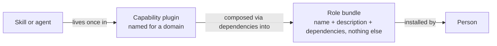
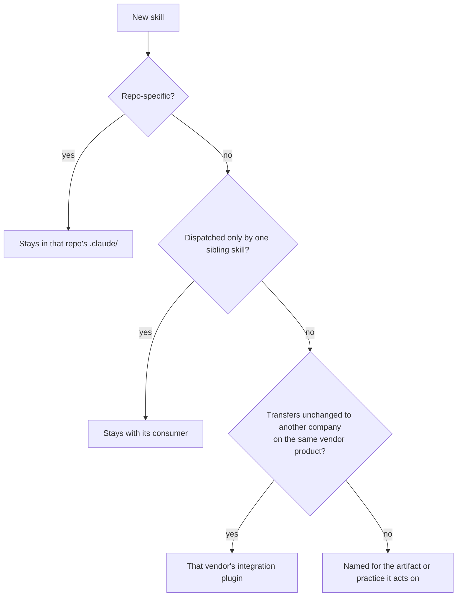
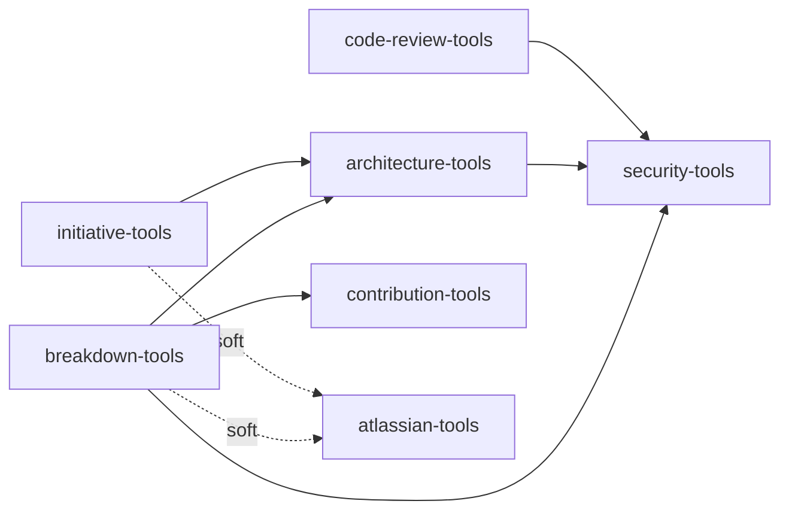

# 0035 - Adopt AI plugin taxonomy

<AdrTable frontMatter={frontMatter}></AdrTable>

## Context and problem statement

The `bitwarden/ai-plugins` marketplace publishes 17 plugins holding 59 skills, 7 agents, and 10
commands. There is no reliable way to decide which plugin a new skill belongs in, and the cost shows
up as duplication and churn rather than as an argument anyone wins.

The marketplace's `CONTRIBUTING.md` defines three plugin families: Persona, Tool Integration, and
Utility. Six of the 17 plugins fit none of them cleanly. Four have no family at all
(`bitwarden-delivery-tools`, `bitwarden-planning-tools`, `bitwarden-design-tools`,
`bitwarden-testing-tools`), and two fit only on a technicality: `bitwarden-code-review` is named for
an activity rather than a role, and `bitwarden-devops-engineer` is named for a role but ships no
agent and nothing but GitHub Actions skills. Those six are exactly the plugins whose contents are
hard to predict from their names. A family of domain skill libraries exists in practice but is
undocumented, so it has no membership test, and `bitwarden-delivery-tools` became the default home
for anything skill-shaped that was not a persona. It now holds git mechanics, organizational
process, architectural judgment, and fleet automation behind a single name.

The absence of a rule is measurable in the tree:

- `architecting-solutions` has moved between plugins twice, and its `SKILL.md` inlines an ADR lookup
  procedure that duplicates the `consulting-adrs` skill sitting in a different plugin.
- `reviewing-dependency-changes` and `reviewing-dependencies` live in different plugins and each
  spends prose defining its scope against the other.
- Ten skills describing one process, the Software Initiative Funnel, are split across three plugins,
  producing thirteen cross-plugin references that exist only because the skills are separated.
- Feature-flag guidance was duplicated across two persona plugins and had to be consolidated, which
  is what first surfaced this problem.

A second requirement constrains any fix: the marketplace has to deliver tools according to a
person's role, and a designer should not receive commit conventions or implementation planning. Many
skills legitimately serve several roles at once. Those two goals conflict if there is only one layer
of plugins. Grouping by role duplicates shared skills and gives them no single home; grouping only
by domain leaves a person with no way to install the set their job needs.

## Considered options

- **Status quo:** three families that do not cover a third of the marketplace, and placement settled
  case by case in PR review.
- **Role plugins with deliberate duplication:** one plugin per job function, and a skill serving two
  roles is copied into both. This is the model Anthropic uses in its own `knowledge-work-plugins`
  library.
- **Capability plugins only:** one home per skill, named by domain, with no role-level packaging.
- **Two layers, capability plugins plus role bundles:** skills live once in a domain-named plugin,
  and roles are expressed as dependency-only bundle plugins that compose them.

## Decision outcome

Chosen option: **two layers, capability plugins plus role bundles**. The rules at adoption:

1. **A capability plugin holds skills and agents.** Every skill has exactly one home. It is named
   for a domain, never for a job title, a seniority level, or a lifecycle phase.
2. **A role bundle holds nothing but a name, a description, and dependencies.** No skills, no
   agents, no commands. It is what a person installs, and it is named for the role.
3. **Placement therefore ranges only over capability plugins**, because a bundle cannot hold a
   skill. A skill serving three roles lives once and appears in three bundles.
4. **Placement is decided in order:** repo-specific knowledge stays in that repo's `.claude/`; a
   skill dispatched only by a sibling stays with its consumer; knowledge that would transfer
   unchanged to another company using the same vendor product belongs to that vendor's integration
   plugin; everything else is named for the artifact or practice it acts on.
5. **A plugin description enumerates its skills**, which makes the boundary self-enforcing at review
   time. A skill that does not fit the enumeration either forces a deliberate description change or
   goes elsewhere.



> _Perspective: Council reviewers ratifying the model. What separates a capability plugin from a
> role bundle, and how a person ends up with either. System context level. Omits concrete plugin
> names, covered below._

Rule 4's ordering is itself a decision procedure, not just a sentence:



> _Perspective: A contributor placing a new skill. The four-branch test rule 4 states in prose,
> walked in order. Omits the plugin-description self-check in rule 5, which runs after this tree
> lands on an answer._

Bundles use the plugin manifest's `dependencies` array, which Claude Code documents for exactly this
purpose: a manifest consisting of only dependencies packages a curated set behind one install, and
bundles can be pushed org-wide through managed settings.

Cross-plugin dependencies are accepted at both layers, bounded by two rules. The graph stays
shallow, ideally one level below a bundle, and every capability-to-capability edge names the
specific skill that composes across it. An edge that cannot name one is deleted.
`bitwarden-atlassian-tools` remains a soft dependency everywhere because it ships an MCP server that
prompts for credentials, and a declared edge would force that prompt on every member of the roles
that depend on it.



> _Perspective: Council reviewers assessing how deep the graph runs. Every declared
> capability-to-capability edge in the marketplace, and how many hops deep it goes. Container level.
> Omits the 9 capability plugins with no outgoing edges and all 8 role bundles, which attach as
> leaves below this graph._

The operational detail lives in the marketplace repository rather than here: the exhaustive mapping
of which skill moves where, the rename ledger, and the migration sequencing. This ADR is superseded
only if the two-layer model itself changes.

### Positive consequences

- "Which plugin does this skill go in" has one answer, and the answer set excludes every role-named
  plugin by construction.
- Institutional knowledge stays single-sourced, so an ADR catalog reference or a funnel phase gate
  cannot drift between copies.
- A role installs one plugin and receives a scoped set. A designer gets the design toolkit and
  nothing from the engineering stack.

  ```mermaid
  flowchart TB
      subgraph SWE["bitwarden-software-engineer declares 3"]
          direction LR
          ct["contribution-tools"]
          crt["code-review-tools"]
          tt["testing-tools"]
      end
      crt -->|hard-abort dependency| st["security-tools"]

      subgraph DES["bitwarden-designer declares 1"]
          dt["design-tools"]
      end
  ```

  > _Perspective: Council reviewers weighing the scoped-install claim. What two representative
  > bundles actually resolve to at install time, contrasted side by side. Component level. Omits the
  > other six bundles, which resolve by the same pattern._

- Consolidating the funnel skills into one plugin converts thirteen cross-plugin references into
  intra-plugin calls, and co-locating `consulting-adrs` with `architecting-solutions` makes the
  duplicated ADR procedure removable.

### Negative consequences

- The model depends on plugin dependencies, which Anthropic documents in depth but does not use once
  across either of its own plugin libraries. Bitwarden would be an early adopter of that machinery,
  and its four failure modes each disable the dependent plugin until resolved.
- Marketplace entries grow from 17 to 22. The count rises even though ambiguity falls, because only
  14 of the 22 can hold a skill.
- Migration spans several pull requests, each carrying a version bump in four places and a changelog
  entry, and three plugins need rename entries so existing installs migrate cleanly.
- Duplication becomes harder rather than impossible. A team that wants a private copy of a skill now
  has to argue for it, which is the intent, but it is friction.

### Plan

Follow-up work in the marketplace repository, sequenced so no step depends on a later one:


> _Perspective: Whoever sequences the migration PRs. The five phases below, in the order each
> depends on the last. Roadmap level. Omits per-plugin task detail, which lives in the marketplace
> repository's own tracking._

- The `CONTRIBUTING.md` plugin families are rewritten against this decision. Tool Integration
  becomes the platform family, Utility becomes the toolchain family, and Persona is redefined as a
  role bundle that holds no skills.
- Plugin descriptions are rewritten to enumerate their skills, and the marketplace catalog is
  grouped by layer.
- Validation is added to CI so that every plugin-qualified reference, every `Skill()` grant, and
  every declared dependency resolves to something real, alongside the lexical invariants the
  marketplace currently lacks.
- The capability consolidations land one plugin identity per pull request, beginning with the
  planning plugin that has not yet shipped and can be renamed at no cost.
- The role plugins are hollowed into bundles once their skills have moved, and a QA bundle is added
  for the one role with no plugin today.
