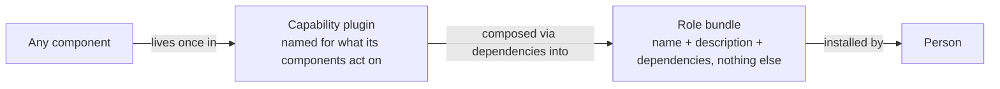
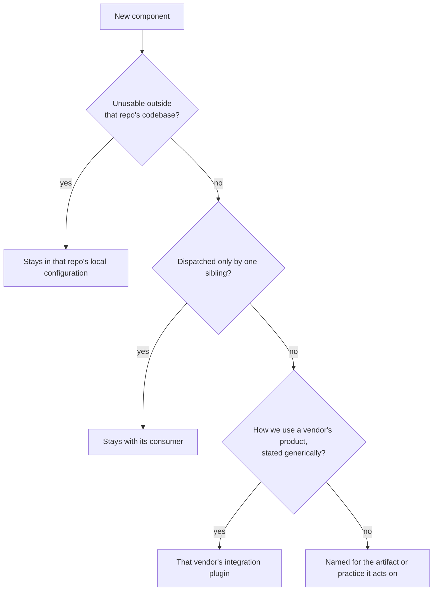
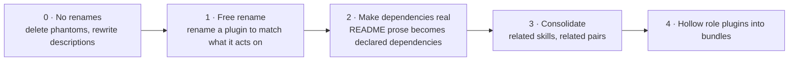

# 0038 - Adopt a placement taxonomy for AI components

<AdrTable frontMatter={frontMatter}></AdrTable>

## Context and problem statement

Bitwarden's AI tooling is a growing set of skills, agents, commands, and prompts. Some live in a
repository's local configuration, and the rest ship through the AI plugin marketplace, which
publishes more than a dozen plugins. There is no reliable way to decide where a new component
belongs, and the cost shows up as duplication and churn.

The problem is sharpest in the marketplace, whose contribution guide defines a small number of
plugin families. A meaningful fraction of plugins fit none of them cleanly: several have no family
at all, and others fit only on a technicality, named for an activity instead of a role, or named for
a role but shipping no agent and nothing but generic skills. Those are the plugins whose contents
are hardest to predict from their names. A family of subject-matter skill libraries exists in
practice but is undocumented, so it has no membership test. One plugin became the default home for
anything skill-shaped that was not a persona, and it now holds several unrelated concerns behind a
single name.

The absence of a rule shows up in the tree:

- A skill has moved between plugins more than once.
- Two skills covering closely related scopes live in different plugins, and each spends prose
  defining its boundary against the other.
- A single process spanning many steps is split across several plugins, producing many cross-plugin
  references that exist only because the steps were separated.
- Guidance keeps getting duplicated across persona plugins, and the copies diverge before anyone
  notices and consolidates them.

Placement is the problem to solve, and it comes with an opportunity. Many skills serve several roles
at once, and a person joining a role currently has to read the whole catalog to work out which
entries apply. Grouping by role would answer that, but it duplicates shared skills and gives them no
single home. A single capability layer keeps one home per skill but does nothing for a person
joining a role.

## Considered options

- **Status quo:** a small number of families that don't cover a meaningful share of the marketplace,
  and placement settled case by case in review.
- **Role plugins with deliberate duplication:** one plugin per job function, and a skill serving two
  roles is copied into both.
- **Capability plugins only:** one home per skill, named for what its skills act on, with no
  role-level packaging. Answers placement fully and leaves discovery to a catalog page.
- **Two layers, capability plugins plus role bundles:** the same capability layer, plus bundle
  plugins that hold only dependencies and compose it. The second layer is additive: it changes
  nothing about where a skill lives.

### Status quo

**Pros**

- No migration, no breaking releases, and no new platform dependency.

**Cons**

- Placement is argued case by case in review, so components keep moving between plugins.
- Plugins that fit no family have names that do not predict their contents.

### Role plugins with deliberate duplication

**Pros**

- A person joining a role installs one plugin named for their job.
- Needs no dependency machinery.

**Cons**

- A skill serving several roles is copied into each, and the copies diverge.
- A shared skill still has no single home, so placement stays undecided for it.

### Capability plugins only

**Pros**

- Every component has exactly one home, decided by a written test.
- Fewer marketplace entries than a model with bundles.

**Cons**

- A person joining a role still reads the whole catalog to work out which plugins apply.
- Discovery depends on a hand-maintained catalog page.

### Two layers, capability plugins plus role bundles

**Pros**

- Every component has one home, and a person joining a role still gets a single install.
- Placement is checkable in review against the plugin description and the placement test.
- The bundle rule and reference resolution can be enforced in CI.

**Cons**

- The platform has no optional dependencies, so a missing dependency stops the dependent plugin from
  loading.
- Sibling dependencies track `@main`, so a bad release of a shared plugin reaches every dependent at
  once.
- More marketplace entries, because bundles hold no components.

## Decision outcome

Chosen option: **two layers, capability plugins plus role bundles**, because it keeps one home per
component and still gives a person joining a role a single install, without copying any component to
get there.

### Positive consequences

- "Where does this component go" has one answer, and the answer set excludes every role-named plugin
  by construction.
- Institutional knowledge stays single-sourced, so a reference or a process-phase gate cannot drift
  between copies.
- A curated per-role install becomes worth having, because one home per skill makes it clear what a
  bundle resolves to. Bundles are being adopted independently of placement, so the taxonomy improves
  them without depending on them.
- Consolidating a multi-step process's skills into one plugin converts many cross-plugin references
  into intra-plugin calls, and co-locating a lookup skill with the skill that needs it makes a
  duplicated procedure removable.

### Negative consequences

- The model depends on plugin dependencies, a platform feature that is documented in depth.
  Bitwarden would be an early adopter of that machinery, and its failure modes each disable the
  dependent plugin until resolved.
- Single-sourcing concentrates dependents onto a few shared capability plugins. A bad release of one
  disables every dependent, and that radius widens as more roles compose the same shared plugin.
  Sibling dependencies are unversioned, the same convention we use for our own GitHub Actions at
  `@main`.
- Marketplace entries grow in count even though ambiguity falls, because only some of the resulting
  entries can hold a component.
- Migration spans several pull requests, each carrying a version bump and a changelog entry, and
  some plugins need rename entries so existing installs migrate cleanly.
- Six persona agents change in breaking releases: four are deleted and two are renamed. Anyone who
  invokes one by name moves to the skills that absorbed it, or to the agent's new name.
- Duplication stays possible but becomes harder, because a team that wants a private copy of a skill
  has to argue for it. That friction is intended, and it is still a cost.

### Plan

The rules at adoption:

1. **A capability plugin carries components,** whatever kinds the platform supports, and every
   component has exactly one home. It is named for what its components act on, meaning an artifact,
   a practice, or an integration surface, never for a job title, a seniority level, or a lifecycle
   phase. The test is whether the name points to something a reviewer can find, such as a file, a
   Jira issue, or a vendor surface, or to a discipline with a Bitwarden standard behind it. A name
   that only says when work happens is a phase.
2. **A role bundle holds nothing but a name, a description, and dependencies.** No components of any
   kind. CI enforces it. It is what a person installs, and it is named for the role.
3. **Placement therefore ranges only over capability plugins**, because a bundle holds nothing. A
   component serving three roles lives once and appears in three bundles.
4. **Placement is decided in order,** for any component: repo-specific knowledge stays in that
   repo's local configuration, where repo-specific means unusable outside that repo's codebase; an
   artifact dispatched only by a sibling stays with its consumer; knowledge of how Bitwarden uses a
   vendor's product, stated generically, belongs to that vendor's integration plugin; everything
   else is named for the artifact or practice it acts on.
5. **A plugin description enumerates what it provides**, which makes the boundary checkable at
   review time. A component that does not fit the enumeration either forces a deliberate description
   change or goes elsewhere.

For example, three plugins as they stand today and where their contents land:

```text
Before
  bitwarden-delivery-tools/           # named for a lifecycle phase
    skills/
      architecting-solutions
      committing-changes
      creating-pull-request
      filing-breakdown-tasks
      force-multiplier
      labeling-changes
      navigating-the-initiative-funnel
      perform-preflight
      running-work-transitions
  bitwarden-tech-lead/                # named for a role, and holds components
    agents/AGENT.md
    skills/contributing-to-technical-strategy
  bitwarden-software-engineer/        # named for a role, and holds an agent
    agents/AGENT.md

After
  bitwarden-code-contribution-tools/  # a change becoming a commit or pull request
    agents/bitwarden-implementor.md
    skills/
      committing-changes
      creating-pull-request
      force-multiplier
      labeling-changes
      perform-preflight
  bitwarden-architecture-tools/       # architectural judgment
    skills/
      architecting-solutions
  bitwarden-initiative-tools/         # initiatives and technical strategy
    skills/
      contributing-to-technical-strategy
      navigating-the-initiative-funnel
      running-work-transitions
  bitwarden-tech-lead/                # role bundle: manifest, README, CHANGELOG
    dependencies: architecture-tools, initiative-tools,
                  code-contribution-tools, code-review-tools
  bitwarden-software-engineer/        # role bundle: manifest, README, CHANGELOG
    dependencies: code-contribution-tools, code-review-tools
```

`filing-breakdown-tasks` leaves the marketplace, because it cannot run outside the repository that
holds the breakdowns.

An agent is a component like any other: it takes a name for the work it does and lives in the
capability plugin that work belongs to. An agent that other components dispatch stays, because its
tools, model, and preloaded skills are what a skill cannot carry. Its prose shrinks to what those
dispatchers need. Otherwise, a persona agent that only restates skills is deleted, and whatever it
said that no skill covers moves into the skill that owns that topic. An agent that does distinct
work is renamed for that work and moves to a capability plugin. Applied to the persona agents:

| Agent             | Disposition                                                                         | Where its content lands                                                                                      |
| ----------------- | ----------------------------------------------------------------------------------- | ------------------------------------------------------------------------------------------------------------ |
| Software engineer | Renamed `bitwarden-implementor`, so it no longer shares a name with its role bundle | `bitwarden-code-contribution-tools`                                                                          |
| Tech lead         | Deleted                                                                             | Two statements move into the initiative skills; the rest is dropped                                          |
| Security engineer | Kept and renamed `bitwarden-security-assessor`, because three skills dispatch it    | `bitwarden-security-tools`                                                                                   |
| Designer          | Deleted                                                                             | Its boundary against product, engineering, and research roles moves into `facilitating-design-critique`      |
| Product analyst   | Deleted                                                                             | Its unclaimed content becomes a new skill, `writing-requirements-documents`, and `work-breakdown` is retired |
| Shepherd          | Deleted                                                                             | Its tech lead authority boundary moves into `shepherding-an-initiative`                                      |



> _Perspective: Council reviewers ratifying the model. How a component reaches the person who
> installs it. System context level. Omits the dependencies between capability plugins._

Rule 4's ordering is a decision procedure:



> _Perspective: A contributor placing a new component. The four-branch test rule 4 states in prose,
> walked in order. Omits the plugin-description self-check in rule 5, which runs after this tree
> lands on an answer._

A component driving one workflow through a vendor surface composes that vendor's integration plugin
and hands it content, so the conventions for using the product stay in one place and the specialized
component carries none of them.

Bundles use the plugin manifest's dependencies array, which the platform documents for this purpose:
a manifest consisting of only dependencies packages a curated set behind one install, and bundles
can be pushed org-wide through managed settings.

A plugin may depend on another plugin at either layer. Before declaring one, name the call: this
skill in one plugin calls that skill in the other. Remove any dependency that cannot be named that
way.

The platform has no optional dependencies, so a plugin whose dependency is missing does not load at
all. Anything meant to work without a plugin it calls has to say so, and keep working when that
plugin is gone.

The operational detail lives in the marketplace repository. Its contribution guide carries the
procedure a contributor follows, including the placement test walked with worked examples and the
tie-breakers that settle an ambiguous case. This decision is superseded only if the two-layer model
itself changes. Rule 4's branch set stays revisable as the marketplace absorbs disciplines beyond
engineering.

Follow-up work in the marketplace repository, sequenced so no step depends on a later one:



> _Perspective: Whoever sequences the migration PRs. The order in which each phase depends on the
> last. Omits per-plugin task detail, which lives in the marketplace repository's own tracking._

- The contribution guide's plugin families are rewritten against this decision, and the marketplace
  catalog is regrouped by layer.
- Plugin descriptions are rewritten to enumerate what they provide.
- Validation is added to CI so that every plugin-qualified reference, every skill grant, and every
  declared dependency resolves to something real, alongside the lexical invariants the marketplace
  currently lacks. Rule 2 is one of them: a bundle directory carrying a component of any kind fails
  the build.
- The capability consolidations land one plugin identity per pull request, beginning with those that
  have not shipped and can be renamed at no cost.
- The role plugins are hollowed into bundles once their skills have moved, and a bundle is added for
  any role with no plugin of its own.
