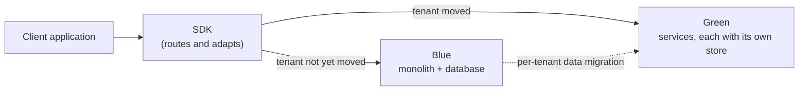

# 0039 - Reach the service-oriented architecture by blue/green rewrite

<AdrTable frontMatter={frontMatter}></AdrTable>

## Notation

This ADR uses [RFC 2119](https://www.rfc-editor.org/info/rfc2119/) keywords (`MUST`, `MUST NOT`,
`SHOULD`, `SHOULD NOT`, `MAY`) deliberately. Anything marked `MUST` or `MUST NOT` is not negotiable
at team level; a team that needs an exception brings the case to the architecture group.

**Blue** is the existing platform: the monolithic server application and its database. **Green** is
the new platform: the services that [ADR-0035](./0035-service-oriented-architecture.md) describes,
each with its own store. A **tenant** is the unit of migration from blue to green, either one
organization or one user. **Parity** is the point at which green passes the same end-to-end suite
that blue passes.

## Context and problem statement

Bitwarden delivers several products (Password Manager, Secrets Manager, and soon PAM) from one
tightly coupled codebase and database. Every change has to account for code, data, and release
timing that it does not own, and much of the cost of delivery comes from that. The Modular Service
Architecture sets the goal as product independence: each product owns its code, its data, and its
release, so a team can change its product without coordinating with the others.
[ADR-0035](./0035-service-oriented-architecture.md) sets the rules those services follow.

<Bitwarden>
The target and the current delivery plan are described on the [Modular Service
Architecture](https://bitwarden.atlassian.net/wiki/spaces/EN/pages/3130228753/Modular+Service+Architecture)
page and its children.
</Bitwarden>

The target topology has three parts:

- **Product services:** Password Manager, Secrets Manager, and PAM, each owning its data.
- **A control plane:** Identity, Organizations, and Billing, holding the master data that products
  reference by identifier.
- **Shared platform services:** Events, Notifications, SCIM, and SSO.

The current plan reaches that target by extracting services from the monolith step by step, each
step building on work that has already shipped. Every extraction coexists with the code it replaces,
sharing its database, its deployment, and its clients, which constrains each service's design to
whatever the monolith can tolerate. Every extraction also changes the platform that all existing
customers are running on.

Building the target beside the monolith and moving tenants onto it avoids both constraints, but only
if something can send each tenant's traffic to the right platform. For Bitwarden's clients, the SDK
(`sdk-internal`) is the natural place, because it is already shared across them. Today it carries
little of their traffic. The web, browser extension, desktop, and CLI clients share one TypeScript
API layer in the `clients` monorepo, and the iOS and Android apps each have their own networking
layer. Counting the distinct server operations (method and path) each client can call on its `main`
branch in September 2026:

| Client            | Server operations | Through the SDK today | Through the SDK with every SDK feature flag on |
| ----------------- | ----------------- | --------------------- | ---------------------------------------------- |
| Web               | 486               | 2.3%                  | 11.9%                                          |
| Browser extension | 325               | 1.5%                  | 16.3%                                          |
| Desktop           | 325               | 1.5%                  | 16.3%                                          |
| CLI               | 281               | 1.8%                  | 18.9%                                          |
| iOS               | 76                | 0%                    | 7.9%                                           |
| Android           | 73                | 0%                    | 8.2%                                           |

The counts are operations each client contains, not measured traffic. The SDK paths that exist sit
mostly behind feature flags that default to off, covering cipher operations, Sends, pre-login, key
rotation, and account key registration.

Routing alone is not enough. For client code to stay unchanged, the SDK also has to turn green's
responses into the types its callers already use, which requires knowing the shape of every blue
response. Of the 619 endpoints in the API and Identity hosts the SDK is generated from, 106 (17%)
return `IActionResult`, `IResult`, or `object` with no declared response type, so the SDK's
generated clients receive those responses untyped.

Not every caller is a Bitwarden client. These surfaces are called directly by customers, their
integrations, their identity providers, or third parties:

| Surface                   | Host and routes                                                                         | Callers                                                                                              |
| ------------------------- | --------------------------------------------------------------------------------------- | ---------------------------------------------------------------------------------------------------- |
| Public API                | API, `/public/*` (28 endpoints)                                                         | Customer scripts, Directory Connector, the Splunk app and other SIEM integrations                    |
| SCIM                      | SCIM, `/v2/{organizationId}/users` and `/groups`                                        | Customer identity providers                                                                          |
| Secrets Manager API       | API, `/secrets`, `/projects`, `/organizations/{organizationId}/secrets` and `/projects` | `bws` and the Secrets Manager SDK embedded in customer applications, which pin their own SDK version |
| Client-credentials tokens | Identity, `/connect/token`                                                              | Every caller above, and self-hosted installations                                                    |
| Single sign-on            | SSO, `/Account/*`, `/saml2/{scheme}/*`, `/oidc-signin`; Identity, `/sso/*`              | Customer identity providers through the browser, at URLs registered with the provider                |
| Payment webhooks          | Billing, `/stripe`, `/paypal`, `/bitpay`, `/apple/iap`                                  | Payment providers                                                                                    |
| Storage validation        | API, `*/file/validate/azure`                                                            | Azure Event Grid                                                                                     |
| Chat integrations         | API, Slack and Teams OAuth callbacks, `integrations/teams/incoming`                     | Slack and Microsoft Teams                                                                            |
| Self-hosted to cloud      | API, `push/*`, `licenses/*`, `organization/sponsorship/sync`; `installations`           | Self-hosted Bitwarden servers                                                                        |
| Icons and notifications   | Icons, `/{domain}/icon.png`; Notifications, `/hub` and `/anonymous-hub`                 | Clients, outside the SDK's HTTP layer                                                                |

## Considered options

- **Evolve in place:** extract services from the monolith step by step, each extraction coexisting
  with blue in production. This is the current plan.
- **Blue/green rewrite:** leave blue as it is, build green from scratch beside it, and move tenants
  from blue to green one at a time.

### Evolve in place

**Pros**

- Value ships incrementally. Decoupling features into owned libraries shrinks what a change can
  break before any service is extracted.
- The work can stop partway and still leave the codebase better than it found it.
- Needs no second production platform, no data migration between platforms, and no change to how
  clients reach the server.

**Cons**

- Each service's design is bound by what the monolith, its shared database, and its existing clients
  can coexist with.
- Every extraction changes the platform all existing customers are running on.
- Each step is sequenced around the monolith's shared database and release train.

### Blue/green rewrite

**Pros**

- Green is built to the target topology, [ADR-0035](./0035-service-oriented-architecture.md), and
  [ADR-0036](./0036-service-to-service-api-standards.md) without coexistence constraints.
- Green's APIs are free of blue's shapes, because the SDK absorbs the differences.
- Blue is not restructured, so customers still on blue run an unchanged platform.
- The build is not sequenced around the monolith's shared database or release train.
- A tenant moves only after the same end-to-end suite passes against both platforms, and a failed
  move affects one tenant.

**Cons**

- Two production platforms run concurrently until the last tenant moves.
- Every client, including the iOS and Android apps, must move its server calls into the SDK and ship
  an SDK that routes between platforms before tenants using it can move.
- Every surface in the table above needs routing on the server side.
- Product independence arrives when tenants move, not incrementally along the way.

## Decision outcome

Chosen option: **Blue/green rewrite**, because it reaches the target without coexistence constraints
and without restructuring the platform existing customers run on, and bounds the risk of each move
to one tenant.

> _Perspective: Engineers across client and server teams. How a client call reaches the right
> platform during the transition. System context level. Omits callers that do not use the SDK, and
> the internal structure of green._

The rules:

1. Green `MUST` be built from scratch. Specifications for its domain models and business rules
   `MUST` be derived from the monolith's behavior.
1. Green `MUST` implement the target topology and conform to
   [ADR-0035](./0035-service-oriented-architecture.md) and
   [ADR-0036](./0036-service-to-service-api-standards.md). Green's APIs are designed to those
   standards, not to match blue's.
1. Blue `MAY` continue to receive new functionality until green reaches parity. From parity on, new
   functionality `MUST` be built on green. Functionality already in flight on blue at parity `MAY`
   land there and `MUST` then be ported to green. Security fixes `MUST` continue to be made on blue
   for as long as any tenant remains on it.
1. Every client call to the Bitwarden server `MUST` go through the SDK.
1. Every existing endpoint `MUST` declare its response shape in its OpenAPI specification.
1. The SDK `MUST` route each call to the platform its tenant is on and `MUST` adapt green's
   responses to the types its callers already use, so that client code calling the SDK does not
   change.
1. Every surface that callers reach without the SDK `MUST` route each request, on the server side,
   to the platform its tenant is on.
1. An end-to-end test suite `MUST` exercise the SDK against a live environment. The same suite
   `MUST` pass against blue and against green before any tenant is moved.
1. Tenants `MUST` be moved from blue to green one organization or one user at a time by a data
   migration script. During a tenant's move its data `MUST` be read-only, for a window expected to
   last a few minutes, after which the tenant is served by green.
1. New customers `MUST` be created on green from parity on.
1. Green `MUST` be made available to self-host and Bitwarden Lite, installable beside the customer's
   existing installation, with a trial migration of selected users before the customer moves the
   rest on their own schedule.

Extracting web clients into separately deployable applications and splitting the SDK by product
follow the migration and are outside this decision.

### Positive consequences

- Green reaches the target without intermediate compromises made for coexistence.
- Customers on blue run an unchanged platform until their tenant moves.
- A move is scoped to one tenant, can be trialed on internal and selected tenants first, and a
  failed move affects only the tenant being moved.
- Vault data is encrypted on the client, so the migration copies encrypted data and never needs the
  keys to decrypt it.
- Product management sees no feature freeze. New functionality moves to green at parity, and the
  little still in flight on blue is ported.
- Typed responses and SDK-routed calls give every client one contract with the server, independent
  of the migration.
- The end-to-end suite outlives the migration as the regression suite for green.

### Negative consequences

- **Specifications have to be recovered from code.** Monolith behavior that lives only in stored
  procedures and in code paths without tests has to be rediscovered before green can reproduce it.
- **The end-to-end suite sees only what the SDK sees.** Emails, the event and audit stream that SIEM
  integrations consume, push notifications, background jobs, and billing are not observable through
  the SDK, and green has to reproduce them too.
- **Rerouting every client is itself a change to what customers run.** Moving six clients' server
  calls into the SDK touches nearly every call they make, on blue, before green serves anyone.
- **Two platforms run in production at once.** Blue and green each need infrastructure, deployment,
  monitoring, and on-call until the last tenant moves, including self-host installations that move
  on their customers' schedules.
- **Client versions gate the move.** A client running an SDK that cannot route to green cannot reach
  a tenant that has moved. A tenant can move only once the clients its users run are recent enough,
  or those users lose access until they update.
- **Routing is needed on the server as well as in the SDK.** Each directly called surface has to
  identify its tenant from its own request before it can route it: an organization ID in a path, a
  client-credentials token, an SSO scheme, or a payment provider's customer reference. SSO URLs are
  registered in customers' identity providers and cannot change. Key Connector validates tokens
  against a single configured identity authority, so tokens green issues have to validate there too.
- **Tenants are not independent.** Users belong to several organizations, organizations share
  collections among members who also hold personal vaults, and providers administer many
  organizations. A migration unit has to account for every relationship that crosses it.
- **The read-only window is visible to users.** Clients have to handle writes rejected during a
  move, and sessions, device registrations, and push subscriptions issued by blue have to be honored
  by green or re-established.
- **In-place extraction stops.** Service extractions from the monolith and the restructuring under
  [ADR-0032](./0032-break-up-core.md) no longer lead to the target.

### Plan

1. Write the specifications the build depends on: the mapping of the target topology to green's
   services, service-to-service authentication and context propagation, required enhancements to
   `Bitwarden.Server.Sdk`, row-level security enforcement, unit test conventions, CI/CD,
   infrastructure as code, client generation, and SDK routing and adaptation.
1. Build a reference implementation of a service, its service client, and a consumer of that client.
1. Declare response shapes on every endpoint and build the end-to-end suite. Reroute the direct
   calls in the shared TypeScript API layer and in the iOS and Android networking layers through the
   SDK. Record the suite passing against blue.
1. Build green's services, generate their clients, and integrate those clients into the SDK with
   routing and adaptation. Record the suite passing against blue with routing in place.
1. Build server-side routing for every surface callers reach without the SDK.
1. Write the data migration script and define what happens to a tenant whose move fails partway.
   Move internal tenants first and record the suite passing against green.
1. Replace the delivery plan for the Modular Service Architecture with this one, keeping its target,
   and revisit the status of [ADR-0032](./0032-break-up-core.md).
