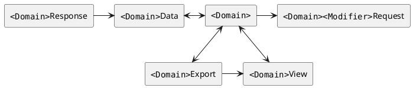
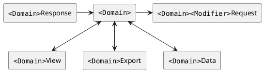

# Data Model

This document describes the internal data model used by the different client applications.

We use several dedicated models to represent our data layer. With a slightly complicated data
transformation pipeline.

<!--
TODO: Should this be completely removed from the docs, and moved to an ADR?

We're currently investigating a migrating towards a relationship closer to:

-->

## Domain

The Domain models lies at the center of our data model, and represents encrypted data.

## View

View models represent the decrypted state of the corresponding `Domain` model. They typically match
the `Domain` model but contains a decrypted string for any `EncString` fields.

## Data

The `Data` models are serializable versions of the corresponding `Domain`. In most cases this means
converting `Date` to `string`. It's exclusively used when serializing the `Domain` models to disk
for persisting state or export. This means it also needs to support deserialize older data models,
which is traditionally done by providing good default values.

## Export

Export models built from Domain or View models. Used for importing and exporting Bitwarden data.

## Request & Response (Deprecated)

In the process of being migrated to live next to the the domain's API service. At which point it
will no longer be a central part of our data model.

### Api

Shared API models used to convert from Responses to Data. Essentially an re-usable extension of the
request models.
