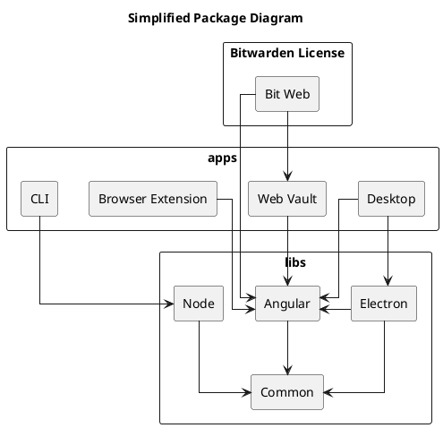

# Web Clients Architecture

The Web based clients, henceforth referenced simply as clients, are the _Web Vault_, _Browser
Extension_, _Desktop Application_ (Electron based) and the _CLI_. They all share a common codebase
and a single [Git repository](https://github.com/bitwarden/clients).

The mono-repository primarily consists of three folders.

- `apps` - Our different application specific code, consists of `web`, `browser`, `desktop` and
  `cli`.
- `bitwarden_license` -
  [Bitwarden Licensed](https://github.com/bitwarden/clients/blob/master/LICENSE.txt) version of the
  web vault.
- `libs` - Shared code between the different applications.

`libs` contains the following projects.

- `Common` - Common code shared between all the clients including CLI.
- `Angular` - Angular specific code used by all the visual clients.
- `Electron` - Used to be shared code for Desktop and Directory Connector GUI, but since directory
  connector no longer uses the same version of libs this module is deprecated.
- `Node` - Used to be shared code for CLI and Directory Connector CLI, but since directory connector
  no longer uses the same version of libs this module is deprecated.

## Package Diagram

Below is a simplified package diagram of the clients repository.

!!! note For readability, ubiquitous app dependencies to `common` are hidden.

