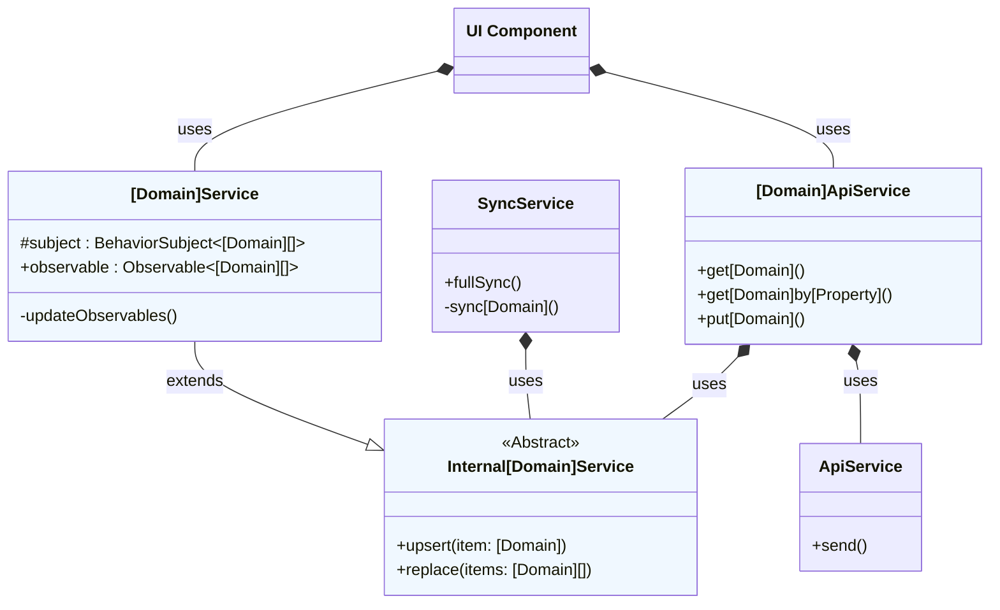
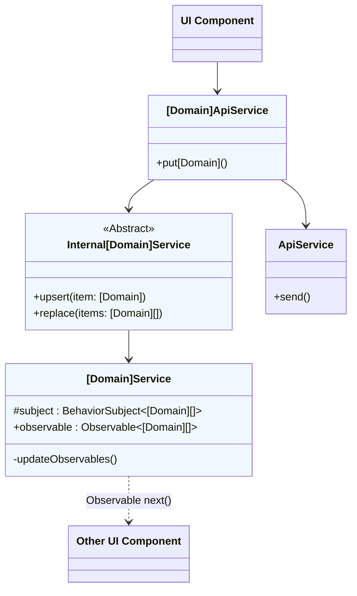
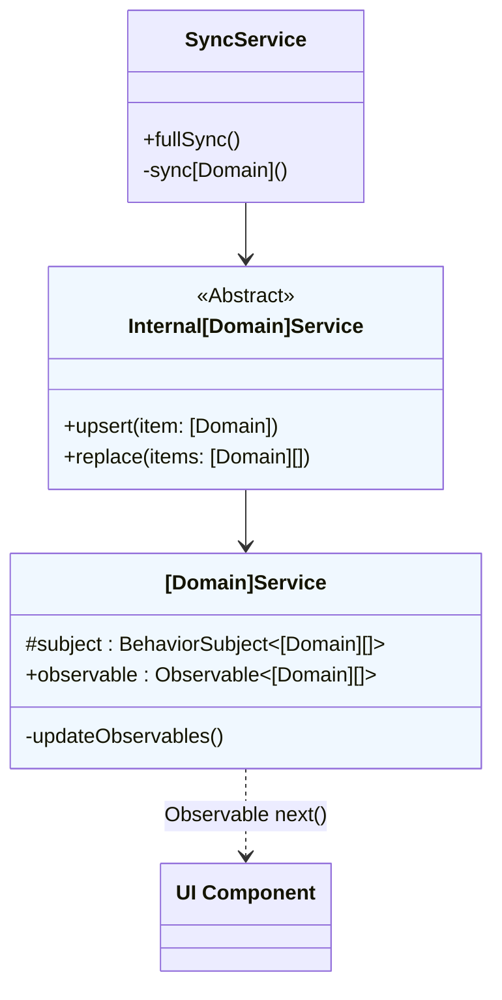
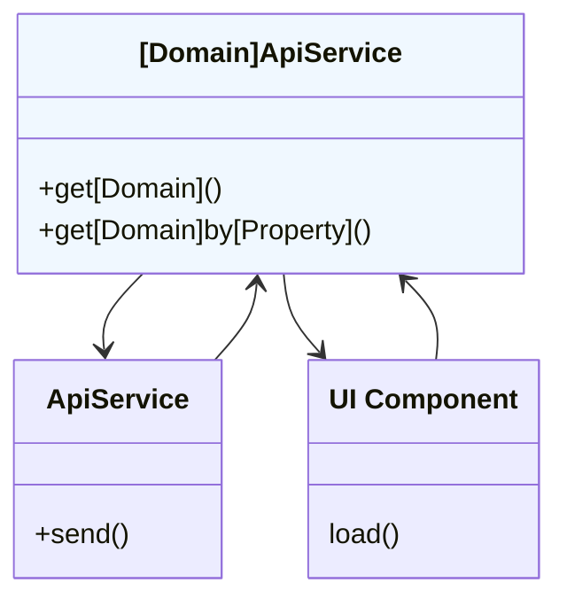

# Implementation

We have defined our [vision](vision.md) for the Bitwarden client-side services. The implementation
below is our attempt to satisfy these goals within the context of our codebase. We are currently in
the process of migrating our services to reflect this ideal.

## Different types of services

The Bitwarden clients have a service architecture that is comprised of primarily three different
types of services, for a given domain in our [Data Model](../data-model.md):

- `[Domain]Service`
- `Internal[Domain]Service`
- `[Domain]ApiService`

The classes and their responsibilities are detailed below:

| Type                      | Responsibility                                                                                                                                                                                                                             | Example                 |
| ------------------------- | ------------------------------------------------------------------------------------------------------------------------------------------------------------------------------------------------------------------------------------------ | ----------------------- |
| `[Domain]Service`         | Provides read access to the domain through an Observable, which is updated when the local state changes via an RxJS `BehaviorSubject`. This service also provides helper methods related to that domain.                                   | `PolicyService`         |
| `Internal[Domain]Service` | Provides public update methods on the service's Observable properties _without_ updating the `[Domain]` on the server. It is implemented as an abstract class which extends `[Domain]Service`, but generally not shared with most classes. | `InternalPolicyService` |
| `[Domain]ApiService`      | Provides synced-with-server write capabilities. In general, if you're editing a `[Domain]`, you want `[Domain]ApiService`. See [Domain updates](#domain-updates) for more details.                                                         | `PolicyApiService`      |

## Domain updates

The Bitwarden product contains multiple clients. At any given time, a user could be logged in to
multiple clients, viewing data and making updates. This influences the architecture for our client
services. Namely, there are at least two reasons that a domain model needs to be updated:

1. **Server Update**: The user updates it in the current client
2. **Cache-Only Update**: The user updates it in a different client, and Live Sync triggers an
   update on the current client

For each of these scenarios, we will examine how the classes above work to persist and propagate
changes across clients.

### Server Update: Updated in the current client

In the case that the domain is updated in the client, the change will begin with the user modifying
data in a UI component. The UI component has a dependency on `[Domain]ApiService`, which is
responsible for transmitting that change to two places:

1. To the server, to persist the change and also notify other clients, and
2. To the `BehaviorSubject` for that domain that is storing the state of that domain for the current
   client

You can see those responsibilities above, where `ApiService` updates the server and
`Internal[Domain]Service` updates the `BehaviorSubject`.

### Cache-Only Update: Updated in a different client

For domain updates from another client, the current client receives those messages through the
`SyncService`. The `SyncService` takes a dependency on the `Internal[Domain]Service`, as it is
responsible for updating only the internal cache. The `SyncService` updates the domain through this
service to propagate the changes in the current client.

The `Internal[Domain]Service` may use `BehaviorSubject`s in the `[Domain]Service` for that caching
mechanism, but that implementation is abstracted from the `SyncService` and any other consumers of
`Internal[Domain]Service`.

## Domain reads

When it is necessary to retrieve data directly from the server rather than subscribing to the
Observable exposed by the `[Domain]Service`, that is done by calling the appropriate method on the
`[Domain]ApiService`.
