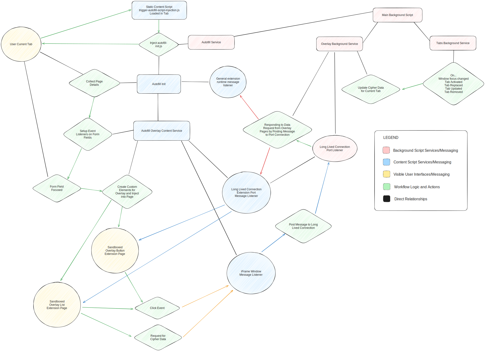
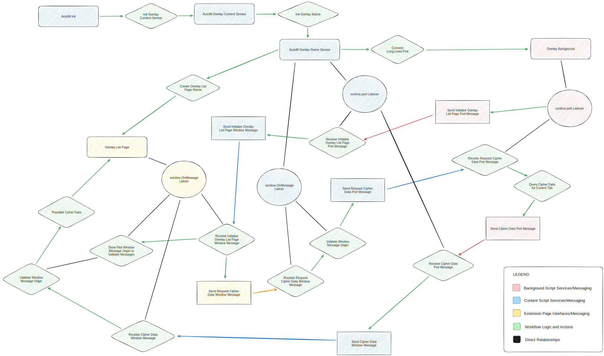

# Inline Autofill Menu

The Inline Autofill Menu allows users to access and autofill credentials from their Bitwarden vault
directly within webpage forms. Enabled by default with the installation of the Bitwarden extension,
this feature can be managed through the autofill settings within the Bitwarden extension. When
active, the extension injects the Autofill Menu into the webpage's DOM via the content script
responsible for enabling the autofill functionality.

## Project Structure

The core scripts for the Autofill Menu feature are located within the
[`/apps/browser/autofill`](https://github.com/bitwarden/clients/tree/main/apps/browser/src/autofill)
directory of the [`clients` repository](https://github.com/bitwarden/clients). These files form the
backbone of the feature's functionality.

| File                                                                                                                                                                                           | Responsibility                                                                                                                                                                                                                                                                                                                                                                                                                                                                                                                                                                                                             |
| ---------------------------------------------------------------------------------------------------------------------------------------------------------------------------------------------- | -------------------------------------------------------------------------------------------------------------------------------------------------------------------------------------------------------------------------------------------------------------------------------------------------------------------------------------------------------------------------------------------------------------------------------------------------------------------------------------------------------------------------------------------------------------------------------------------------------------------------- |
| [`overlay.background.ts`](https://github.com/bitwarden/clients/blob/main/apps/browser/src/autofill/background/overlay.background.ts)                                                           | Orchestrates communication among three key components: the content script containing the [`AutofillOverlayContentService`](https://github.com/bitwarden/clients/blob/main/apps/browser/src/autofill/services/autofill-overlay-content.service.ts), the extension pages displaying the Autofill Menu UI, and the extension background script. It facilitates the activation of various logic sequences by transmitting messages between these components.                                                                                                                                                                   |
| [`autofill-overlay-content.service.ts`](https://github.com/bitwarden/clients/blob/main/apps/browser/src/autofill/services/autofill-overlay-content.service.ts)                                 | Contains the initialization logic for the content script of the Autofill Menu. It is initialized within the content script encompassing the [`AutofillInit`](https://github.com/bitwarden/clients/blob/main/apps/browser/src/autofill/content/autofill-init.ts) class. The behavior for the Autofill Menu is setup on each form field of a webpage when the first `collectPageDetails` message is received within the webpage. This service is responsible for creating the custom elements that constitute the Autofill Menu UI and managing the behavior associated with user interactions on the webpage’s form fields. |
| [`autofill-inline-menu-iframe-element.ts`](https://github.com/bitwarden/clients/blob/main/apps/browser/src/autofill/overlay/inline-menu/iframe-content/autofill-inline-menu-iframe-element.ts) | Serves as a parent class for initializing the Autofill Menu button and list custom elements. It constructs a closed shadow DOM and initializes the [`AutofillInlineMenuIframeService`](https://github.com/bitwarden/clients/blob/main/apps/browser/src/autofill/overlay/inline-menu/iframe-content/autofill-inline-menu-iframe.service.ts). This service is responsible for injecting an iframe, which either displays the Autofill Menu list or button page.                                                                                                                                                              |
| [`autofill-inline-menu-button-iframe.ts`](https://github.com/bitwarden/clients/blob/main/apps/browser/src/autofill/overlay/inline-menu/iframe-content/autofill-inline-menu-button-iframe.ts)   | Initializes the custom Autofill Menu button element that is injected into the DOM. This script extends the [`AutofillInlineMenuIframeElement`](https://github.com/bitwarden/clients/blob/main/apps/browser/src/autofill/overlay/inline-menu/iframe-content/autofill-inline-menu-iframe-element.ts) class and initializes properties specific to the Autofill Menu button page.                                                                                                                                                                                                                                             |
| [`autofill-inline-menu-list-iframe.ts`](https://github.com/bitwarden/clients/blob/main/apps/browser/src/autofill/overlay/inline-menu/iframe-content/autofill-inline-menu-list-iframe.ts)       | Initializes the custom Autofill Menu list element that is injected into the DOM. This script extends the [`AutofillInlineMenuIframeElement`](https://github.com/bitwarden/clients/blob/main/apps/browser/src/autofill/overlay/inline-menu/iframe-content/autofill-inline-menu-iframe-element.ts) class, and initializes properties unique to the Autofill Menu list page.                                                                                                                                                                                                                                                  |
| [`autofill-inline-menu-iframe.service.ts`](https://github.com/bitwarden/clients/blob/main/apps/browser/src/autofill/overlay/inline-menu/iframe-content/autofill-inline-menu-iframe.service.ts) | Handles the functionality of the Autofill Menu page iframes, which are contained within the custom web component injected into a user's page. This script acts as an intermediary for message passing between the extension background and the iframe within the custom web component.                                                                                                                                                                                                                                                                                                                                     |
| [`autofill-inline-menu-page-element.ts`](https://github.com/bitwarden/clients/blob/main/apps/browser/src/autofill/overlay/inline-menu/pages/shared/autofill-inline-menu-page-element.ts)       | Serves as the parent class for individual Autofill Menu page scripts. It encapsulates common logic used across Autofill Menu pages, including initialization routines, establishing global listeners, handling window message posting to the parent of the iframe, and managing focus redirection from the iframe element.                                                                                                                                                                                                                                                                                                 |
| [`autofill-inline-menu-button.ts`](https://github.com/bitwarden/clients/blob/main/apps/browser/src/autofill/overlay/inline-menu/pages/button/autofill-inline-menu-button.ts)                   | Utilized within [`button.html`](https://github.com/bitwarden/clients/blob/main/apps/browser/src/autofill/overlay/inline-menu/pages/button/button.html) to facilitate the Autofill Menu button extension page within a sandboxed iframe. It inherits from the [`AutofillInlineMenuPageElement`](https://github.com/bitwarden/clients/blob/main/apps/browser/src/autofill/overlay/inline-menu/pages/shared/autofill-inline-menu-page-element.ts) class and is specifically tasked with managing the behavior of the Autofill Menu button injected into webpages.                                                             |
| [`autofill-inline-menu-list.ts`](https://github.com/bitwarden/clients/blob/main/apps/browser/src/autofill/overlay/inline-menu/pages/list/autofill-inline-menu-list.ts)                         | Utilized within [`list.html`](https://github.com/bitwarden/clients/blob/main/apps/browser/src/autofill/overlay/inline-menu/pages/list/list.html) to facilitate the Autofill Menu list extension page within a sandboxed iframe. It inherits from the [`AutofillInlineMenuPageElement`](https://github.com/bitwarden/clients/blob/main/apps/browser/src/autofill/overlay/inline-menu/pages/shared/autofill-inline-menu-page-element.ts) class and is specifically tasked with managing the behavior of the Autofill Menu list injected into webpages.                                                                       |

## Implementation Details

The development of the Autofill Menu necessitated a focus on security to mitigate risks associated
with content script injection into unknown webpages. Ensuring the security of user data was a
critical factor; thus, efforts were made to obfuscate the content and behavior of the Autofill Menu
to prevent potential data compromises.

The accompanying diagram provides a high-level architectural overview of the Autofill Menu. It
details the interaction mechanisms between the extension, webpage, and user in presenting the
Autofill Menu, highlighting the structural framework of this feature.

[ _(A visual representation of the architectural workflow of the Autofill Menu)_](./assets/autofill-overlay-architecture.svg)

In addition to the visible aspects, several underlying elements have been integrated to ensure that
the Autofill Menu is both performant and secure. The subsequent sections detail the design and
implementation specifics of this feature:

### Injection of the Autofill Menu

An important consideration during the development of the Autofill Menu was addressing user concerns
about the performance and security of UI elements injected into an unknown webpage. As a result, the
Autofill Menu has been implemented to ensure that it is injected into a webpage only when a user has
enabled the feature.

When the Autofill Menu is disabled, the core autofill functionality is enabled via a content script
named
[`bootstrap-autofill.ts`](https://github.com/bitwarden/clients/blob/main/apps/browser/src/autofill/content/bootstrap-autofill.ts).
This script, utilizing the
[`AutofillInit`](https://github.com/bitwarden/clients/blob/main/apps/browser/src/autofill/content/autofill-init.ts)
class, initiates the autofill feature and omits the injection of the Autofill Menu code. However,
when a user activates the Autofill Menu, a distinct content script,
[`bootstrap-autofill-overlay.ts`](https://github.com/bitwarden/clients/blob/main/apps/browser/src/autofill/content/bootstrap-autofill-overlay.ts),
is deployed instead. This script is responsible for initializing both the
[`AutofillOverlayContentService`](https://github.com/bitwarden/clients/blob/main/apps/browser/src/autofill/services/autofill-overlay-content.service.ts)
class and the `AutofillInit` class.

This initialization process occurs on each page a user opens. Once the Autofill Menu is set up, the
system awaits a `collectPageDetails` message from the background extension, received by the
`AutofillInit` class. Receipt of this message activates event listeners on all form field elements
of the webpage. These listeners are essential in controlling the Autofill Menu's display and its
interactive behavior as users engage with form fields.

Whenever a user interacts with a form field, the system generates two
[custom web components](https://developer.mozilla.org/en-US/docs/Web/API/Web_components/Using_custom_elements)
with randomized names. This randomization, occurring each time the Autofill Menu initializes on a
webpage, hinders any programmatic manipulation of the injected Autofill Menu elements. These custom
elements, created within a
[closed shadow DOM](https://developer.mozilla.org/en-US/docs/Web/API/Web_components/Using_shadow_DOM#element.shadowroot_and_the_mode_option),
are appended to the bottom of the webpage's body. This approach ensures that the webpage cannot
directly access these elements or their content.

### Rendering Views through Sandboxed iFrames

The user interface representing the Autofill Menu consists of extension pages rendered within
sandboxed iframes. These sandboxed iframes are structured within the custom elements injected into a
user's webpage and represent the Autofill Menu
[button](https://github.com/bitwarden/clients/tree/main/apps/browser/src/autofill/overlay/inline-menu/pages/button)
and
[list](https://github.com/bitwarden/clients/tree/main/apps/browser/src/autofill/overlay/inline-menu/pages/list)
UI elements.

Rendering these views within a sandboxed iframe sets clear limitations on how these pages can
communicate with the extension background. This approach effectively
[strips the pages of the ability to directly access the extension API](https://developer.chrome.com/docs/extensions/mv3/sandboxingEval/),
necessitating communication with the extension background through postMessage calls routed through
the iframe element's parent. This ensures that any actions needing to occur within the extension
background script cannot be initiated outside the
[isolated context of the content script](https://developer.chrome.com/docs/extensions/mv3/content_scripts/#isolated_world)
that injects the Autofill Menu UI elements into the DOM.

These pages are rendered with a strict content security policy that prohibits the execution of any
inline scripts or scripts foreign to the extension. This ensures that the pages cannot execute any
form of script not explicitly defined within the extension, whether inline or through a script tag.

### Passing Messages Between the Autofill Menu and the Extension

As a consequence of the sandboxed iframe implementation, an indirect messaging system was necessary
to enable communication between the extension background and the Autofill Menu pages. This messaging
approach operates through the use of `postMessage` calls exchanged among the Autofill Menu pages,
the content script, and the extension background.

When an Autofill Menu page needs to communicate with the extension background, it initiates a
`postMessage` call to its parent frame, the content script that injected the Autofill Menu into the
webpage. This content script verifies the origin of the window message to confirm it originates from
the expected source. Upon validation, it relays a message to the extension background via a
long-lived port connection. The extension background, upon receiving this message, executes the
necessary background logic and responds with a port message back to the content script. This message
is then transferred to the Autofill Menu page through another `postMessage` call.

Below is an illustration that demonstrates how this messaging system operates when initializing and
retrieving cipher data for the Autofill Menu list page:

[ _(A visual representation of the messaging workflow of the Autofill Menu)_](./assets/autofill-overlay-messaging.svg)

As illustrated in the example above, any messages that need to be relayed from the `OverlayListPage`
to the `OverlayBackground` script must pass through the `AutofillOverlayIframe` content script. This
arrangement ensures that the Autofill Menu pages cannot directly access the extension background
script and, likewise, that the extension background script is not directly manipulable by the
Autofill Menu pages.

### Populating the Autofill Menu with Data

We exercised considerable selectivity in the types of data passed to the Autofill Menu to safeguard
against compromising a user's vault. Consequently, only the following data types are transmitted to
the Autofill Menu UI elements:

```typescript
type OverlayCipherData = {
  id: string;
  name: string;
  type: CipherType;
  reprompt: CipherRepromptType;
  favorite: boolean;
  icon: { imageEnabled: boolean; image: string; fallbackImage: string; icon: string };
  login?: { username: string };
  card?: string;
};
```

The `id` value in the aforementioned data structure is a generic identifier assigned during the
creation of the `OverlayCipherData` data structure. It does not correspond to the actual `id` value
of a cipher in a user's vault. This precaution ensures that the Autofill Menu cannot be utilized to
pinpoint a specific cipher within a user's vault.

The `login.username` value is obfuscated by the extension background script prior to being
transmitted to the Autofill Menu. To prevent full exposure of the username to the webpage, these
values are partially masked in the Autofill Menu. For instance, a username like
`useremail@example.com` would be displayed as `us******l@example.com` in the Autofill Menu.

### Handling User Interaction

The Autofill Menu is positioned using a `position: fixed` CSS value in relation to the form field a
user interacts with. The exact position coordinates are calculated by invoking
`getBoundingClientRect` on the field itself. This approach ensures the Autofill Menu aligns with the
webpage's viewport, rather than just the form field element. This positioning strategy is effective
in preventing the Autofill Menu from being obscured by nearby elements positioned close to the form
field.

This approach can lead to misalignment of the Autofill Menu when the page is scrolled or resized. To
counter this, we have implemented event listeners that reposition the Autofill Menu whenever a
`scroll` or `resize` event occurs. If the associated form field exits the user's viewport during
these events, the Autofill Menu is completely removed.

Users can navigate the Autofill Menu using their keyboard, facilitated by various listeners attached
to both the form field element and the UI elements of the Autofill Menu. These listeners are
designed to handle the following keyboard interactions:

- Pressing `ArrowDown` on a focused input element moves the focus to the Autofill Menu list. Users
  can then press down further to navigate the list and select a credential for autofill.
- Pressing `ArrowUp` within the Autofill Menu list shifts the focus to the previous list item.
- Navigating to the end of the Autofill Menu list automatically redirects the focus to the list's
  first element.
- Pressing `Enter` while an element of the Autofill Menu list is focused will trigger the autofill
  of the selected credential.
- Pressing `Escape` while focused on the Autofill Menu list element closes the Autofill Menu.
- The Autofill Menu can also be closed by pressing `Escape` when focused on an input element.
- Pressing `Tab` while focused on the Autofill Menu moves the focus to the next focusable element on
  the webpage, relative to the most recently focused input field.
- Pressing `Shift + Tab` while focused on the Autofill Menu shifts the focus to the previous
  focusable element on the webpage, relative to the most recently focused input field.

When triggering autofill, the Autofill Menu utilizes the same autofill logic employed when a user
selects a cipher within the Bitwarden extension popup. In the Autofill Menu, selecting a cipher
involves sending a message to the background with an 'id' value unique to the list of aggregated
ciphers in the Autofill Menu UI. This enables the identification and autofill of the chosen cipher
from the background. This approach ensures consistency in the autofill process across the extension
and prevents the introduction of new vulnerabilities through the Autofill Menu.

## Security Considerations

The Autofill Menu heavily relies on content scripts to inject its UI into webpages. This process,
which entails injecting code and DOM elements into unfamiliar websites, required the implementation
of stringent security measures. Throughout the design and implementation of this feature we worked
to mitigate a broad range of security risks. Additionally, we conducted a comprehensive security
review with a number of third-party organizations, ensuring the robust security of the feature.

The subsequent sections detail various security considerations that were factored in during the
design and implementation of the feature.

### Clickjacking

To combat clickjacking, the following defensive measures have been implemented for the Autofill Menu
feature:

#### **Injecting elements as custom elements with a closed shadow DOM**

- Upon injection, a custom element using a
  [closed shadow DOM](https://developer.mozilla.org/en-US/docs/Web/API/Web_components/Using_shadow_DOM#element.shadowroot_and_the_mode_option)
  is created and appended to the bottom of the body element of the target page.
- This custom element is named randomly each time the Autofill Menu initializes on a webpage, making
  it difficult for attackers to target the element programmatically.
- The use of a closed shadow DOM restricts direct access to the element's properties or methods by
  the page itself.
- Notably, malicious extensions can access a closed shadow DOM element via the
  [extension.dom API](https://developer.chrome.com/docs/extensions/reference/dom/). To counter this,
  a strict content security policy is applied to the Autofill Menu pages, inhibiting other
  extensions from accessing the execution context of these pages.

#### **Rendering Autofill Menu UI elements as sandboxed iFrame pages**

- The custom element contains a sandboxed iframe that displays the extension's UI.
- Designating these pages as sandbox pages prevents direct use of the extension API by the page.
  Actions requiring the extension background script are relayed through `postMessage` calls to the
  Autofill Menu UI element's parent.
- This setup ensures that actions within the extension background script are only triggered within
  the
  [isolated context of the content script](https://developer.chrome.com/docs/extensions/mv3/content_scripts/#isolated_world)
  which injects the Autofill Menu UI elements.

#### **Establishing a strict content security policy for the Autofill Menu pages**

- We have followed
  [Google's guidelines for establishing sandboxed pages](https://developer.chrome.com/docs/extensions/mv3/sandboxingEval/)
  in our extension. Although we do not utilize any form of `eval` in the Autofill Menu
  implementation, establishing limitations for the injected UI elements was still deemed crucial.
- The sandboxed pages for the Autofill Menu UI elements adhere to a content security policy of
  `sandbox allow-scripts; script-src 'self'`.
- This policy ensures that only scripts explicitly defined within the extension can be executed by
  the injected UI elements.

#### **Reacting to attempts to modify the Autofill Menu elements programmatically**

- A defensive approach using the
  [MutationObserver API](https://developer.mozilla.org/en-US/docs/Web/API/MutationObserver) is
  implemented to guard against modifications to the Autofill Menu UI elements.
- The content script monitors for elements trying to append to the bottom of the body, repositioning
  the UI elements as necessary to prevent allowing the Autofill Menu to be overlaid by potential
  clickjacking elements.
- It also watches for changes to the styles or attributes of the Autofill Menu UI elements,
  resetting them to their original values if altered by malicious actions.

### Cross-Site Scripting (XSS)

To mitigate the risks of Cross-Site Scripting (XSS), the following defensive measures have been
implemented for the Autofill Menu feature:

#### **Limiting user input usage in the Autofill Menu**

- The implementation largely avoids reliance on the injection of external values.
- User-created cipher values are used to populate the Autofill Menu list with credentials. These
  values are carefully sanitized when saved in a user's vault.
- Collection of foreign input occurs when a user creates a new cipher through the Autofill Menu.
  However, these inputs are processed by the extension background script and are never introduced
  into any executable context.

#### **Enforcing a strict content security policy to block foreign scripts**

- The execution of inline scripts or scripts external to the extension is prohibited within the
  Autofill Menu pages. This is achieved by implementing a stringent content security policy
  specifically for the Autofill Menu pages.

### DOM Clobbering

To address the risks associated with DOM clobbering, the following defensive strategies have been
implemented for the Autofill Menu feature:

#### **Utilizing the isolated execution context of the content script**

- Web extension content scripts operate in a
  [unique, isolated context](https://developer.chrome.com/docs/extensions/mv3/content_scripts/#isolated_world),
  separate from the global execution context of the webpage into which they are injected.
- This isolated execution context guarantees that variables or functions defined within the content
  script are not accessible to the webpage's scripting environment, thus safeguarding them from
  being overwritten by the webpage.

#### **Adhering to OWASP secure coding guidelines**

- In developing our content scripts, we have adhered to the
  [OWASP Secure Coding Guidelines](https://cheatsheetseries.owasp.org/cheatsheets/DOM_Clobbering_Prevention_Cheat_Sheet.html#secure-coding-guidelines)
  to avoid introducing vulnerabilities into the extension.
