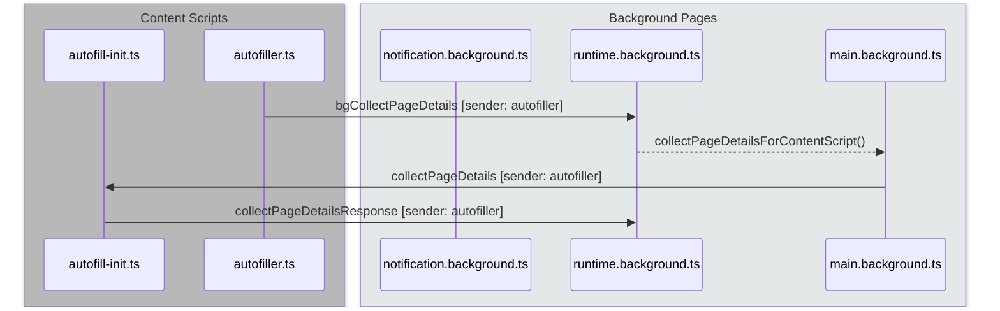
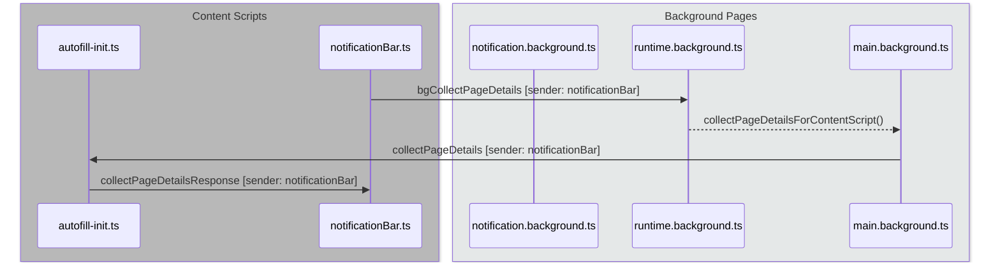
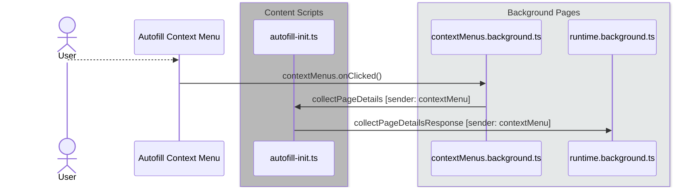
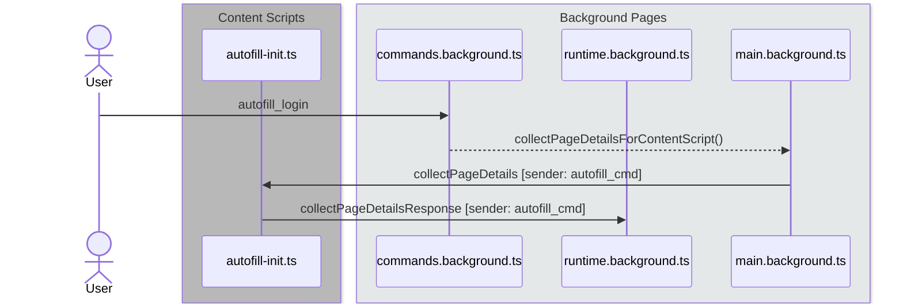
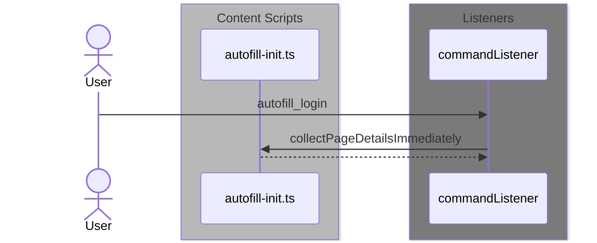
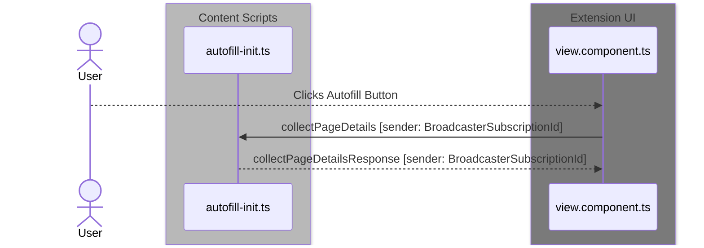
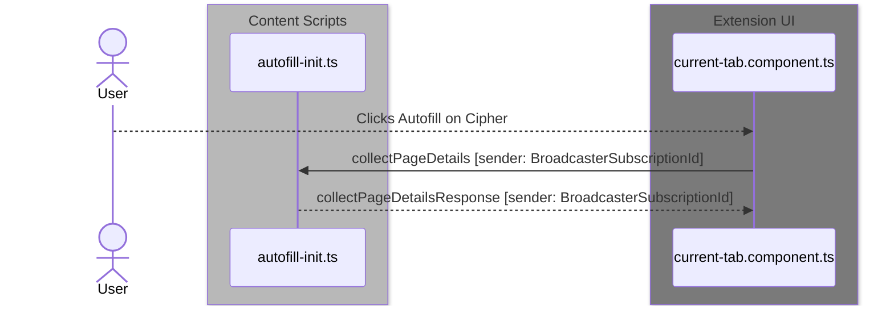

# Collecting Page Details

The first step in the Autofill process is to collect what are referred to as the "Page Details" in
the codebase. The Page Details are an array of metadata about the page source of the current browser
tab.

Because it needs access to the DOM of the tab, the collection of the Page Details must be performed
by a content script. The Bitwarden browser extension performs this through the
[`CollectAutofillContentService`](https://github.com/bitwarden/clients/blob/main/apps/browser/src/autofill/services/collect-autofill-content.service.ts)
that is initialized in the `autofill-init.ts` content script. The logic in this class is responsible
for parsing the page DOM and returning a data structure that represents the Page Details of the
current tab.

:::info Page Details

For in-depth knowledge of what is contained in the Page Details, the
[`AutofillPageDetails`](https://github.com/bitwarden/clients/blob/main/apps/browser/src/autofill/models/autofill-page-details.ts)
TypeScript class is documented to explain the properties and their purposes.

:::

## Requesting page detail collection

Page detail collection can be requested from other content scripts or from the extension itself.

### Requesting page details in the background

Page detail collection is requested from content script in two cases:

- The `notificationBar.js` content script detects that the page DOM or URL has changed, or
- The user has Autofill on Page Load turned on, so `autofiller.js` requests autofill on page load

In both of these cases, page detail collection is handled as follows:

1. The requesting content script sends the `bgCollectPageDetails` command to communicate the request
   to the `runtime.background.ts` background page.
2. The `runtime.background.ts` page calls the `collectPageDetailsForContentScript` method on
   `main.background.ts`.
3. The `collectPageDetailsForContentScript` method sends a message with command `collectPageDetails`
   to the `autofill-init.ts` content script.
4. The `autofill-init.ts` content script generates the page details and broadcasts a
   `collectPageDetailsResponse` message with a sender of either `autofiller` or `notificationBar`.
5. The `runtime.background.js` and `notification.background.js` are listening for these two
   messages, respectively, and will act upon them.

These flows are diagrammed below:

#### Autofill on Page Load

#### Notification Bar

### Requesting page details from context menu

Bitwarden extension users have the ability to trigger Autofill from the context menu by
right-clicking on the page and selecting "Bitwarden / Autofill", then picking a vault item from the
items matching the current page URI.

When the user selects an item on the context menu, the browser `contextMenu.OnClicked()` event is
fired. This event is handled by the `contextMenus.background.js` background page. The page issues a
`collectPageDetails` command with a `contextMenus` sender. The `autofill-init.ts` content script
catches this request and issues a `collectPageDetailsResponse` with a sender of `contextMenus` when
complete, which is handled by the `runtime.background.js` background page.

### Requesting page details on keyboard shortcut

The keyboard shortcut for the Bitwarden Autofill is configured in the `manifest.json` and
`manifest.v3.json` files, for Manifest v2 and v3, respectively. The command is defined in the
manifest files as `autofill_login`. When the user initiates that key combination, the browser
command is broadcast to all listeners. This behavior is detailed
[here](https://developer.mozilla.org/en-US/docs/Mozilla/Add-ons/WebExtensions/manifest.json/commands).

#### Manifest v2

In a browser extension running Manifest v2, the `commands.background.ts` background page is
listening for the `autofill_login` command. This background page executes the
`collectPageDetailsForContentScript()` method on `main.background.js`, which broadcasts the
`collectPageDetails` message to the `autofill-init.ts` content script.

After generating the page details, the `autofill-init.ts` content script broadcasts a
`collectPageDetailsResponse` message with an `autofill_cmd` sender. The `runtime.background.js`
background page is listening for this message and receives it.

#### Manifest v3

For browser extensions running Manifest v3, the background pages are replaced with the
`commandListener`. The `commandListener` is listening for the `autofill_login` command, and it
responds by broadcasting the `collectPageDetailsImmediately` command.

The `collectPageDetailsImmediately` is different from the `collectPageDetails` command, in that the
response is **not** another message broadcast through the browser command API. Instead, the
`autofill-init.ts` content script performs the page details generation and returns the response
asynchronously through a Promise.

### Requesting page details from the extension UI

There are two ways that a user can request an autofill from the Bitwarden browser extension UI:

- Clicking the Autofill button when viewing an item in their vault (`view.component.ts`), or
- Clicking on a vault item on the Current Tab view (`current-tab.component.ts`)

In both of these cases, the component issues a `collectPageDetails` command with the extension
instance's unique `BroadcasterSubscriptionId` as the `sender`. The `autofill-init.ts` content script
generates the page details and responds with a `collectPageDetailsResponse` message with the same
`sender`, ensuring that the message is received properly by the correct sender.

Autofill from the item view (`view.component.ts`):

Autofill from the current tab view (`current-tab.component.ts`):

## Performing the collection of the page details

In all the scenarios above, the `autofill-init.ts` content script receives a request to collect page
details. When this occurs, the collection of the page details takes place through the
`getPageDetails()` method of the `CollectAutofillContentService`.

The `getPageDetails()` method parses the page DOM and creates an instance of the
[`AutofillPageDetails`](https://github.com/bitwarden/clients/blob/main/apps/browser/src/autofill/models/autofill-page-details.ts)
class.

This class contains arrays of
[`AutofillField`](https://github.com/bitwarden/clients/blob/main/apps/browser/src/autofill/models/autofill-field.ts)
and
[`AutofillForm`](https://github.com/bitwarden/clients/blob/main/apps/browser/src/autofill/models/autofill-form.ts)
objects, each of which represents a potentially fillable field on the page source. The properties on
the objects are used in the next step of the Autofill process,
['Generating the Fill Scripts'](./generating-fill-scripts.md).
