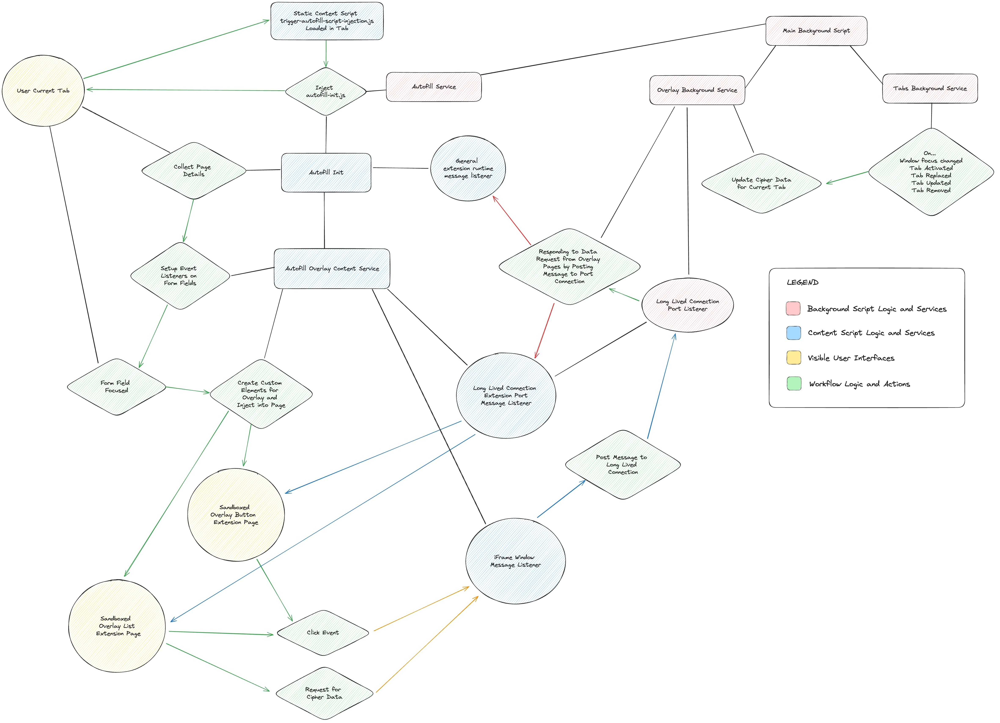

# Autofill Overlay Menu

The autofill overlay menu is a feature that allows users to interact with their Bitwarden vault and
autofill credentials directly from form elements within a webpage. This is an opt-in experience that
users can enable through the Bitwarden extension settings. When enabled, the overlay menu is
injected into the DOM of a webpage through the use of the same content script that facilitates
filling of login credentials.

## Project Structure

The following files represent the core script logic for the autofill overlay menu feature. All files
are structured within the `/apps/browser/autofill` folder of the `clients` repository.

| File                                  | Responsibility                                                                                                                                                                                                                                                                                                                                                                                                                                                                                                                                       |
| ------------------------------------- | ---------------------------------------------------------------------------------------------------------------------------------------------------------------------------------------------------------------------------------------------------------------------------------------------------------------------------------------------------------------------------------------------------------------------------------------------------------------------------------------------------------------------------------------------------- |
| `overlay.background.ts`               | Manages communication between three components: the `AutofillOverlayContentService` content script, the extension pages that present the overlay UI, and the extension background script. This enables the triggering of different pieces of logic by passing messages among these contexts.                                                                                                                                                                                                                                                         |
| `autofill-overlay-content.service.ts` | Represents the initialization logic of the content script behavior for the autofill overlay menu. The logic for this script is triggered within the content script containing the `AutofillInit` class, and the core behavior for the overlay elements are setup on each form field of the webpage when the first call to `collectPageDetails` is made by the extension background script. This service handles creation of the custom elements that house the overlay UI and behavior associated with user interactions on a webpage's form fields. |
| `autofill-overlay-iframe-element.ts`  | Acts as a parent class to the initialize the overlay button and list custom elements. Creates a closed ShadowDOM and initializes the `AutofillOverlayIframeService` to handle injection of an iframe that references either the overlay list or button page.                                                                                                                                                                                                                                                                                         |
| `autofill-overlay-button-iframe.ts`   | Initializes the overlay button custom element that is injected into the DOM. Inherits the `AutofillOverlayIframeElement` class, and initializes properties specific to the overlay button page.                                                                                                                                                                                                                                                                                                                                                      |
| `autofill-overlay-list-iframe.ts`     | Initializes the overlay list custom element that is injected into the DOM. Inherits the `AutofillOverlayIframeElement` class, and initializes properties specific to the overlay list page.                                                                                                                                                                                                                                                                                                                                                          |
| `autofill-overlay-iframe.service.ts`  | Handles behavior for the overlay page iframe elements that are contained within the custom web component that is injected into a user's page. In effect, this class also behaves as the intermediary when messages need to be passed between the extension background and the iframe contained within the custom web component.                                                                                                                                                                                                                      |
| `autofill-overlay-page-element.ts`    | Acts as a parent class to the scripts for each overlay page. Contains shared logic that both overlay page scripts use including initialization of the page, setting up global listeners for the page, posting window messages to the iframe's parent, and redirecting focus out of the overlay iframe element.                                                                                                                                                                                                                                       |
| `autofill-overlay-button.ts`          | The page script used within `button.html` for the overlay button extension page that is rendered in the sandboxed iframe. Inherits the `AutofillOverlayPageElement` class, and handles behavior associated with the overlay button that is injected into a webpage.                                                                                                                                                                                                                                                                                  |
| `autofill-overlay-list.ts`            | The page script used within `list.html` for the overlay list extension page that is rendered in the sandboxed iframe. Inherits the `AutofillOverlayPageElement` class, and handles behavior associated with the overlay list that is injected into a webpage.                                                                                                                                                                                                                                                                                        |

## Implementation Details

When implementing autofill overlay, we had to consider several factors that would impact the overall
design of the feature. The most important of these factors was security of the feature, and ensuring
that we were not introducing any vulnerabilities that could expose user data. Injection of content
scripts into a unknown webpage is inherently risky, and obfuscating the content and behavior of the
overlay menu was important to ensure user data could not easily be compromised.

A general overview of the architecture of the autofill overlay menu is shown below. This represents
a high level overview for how the extension interacts with the webpage and the user to present the
overlay menu.

[ _(A visual representation of the architectural workflow of the autofill overlay menu)_](./assets/autofill-overlay-architecture.jpg)

There is also a variety of behind the scenes elements that we've implemented to present the autofill
overlay in a performant and secure manner. The following sections outline the design and
implementation details of the feature:

### Injection of the Overlay Menu

The overlay menu is strictly an opt-in experience enabled through the setting of the browser
extension. An important consideration that was kept in mind during the development of this project
was concerns that users had regarding the performance and security of an overlay menu. As a result,
we've implemented the overlay menu in a way that ensures it is only injected into a webpage when a
user has enabled the feature.

By default, we inject the logic required for the core autofill feature through
[a content script named `bootstrap-autofill.ts`](https://github.com/bitwarden/clients/blob/master/apps/browser/src/autofill/content/bootstrap-autofill.ts).
This content script handles initialization of the autofill feature through the
[`AutofillInit` class](https://github.com/bitwarden/clients/blob/master/apps/browser/src/autofill/content/autofill-init.ts),
and completely skips injection of the autofill overlay menu code. However, if a user opts to turn
the overlay menu on, we inject
[a separate content script named `bootstrap-autofill-overlay.ts`](https://github.com/bitwarden/clients/blob/master/apps/browser/src/autofill/content/bootstrap-autofill-overlay.ts)
that handles initialization of the
[`AutofillOverlayContentService` class](https://github.com/bitwarden/clients/blob/master/apps/browser/src/autofill/services/autofill-overlay-content.service.ts)
along with the `AutofillInit` class.

This initialization happens on each page that a user opens, and once the overlay menu is
initialized, we wait for a `collectPageDetails` message to be sent to the `AutofillInit` class. This
message, sent from the background extension, triggers the setup of event listeners on each form
field element of the webpage. These event listeners are responsible for handling the presentation
and behavior of the overlay menu when a user interacts with a form field.

Upon interaction with a form field element, our implementation creates two
[custom web components](https://developer.mozilla.org/en-US/docs/Web/API/Web_components/Using_custom_elements)
with randomized names. These names are determined each time the overlay is initialized on a webpage,
which ensures that it is difficult to programmatically manipulate the injected overlay menu
elements. Furthermore, the custom elements are created using a
[closed shadow DOM](https://developer.mozilla.org/en-US/docs/Web/API/Web_components/Using_shadow_DOM#element.shadowroot_and_the_mode_option)
and are appended to the bottom of the webpage's body element. This ensures that the elements are not
directly accessible by the webpage itself, and that the webpage cannot directly access the element's
content.

### Rendering Views through Sandboxed iFrames

The user interface that represents the overlay menu consists of extension pages that are rendered
within sandboxed iframes. These sandboxed iframes are structured within the custom elements that we
inject into a user's webpage, and represent the
[overlay button](https://github.com/bitwarden/clients/tree/master/apps/browser/src/autofill/overlay/pages/button)
and
[overlay list](https://github.com/bitwarden/clients/tree/master/apps/browser/src/autofill/overlay/pages/list)
UI elements.

Rendering these views within a sandboxed iframe establishes distinct limitations for how these pages
can communicate with the extension background. We effectively
[strip these pages from the ability to directly access the extension API](https://developer.chrome.com/docs/extensions/mv3/sandboxingEval/).
This instead forces these pages to communicate with the extension background through the use of
`postMessage` calls which must be routed through the parent of the iframe element. This ensures that
any behavior that must happen within the extension background script cannot be triggered outside the
[isolated context of the content script](https://developer.chrome.com/docs/extensions/mv3/content_scripts/#isolated_world)
that injects the overlay UI elements into the DOM.

These pages are also rendered with a strict content security policy that prevents the execution of
any inline scripts or scripts that are foreign to the extension. This ensures that the pages cannot
execute any form of script that is not explicitly defined within the extension, either inline or
through a script tag.

### Passing Messages Between the Overlay Menu and the Extension

As a result of the sandboxed iframe implementation, a messaging system had to be implemented to
facilitate communication between the extension background and the overlay menu pages. This messaging
system is facilitated through the use of `postMessage` calls that are made between the overlay menu
pages, the content script and the extension background.

These messages are passed through the parent of the iframe element which houses the overlay page,
and acts as the intermediary between the extension background and the overlay menu pages. An example
of how the messaging system works is shown below:

```kroki type=plantuml
@startuml
box "AutofillOverlayContentService" #B8B8B8
participant "main context" as autofillOverlayContentServiceMain
end box

box "AutofillOverlayIframeService" #B8B8B8
participant "main context" as autofillOverlayIframeServiceMain
participant "runtime.port listener" as autofillOverlayIframePort
participant "window.onMessage listener" as autofillOverlayIframeServiceOnMessage
end box

box "OverlayListPage" #D1D1D1
participant "main context" as overlayListPageMain
participant "window.onMessage listener" as overlayListPageOnMessage
end box

box "OverlayBackground" #E5E8E8
participant "main context" as overlayBackgroundMain
participant "runtime.port listener" as overlayBackgroundPort
end box

autofillOverlayContentServiceMain -> autofillOverlayIframeServiceMain : init overlay iframe
autofillOverlayIframeServiceMain -> autofillOverlayIframePort : setup long-lived port
autofillOverlayIframePort -> overlayBackgroundPort : connect port to background
overlayBackgroundPort -> autofillOverlayIframePort : initialize overlay list page [port.postMessage]
autofillOverlayIframeServiceMain -> overlayListPageMain : init overlay list page iframe
overlayListPageMain -> autofillOverlayIframeServiceOnMessage : request cipher data [window.postMessage]
autofillOverlayIframeServiceOnMessage -> autofillOverlayIframeServiceMain : validate window message origin
autofillOverlayIframeServiceMain -> overlayBackgroundPort : request cipher data [port.sendMessage]
overlayBackgroundPort -> overlayBackgroundMain : trigger background logic
overlayBackgroundMain -> autofillOverlayIframePort : return cipher data [port.postMessage]
autofillOverlayIframePort -> overlayListPageOnMessage : send cipher data to overlay list [window.postMessage]
overlayListPageOnMessage -> overlayListPageMain : validate window message origin
overlayListPageMain -> overlayListPageMain : populate cipher data

@enduml
```

As can be seen in the example above, any messages that must be passed from the `OverlayListPage` to
the `OverlayBackground` script must be passed through the `AutofillOverlayIframe` content script.
This ensures that the extension background script is not directly accessible by the overlay menu
pages, and that the extension background script cannot be directly manipulated by the overlay menu
pages.

### Populating the Overlay Menu with Data

We attempted to be incredibly selective with the type of data that we pass to the overlay menu. This
was done to ensure that we were not passing any sensitive data to the overlay menu that could be
used to compromise a user's vault. As a result, we only pass the following data to the overlay menu:

```typescript
type OverlayCipherData = {
  id: string;
  name: string;
  type: CipherType;
  reprompt: CipherRepromptType;
  favorite: boolean;
  icon: { imageEnabled: boolean; image: string; fallbackImage: string; icon: string };
  login?: { username: string };
  card?: string;
};
```

The `id` value in the data structure above is a generic identifier that is populated when creating
the `OverlayCipherData` data structure, and does not correspond to the actual `id` value of the
cipher in a user's vault. This ensures that the overlay menu cannot be used to identify a specific
cipher in a user's vault.

The `login.username` value is obfuscated by the extension background script before being passed to
the overlay menu. These values will appear with partial masking in the overlay menu to ensure that
the username is not fully exposed to the webpage. For example, if a username is
`cgonzalez@bitwarden.com` it will appear as `cg******z@bitwarden.com` in the overlay menu.

### Handling User Interaction

The overlay menu is positioned relative to the form field that a user interacts with by using a
`position: fixed` CSS value and position values that are calculated by calling
`getBoundingClientRect` on the field itself. This ensures that the overlay menu is positioned
relative to the viewport of the webpage, rather than the form field element. This is important to
ensure that the overlay menu is not overlaid by any elements that might be positioned near the form
field.

This creates a situation where scroll or resizing the page could mis-align the overlay menu. To
mitigate this, we've implemented listeners that handle repositioning the overlay element anytime a
scroll or size event is triggered by the user. During this event, if the form field leaves the
user's viewport we remove the overlay menu entirely.

Users also have the ability to use keyboard navigation with the overlay menu. This is handled
through a variety of listeners attached to the form field element, as well as the UI elements of the
overlay menu itself. These listeners handle the following keyboard interactions:

- When an input element is focused, pressing `ArrowDown` will move focus from the input element to
  the overlay menu list. Users can then continue pressing down to navigate within the overlay menu
  list and select a credential to autofill.
- Within the overlay menu list, pressing `ArrowUp` will move focus from the list back to the input
  element.
- As users navigate the elements of the overlay list, if the end of the list is reached, focus will
  be moved back to the first element of the list.
- Pressing `Enter` while focused on an element of the overlay list will trigger autofill of the
  selected credential.
- Pressing `Escape` while focused on an element of the overlay list will close the overlay menu.
- Users can also close the overlay menu if they press `Escape` while focused on an input element.
- Pressing `Tab` while focused on the overlay menu will trigger focus of the next focusable element
  relative to the most recently focused input field on the webpage.
- Pressing `Shift + Tab` while focused on the overlay menu will trigger focus of the previous
  focusable element on the webpage, relative to the most recently focused input field.

When triggering autofill, the overlay menu does not facilitate a different methodology for the
autofill process. Instead, the overlay menu triggers the same autofill logic that is used when a
user clicks a cipher within the Bitwarden extension popup. When selecting a specific cipher in the
overlay, we pass a message to the background indicating a id value that is unique to the list of
aggregated ciphers present in the overlay UI. This lets us identify and autofill the selected cipher
from the background. This ensures that the autofill process is consistent across the extension, and
that the overlay menu does not introduce any new vulnerabilities into the autofill process.

## Security Considerations

The autofill overlay menu relies heavily on content scripts to facilitate the injection of the
overlay menu into a webpage. Inherently, this means that the extension is injecting code and DOM
elements into a webpage that is not under the control of the extension. As such, there are several
security considerations that had to be taken into account when designing and implementing the
feature. During our efforts to mitigate these risks, we worked to adhere to
[OWASP security standards and best practices](https://owasp.org/) and made efforts to design the
feature in a way that would mitigate a variety of security risks.

The following sections outline several of the security considerations that were taken into account
when designing and implementing the feature.

### Clickjacking

In order to mitigate clickjacking, we've applied the following defensive measures to the overlay
menu feature:

- **Injecting elements as custom elements with a closed shadow DOM**
  - When the overlay is injected, we create a custom element using a
    [closed shadow DOM](https://developer.mozilla.org/en-US/docs/Web/API/Web_components/Using_shadow_DOM#element.shadowroot_and_the_mode_option)
    that is appended to the bottom of body element of the page we are injecting into.
  - The custom element is defined using a randomized name each time we initialize the overlay menu
    in a webpage. This ensures that it is difficult to anticipate the name of the element that will
    be injected into the page and impeding the ability for an attacker to target the element
    programmatically.
  - Usage of a closed shadow DOM ensures that the element is not directly accessible by the page
    itself. This means that the page cannot directly access the element's properties or methods.
  - It's important to note that malicious extensions can still access a closed shadow DOM element
    through the use of the
    [extension.dom API](https://developer.chrome.com/docs/extensions/reference/dom/). However, to
    mitigate this risk, we've implemented a strict content security policy for the overlay menu
    pages that prevents other extensions from accessing the execution context of the overlay menu
    pages.
- **Rendering overlay UI elements as sandboxed iframe pages**
  - The injected custom element contains a sandboxed iframe element that renders the extension based
    pages which represent the actual UI of the overlay.
  - Setting these pages as sandbox pages ensures that the extension API is not directly usable by
    the page. Any action that needs to occur within the extension background script must be routed
    through a `postMessage` call made to the parent of the overlay UI element.
  - This ensures that any behavior that must happen within the extension background script cannot be
    triggered outside the
    [isolated context of the content script](https://developer.chrome.com/docs/extensions/mv3/content_scripts/#isolated_world)
    that injects the overlay UI elements into the DOM.
- **Establishing a strict content security policy for the overlay menu pages**
  - We've adhered to recommendations that
    [Google put in place for establishing sandboxed pages](https://developer.chrome.com/docs/extensions/mv3/sandboxingEval/)
    in our extension. While we don't use any form of eval within the overlay implementation, it was
    important that we put in place limitations for the injected UI elements.
  - The sandboxed pages used to render the overlay UI elements are set with a content security
    policy of `sandbox allow-scripts; script-src 'self'`.
  - This ensures that the injected UI elements cannot execute any form of script that is not
    explicitly defined within the extension.
- **Reacting to attempts to modify the overlay elements programmatically**
  - We've implemented a defensive approach towards any actions that might try to modify the overlay
    UI elements using the MutationObserver API.
  - Our content script watches for potential DOM elements that might attempt to append to the bottom
    of the webpage's body, and re-appends our own UI elements to ensure they are never overlaid by
    an element attempting a clickjacking attack.
  - We also watch for any attempts to modify the styles or attributes of the overlay UI elements
    themselves and reset them to their original values if they are modified by a malicious action.

### Cross-Site Scripting (XSS)

In order to mitigate XSS, we've applied the following defensive measures to the overlay menu
feature:

- **Limiting usage of user input within the overlay menu**
  - The vast majority of the implementation is not reliant on injection of any foreign values.
  - We do use user created cipher values to populate the overlay list with credentials, but we take
    care to sanitize the values as they are saved in a user's vault.
  - We also handle collection of foreign input when a user is creating a new cipher through the
    overlay menu. However, these values are handled by the extension background script and are never
    injected into any executable context.
- **Blocking foreign scripts through the use of a strict content security policy**
  - Execution of inline scripts or scripts that are foreign to the extension are not allowed within
    the overlay menu pages. This is enforced through the use of a strict content security policy
    that is set on the overlay menu pages.

### DOM Clobbering

In order to mitigate DOM clobbering, we've applied the following defensive measures to the overlay
menu feature:

- **Relying on the isolated execution context of the content script**
  - Web extensions execute content scripts in a
    [unique context that is isolated](https://developer.chrome.com/docs/extensions/mv3/content_scripts/#isolated_world)
    from the global execution context of the web page where those extension scripts are injected.
  - This means that any variables or functions that are defined within the content script are not
    accessible by the scripting execution context of the webpage. This ensures that these elements
    cannot be overwritten by the webpage.
- **Following OWASP Secure Coding Guidelines**
  - We've followed the
    [OWASP Secure Coding Guidelines](https://cheatsheetseries.owasp.org/cheatsheets/DOM_Clobbering_Prevention_Cheat_Sheet.html#secure-coding-guidelines)
    within our content scripts to ensure that we are not introducing any vulnerabilities into the
    extension.
