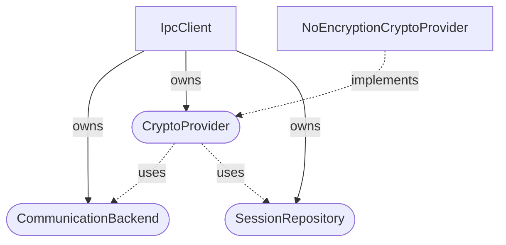
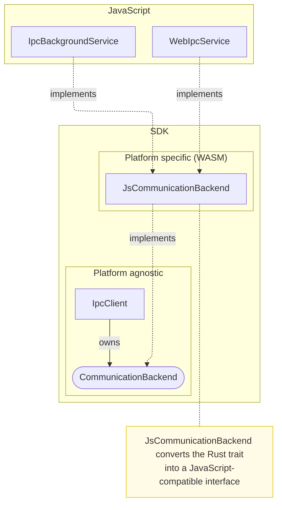
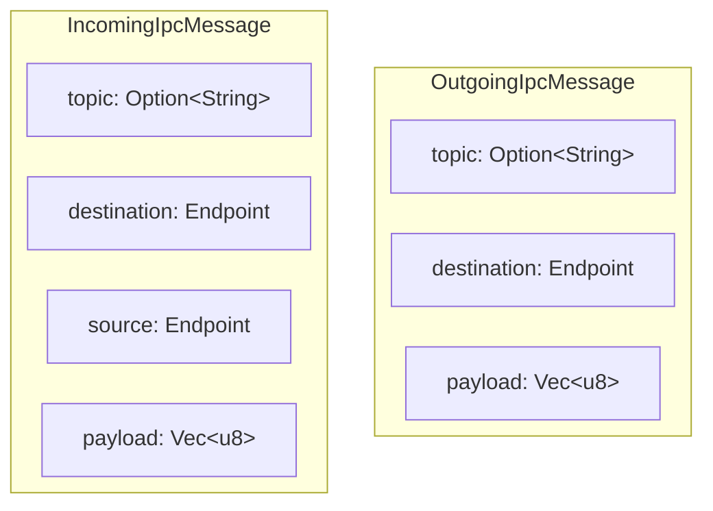
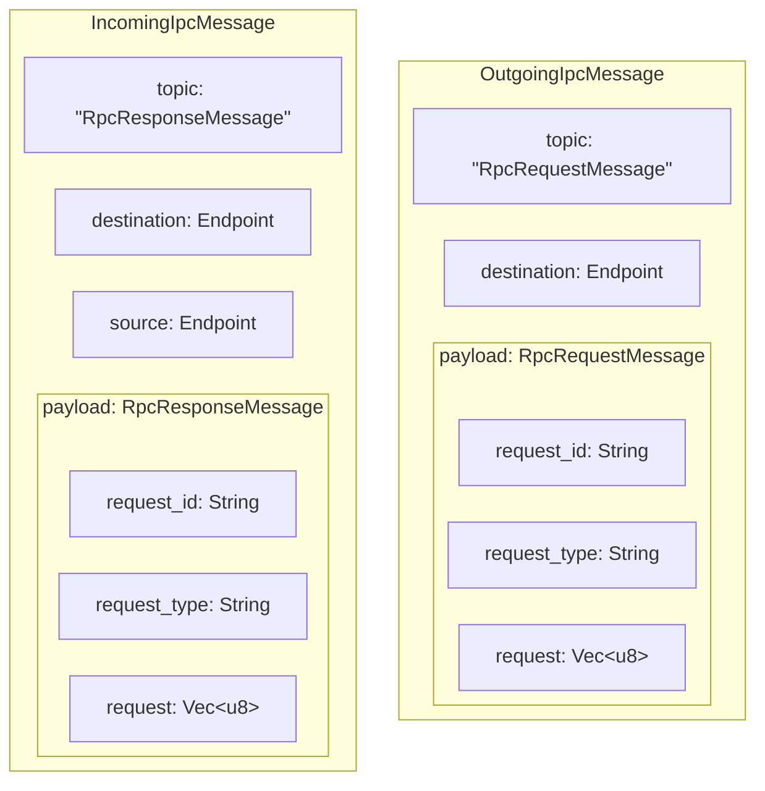

# Inter-Process Communication (IPC)

Bitwarden uses IPC to allow communication between and within certain parts of our clients. Examples
of IPC within a client include communication to and from the background script/service worker in the
browser extension and the main and renderer processes in the desktop application. IPC is also used
to allow communication between different clients, such as the browser extension and the desktop
application, to enable features like unlocking the extension using biometric authentication.

Bitwarden now has a generic framework for IPC provided in our
[SDK](https://github.com/bitwarden/sdk-internal). This framework is used to provide a common
interface for IPC across all clients. The framework is designed to be cross-platform and can be used
in any client that needs to communicate with another process.

## Usage

Please refer to the code documentation for more information on how to use the IPC framework:

- [`IpcClient` in the SDK](https://sdk-api-docs.bitwarden.com/bitwarden_ipc/struct.IpcClient.html)
- [`IpcService` in the TypeScript clients](https://github.com/bitwarden/clients/blob/main/libs/common/src/platform/ipc/ipc.service.ts)

## Availability

When fully rolled out, an initialized `IpcClient` will be available in all TypeScript clients
through the `IpcService`, and in the SDK through the `BitwardenClient`. The framework is available
in the background script/service worker of the browser extension and the web vault. Due to the
complex infrastructure required to run the framework, it is not recommended for use in smaller
processes like content scripts or macOS extensions.

For more up-to-date information on the availability of the IPC please refer to the source code.

## Architecture

The IPC framework is split into two main parts:

### Platform-agnostic

The platform-agnostic parts of the IPC framework are written in Rust and are responsible for the
high-level logic of the IPC communication. This includes the serialization and deserialization of
messages, as well as the encryption and decryption of messages. They depend on the platform-specific
parts to integrate with the underlying platform's IPC mechanisms.

### Platform-specific

The platform-specific parts of the IPC framework are written in different languages and are
responsible for the low-level communication between the processes. This includes the actual sending
and receiving of messages, persisting cryptographic sessions, as well as any other platform-specific
details of the IPC communication. Below is an illustration of the platform-specific implementation
for the WebAssembly (WASM) platform, which uses JavaScript to implement how messages are sent and
received:

## Security

The IPC framework is designed with security in mind. Every message sent between processes is
converted to a `Vec<u8>` representation and encrypted using a `CryptoProvider` before being sent
over the communication channel. This ensures that messages are not sent in plain text and are
protected from eavesdropping or tampering. For consumers of the framework the encryption is
completely transparent, as the framework handles the encryption and decryption of messages
automatically.

The framework also supports session management, allowing clients to securely store and retrieve
cryptographic sessions. This is useful to avoid having to re-establish shared secrets or keys
between processes every time they communicate. The session management is handled by the
`SessionRepository` trait, and is implemented by the platform-specific parts of the IPC framework.
`CryptoProvider`s have full access to the `CommunicationBackend` which allows them to send and
receive their own messages over the communication channel to establish and maintain sessions. These
messages can be completely separate from the actual IPC data messages and might be completely
transparent to the consumer of the framework.

## Usage patterns

The IPC framework provides a simple interface for sending and receiving messages between processes.
It supports two main communication patterns:

### Publish / Subscribe

Allows consumers to subscribe to specific topics and receive messages published to those topics. It
is useful for scenarios where multiple consumers need to receive the same message, such as
notifications or updates, or for fire-and-forget scenarios where the sender does not need to receive
a response. Consumers can subscribe to the raw data or a specific type of message, and the framework
will handle the serialization and deserialization of the messages, as long as the type implements
the appropriate `serde` traits.

### Request / Response

Allows a consumer to send a request to a producer and receive a response. It is useful for scenarios
where a consumer needs to request specific information or perform an action, such as authentication
or data retrieval. The framework handles the serialization and deserialization of the messages, as
long as the type implements the appropriate `serde` traits.

## Message format

The IPC framework uses a simple message format that, while not formally defined, is designed to be
flexible and extensible. Each message consists of a topic, a destination, and a payload. The topic
is a string that identifies the message, the destination is an enum that specifies the target of the
message, and the payload is a `Vec<u8>` that contains the serialized data. The topic allows messages
to be categorized and filtered, while the destination allows messages to be sent to specific
consumers or processes. The payload contains the actual data being sent, and can be manually
assigned or automatically serialized by the framework.

When the framework returns a message to the consumer it will also contain a source, which represents
where the current process received the message from. This can be used to determine the origin of the
message and can be useful for determining trust. Since the field is added by the receiver you can
assume that it is correct and trustworthy.

The top-level encoding and decoding of messages is handled by the `CommunicationBackend` trait and
is not formalized by the framework itself. Instead, it is left to the platform-specific
implementations to define how messages are sent across the wire. This allows the framework to be
flexible and adaptable to different platforms and use cases, while still providing a consistent
interface for consumers.

### Request / Response

The request / response functionality is built on top of the publish / subscribe message format by
using a hard-coded topic reserved for RPC (Remote Procedure Call) messages. On receipt of a request
message, the framework will automatically decode the payload as an `RpcRequestMessage` which
contains additional metadata about the request, such as the request identifier, type, and payload.
The type is used to determine which handler to call for the request, and the payload is the actual
data being sent in the request. The framework will then serialize the response as an
`RpcResponseMessage` and send it back to the consumer using a topic reserved for responses. The
response message will contain the request identifier, type, and payload, allowing the framework to
match the response with the original request and handle it accordingly.

