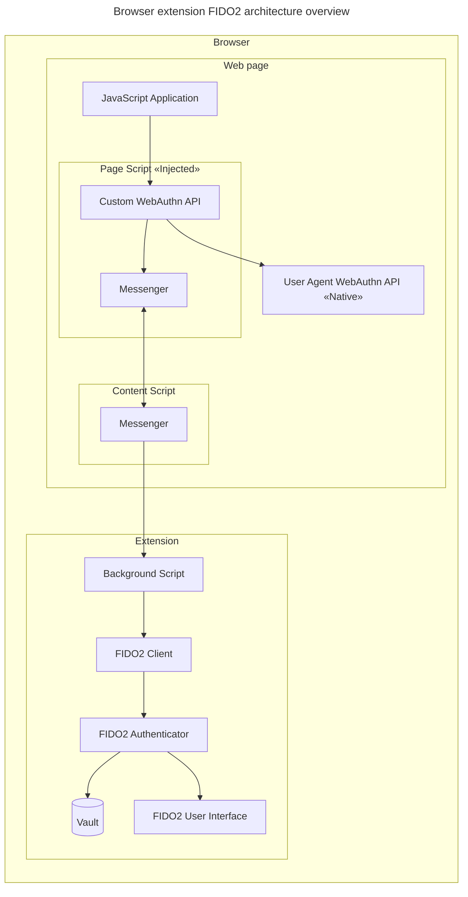

# Browser extension

Bitwarden supports passkeys in all browser by implementing the WebAuthn API. The browser does not
need to support WebAuthn natively, the extension will polyfill if necessary, effectively adding
support for passkeys to any browser.

## Compatibility

There are currently no browser APIs that allow extensions to provide passkeys alongside the
browser's native implementation. This means that the only way an extension can provide passkeys is
by completely replacing the native implementation with its own. This is done by injecting a script
into the page that replaces the native implementation with the extension's implementation. In
practice, this is done by reassigning the `navigator.credentials.create` and
`navigator.credentials.get` methods.

To avoid implementing support for the entire FIDO2 ecosystem (hardware keys, CaBLE, etc.), the
extension retains the ability to trigger the native implementation (usually referred to as a
"fallback"), if the user chooses to not proceed with Bitwarden. In practice this is done by storing
references to the native functions in separate variables before reassigning.

## Architecture

Bitwarden implements a simplified version of the FIDO2 architecture based solely on the
[WebAuthn API specification](https://www.w3.org/TR/webauthn-3/). This is because the embedded
`FIDO2 Authenticator` will never be used in a standalone context and does not need to support the
full CTAP2 protocol.

:::info

`FIDO2 Client` is analogous to `WebAuthn Client` in the [FIDO2 Overview](../..#diagram), but is
named differently due to naming conflicts with the RP implementation also in the Bitwarden codebase.
See [Naming Convention](../../naming-convention) for more information.

:::

## Discoverability

The browser extension respects discoverability requirements from RPs by saving a client-side
discoverability flag in the passkey metadata (called `discoverable`). If this flag is set to
`false`, the RP will need to provide the `credentialId` to Bitwarden in order to perform an
assertion. If the flag is set to `true` the passkey will be discoverable using the `rpId`. The
`userHandle` is always returned if available.

## User presence

The browser extension always requires user presence. This means that Bitwarden will never respond to
a request without guaranteeing that the user has first interacted with their device somehow, by
confirming or denying the request.

## User verification

The browser extension does not yet fully support user verification. This is a limitation of the
existing user verification services. Full support for user verification will be added soon, via the
user's unlock methods, such as a PIN or biometric unlock, with the master password as a fallback.
