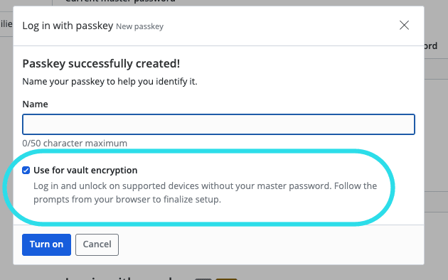

# Passkeys for Decryption

When a user logs into their Bitwarden vault, two related but distinct operations take place -
authentication and decryption.

When using a master password, the password itself serves both of these purposes - authenticating the
user by verifying the password was entered correctly, and allowing decryption of your data through
the derivation of an encryption key from the password. For more detail on this, see the
[Bitwarden Security Whitepaper](https://bitwarden.com/help/bitwarden-security-white-paper/).

Passkeys inherently provide the mechanism for authentication. The `prf` extension introduced in the
WebAuthn [specification](https://w3c.github.io/webauthn/#prf-extension) provides the framework
necessary for passkeys to be used for decryption as well.

## What is PRF?

At the most abstract level, account encryption and decryption requires that the user's symmetric key
be encrypted ("protected") with another key that is available only to the client. For master
password-based decryption, this is done with the master key, derived through a key derivation
function from the master password.

In order to use a passkey for account decryption on login, we need such a key available on the
passkey, with which we can encrypt and decrypt the user's symmetric key. Fortunately, the `prf`
extension to the WebAuthn spec provides exactly this functionality.

The `prf` extension, which is built upon the `hmac-secret` CTAP2 extension, provides the
specification by which credential assertion can return the output from a pseudo-random function
(hence "PRF") that is unique to each credential on the authenticator. The Bitwarden relying party
can leverage this to obtain a unique, cryptographically-secure key, with which it can encrypt and
decrypt the user's symmetric key - analogous to the derived master key when using a master password
to log in.

## How does Bitwarden use the PRF key?

### During passkey registration

When a passkey is registered for use with Bitwarden, we interrogate the attestation response to see
if PRF is supported. If so, we allow the user to choose to enable encryption.

If the user chooses to enable encryption, we request an assertion from the authenticator, which will
provide the key. (This is why you may be prompted multiple times to provide user verification when
registering a PRF-capable passkey.)

The 32-byte key returned from the authenticator is then stretched to a 64-byte two-part key using
HKDF. The first 32 bytes will serve as the AES-256 encryption key and the second 32 bytes will serve
as a message authentication code (MAC).

Once we have this encryption key, we can encrypt the user's symmetric key as follows:

    1. Create an RSA public/private key pair, specific to this credential.
    2. Encrypt the RSA private key with the encryption key.
    3. Encrypt the user's symmetric key with the RSA public key.

The PRF-encrypted private key, the public key-encrypted encryption key, and the RSA public key are
persisted to the server and associated with the registered passkey. Note that the PRF key does
**not** leave the client at any point, to ensure zero-knowledge encryption.

:::tip Why an RSA key pair?

Put simply: key rotation. In order to support
[encryption key rotation](https://bitwarden.com/help/account-encryption-key/#rotate-your-encryption-key),
a user must be able to re-encrypt the symmetric key for all registered passkeys without gaining
access to the PRF keys for each registered credential. The use of a public/private keypair allows a
user to re-encrypt the new symmetric key with the public key, with the assurance that only the
holder of the private key can decrypt it.

:::

### During passkey login

When a user chooses to authenticate with a passkey, we request an assertion from the authenticator.
If the passkey is registered for encryption, and the
[platform supports it](prf.md/#what-if-i-am-prompted-for-my-master-password-when-using-a-prf-enabled-passkey),
the Bitwarden client will receive the PRF key in the assertion response.

The client will then submit the assertion (without the PRF key) to the server to perform
authentication.

If the server is able to validate the assertion, the user is authenticated, and as a part of the
authentication response the PRF-encrypted key data is returned to the client:

    - The PRF-encrypted private key
    - The public key-encrypted user symmetric key

In order to decrypt the vault data, the PRF key from the credential is used to decrypt the private
key, and this private key is used to decrypt the user's symmetric key. The symmetric key can then be
used for vault decryption.

## Tips for using your passkey for decryption

### What if I am prompted for my master password when using a PRF-enabled passkey?

Support for PRF varies greatly across authenticators and platforms. Only when all members of the
WebAuthn attestation ceremony support PRF can Bitwarden obtain the key necessary for decryption. If
you registered a passkey with PRF support, but you are prompted for your master password on login,
make sure you are using the same operating system and browser that you used during registration.
