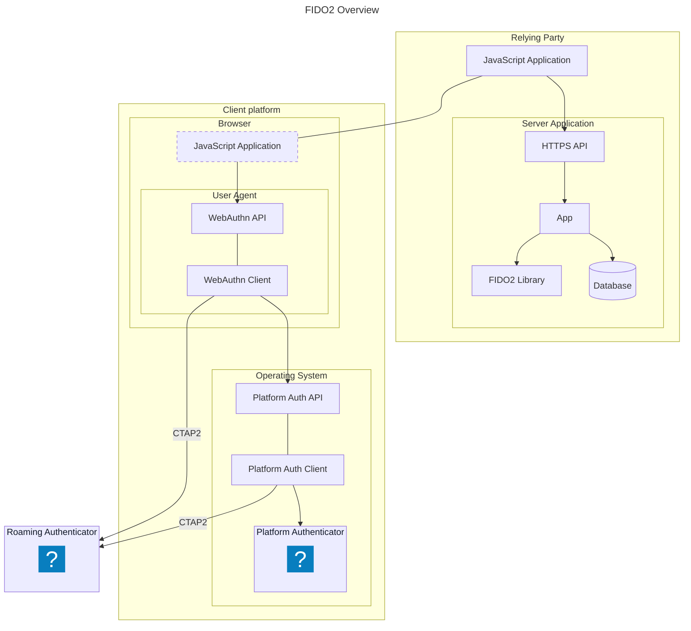

# FIDO2 and Passkeys

:::info

For more information on how Bitwarden implements FIDO2, see [Implementations](./implementations).

:::

## What are passkeys?

Passkeys are another name given to the credentials defined by the two specifications:

- [World Wide Web Consortium’s (W3C) Web Authentication (WebAuthn)](https://www.w3.org/TR/webauthn-3/)
- [FIDO Alliance’s Client-to-Authenticator Protocol v2 (CTAP2)](https://fidoalliance.org/specs/fido-v2.1-ps-20210615/fido-client-to-authenticator-protocol-v2.1-ps-20210615.html)

which together make up what is usually referred to as the FIDO2 standard.

At its core, FIDO2 is based on public-key cryptography, where each passkey contains a unique
public/private key-pair. The public key is given to an application during the initial credential
creation operation, while the private key is never shared. The private key is then used in all
subsequent requests to sign challenges from the application to prove ownership of the key.

## Architecture

FIDO2 can be broken down into two main components: WebAuthn and CTAP2. WebAuthn is a web standard
that allows for the creation and use of passkeys through a well-defined JavaScript interface, and
CTAP2 is a protocol for communicating with external authenticators (also know as roaming
authenticators), such as hardware security keys (e.g. YubiKeys).

The interaction between these two components can vary depending on the use case:

- When using platform credentials, the interaction is always between the browser and the platform
  authenticator (i.e. the operating system) using native APIs.
- When using roaming authenticators, the interaction can be either:
  - Mediated by the platform, or
  - Directly between the browser and the authenticator using e.g. USB/HID or BLE protocols.

### Diagram

The following diagram shows a generic overview of the FIDO2 architecture. The diagram is a
high-level overview and does not include any specific details about how Bitwarden implements FIDO2.

:::info

The `JavaScript Application` is part of the `Relying Party` but executed on the client platform by
the browser.

:::

