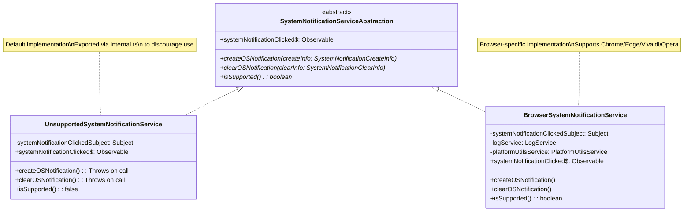

# System Notifications Architecture

## Overview

The system notifications architecture provides a platform-agnostic way to create and manage system
notifications across different environments (browser extensions, desktop, etc.). The design follows
a clean abstraction pattern that separates the interface from platform-specific implementations.

## Core Components

### 1. Abstraction Layer

The `SystemNotificationServiceAbstraction` interface defines the contract that all notification
implementations must follow. This includes:

- Creating notifications
- Clearing notifications
- Handling notification click events
- Checking platform support

### 2. Platform-Specific Implementations

Different platforms implement the abstraction layer in their own way. For example:

- Chrome Extension implementation (`BrowserSystemNotificationService`)
- Desktop implementation
- Web implementation

### 3. Event System

The architecture uses RxJS Observables to handle notification events in a reactive way, allowing
components to subscribe to notification interactions. This currently hooks into the chrome extension
api button onClick listener. We listen for both click events to the OS notification itself and the
buttons that can be optionally placed in the notification.

## Architecture Diagram



## Key Features

1. **Platform Independence**: The abstraction layer allows for different implementations while
   maintaining a consistent API.
2. **Event Handling**: Uses RxJS for reactive event handling of notification interactions.
3. **Button Support**: Supports custom buttons in notifications with predefined locations and
   actions.
4. **Leverages DI**: Dependency injection is used to only use function services where we build them
   out.

## Usage Example

```typescript
// Creating a notification
const notificationService: SystemNotificationServiceAbstraction =
  new ChromeExtensionSystemNotificationService();

await notificationService.createOSNotification({
  id: "unique-id",
  type: "authRequestNotification",
  title: "Authentication Request",
  body: "Please approve this authentication request",
  buttons: [{ title: "Approve" }, { title: "Deny" }],
});

// Subscribing to notification events
notificationService.systemNotificationClicked$.subscribe((event) => {
  if (event.buttonIdentifier === ButtonLocation.FirstOptionalButton) {
    // Handle approve
  } else if (event.buttonIdentifier === ButtonLocation.SecondOptionalButton) {
    // Handle deny
  }
});
```

## Button Locations

We want to define a general pattern for knowing which button is clicked. This was implemented only
for the chrome notification api. If the button values need to change to better support other browser
notification button api's it should fit within this loosely structured enumeration of values.

The system defines specific button locations for consistent handling:

- `FirstOptionalButton` (0): First custom button
- `SecondOptionalButton` (1): Second custom button
- `NotificationButton` (2): Main notification body click
