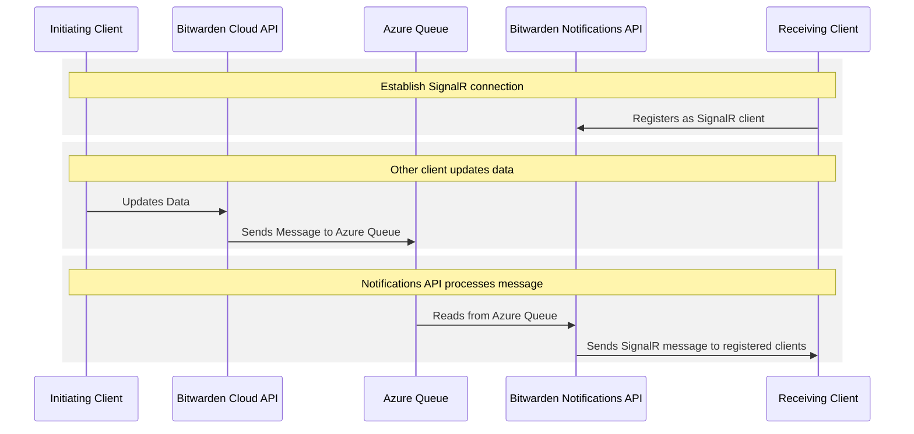
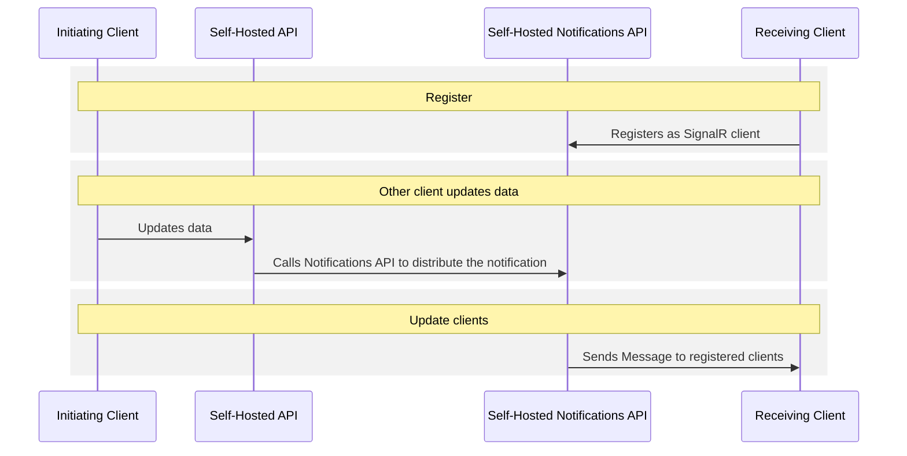

# Other Client Push Notifications

For non-mobile clients, push notifications are handled with
[SignalR](https://learn.microsoft.com/en-us/aspnet/core/signalr/introduction), Microsoft's library
for real-time client communication over WebSockets.

## Server implementations

When real-time changes must be communicated to the registered non-mobile clients, it is the
responsibility of the Bitwarden API for their configured server instance to distribute the
information. The server abstracts this with the
[`IPushNotificationService`](https://github.com/bitwarden/server/blob/main/src/Core/Services/IPushNotificationService.cs)
interface, which has different implementations based on whether the instance is cloud-hosted or
self-hosted.

### Cloud implementation

For the Bitwarden Cloud implementation, the API uses the
[`AzureQueuePushNotificationService`](https://github.com/bitwarden/server/blob/main/src/Core/Services/Implementations/AzureQueuePushNotificationService.cs)
implementation. This service submits the push notification to an Azure Queue in the Bitwarden Azure
tenant.

The Bitwarden Cloud Notifications API includes a queue processor - the
[`AzureQueueHostedService`](https://github.com/bitwarden/server/blob/main/src/Notifications/AzureQueueHostedService.cs) -
that monitors the Azure Queue for pending push notifications. The processor pulls messages from the
queue and sends them to all clients registered for the initiating user or organization.

### Self-hosted implementation

For a self-hosted implementation, the push notification architecture differs because there is no
Azure Queue available.

Self-hosted instances have a slightly simplified flow since they don't have access to Azure
resources like Azure Queues. The overall flow is still the same as the cloud-hosted implementation,
with the exception that instead of buffering the notifications using a Azure Queue, the self-hosted
Bitwarden API submits the notifications directly to the self-hosted Notifications API.

## Client registration

When a non-mobile client starts and the user is authenticated, it initiates a WebSocket connection
to the Notification service (`/notifications/hub`) for their configured server instance. This
request includes their JWT `bearer` token, which is used to retrieve the user ID, which in turn
determines which notifications the user receives.
