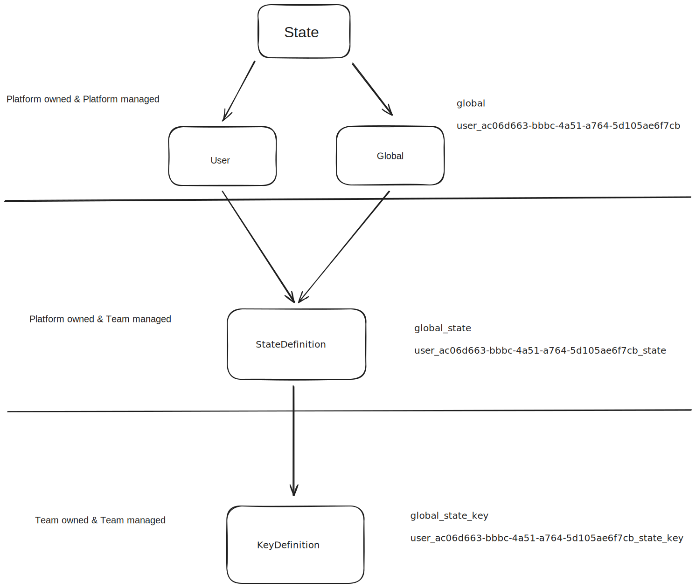

# State Provider Framework

The state provider framework was designed for the purpose of allowing state to be owned by domains
but also to enforce good practices, reduce boilerplate around account switching, and provide a
trustworthy observable stream of that state.

## APIs

- [Storage definitions](#storage-definitions)
  - [`StateDefinition`](#statedefinition)
  - [`KeyDefinition` & `UserKeyDefinition`](#keydefinition-and-userkeydefinition)
- [`StateProvider`](#stateprovider)
- [`Update`](#updating-state-with-update)
- [`GlobalState<T>`](#globalstatet)
- [`SingleUserState<T>`](#singleuserstatet)
- [`ActiveUserState<T>`](#activeuserstatet)

### Storage definitions

In order to store and retrieve data, we need to have constant keys to reference storage locations.
This includes a storage medium (disk or memory) and a unique key. `StateDefinition` and
`KeyDefinition` classes allow for reasonable reuse of partial namespaces while also enabling
expansion to precise keys. They exist to help minimize the potential of overlaps in a distributed
storage framework.

:::warning

Once you have created the definitions you need to take extreme caution when changing any part of the
namespace. If you change the name of a `StateDefinition` pointing at `"disk"` without also migrating
data from the old name to the new name you will lose data. Data pointing at `"memory"` can have its
name changed.

:::

#### `StateDefinition`

:::note

Secure storage is not currently supported as a storage location in the State Provider Framework. For
now, don't migrate data that is stored in secure storage but please contact the Platform team when
you have data you wanted to migrate so we can prioritize a long-term solution. If you need new data
in secure storage, use `StateService` for now.

:::

`StateDefinition` is a simple API but a very core part of making the State Provider Framework work
smoothly. It defines a storage location and top-level namespace for storage. Teams will interact
with it only in a single `state-definitions.ts` file in the
[`clients`](https://github.com/bitwarden/clients) repository. This file is located under Platform
team code ownership but teams are expected to create edits to it. A team will edit this file to
include a line such as:

```typescript
export const MY_DOMAIN_DISK = new StateDefinition("myDomain", "disk");
```

The first argument to the `StateDefinition` constructor is expected to be a human readable,
camelCase-formatted name for your domain or state area. The second argument will either be the
string literal `"disk"` or `"memory"` dictating where all the state using this `StateDefinition`
should be stored.

The Platform team is responsible for reviewing all new and updated entries in this file and makes
sure that there are no duplicate entries containing the same state name and state location. Teams
are able to have the same state name used for both `"disk"` and `"memory"` locations. Tests are
included to ensure this uniqueness and core naming guidelines so teams can ensure a review for a new
`StateDefinition` entry is done promptly and with very few surprises.

##### Client-specific storage locations

An optional third parameter to the `StateDefinition` constructor is provided if you need to specify
client-specific storage location for your state.

This will most commonly be used to handle the distinction between session and local storage on the
web client. The default `"disk"` storage for the web client is session storage, and local storage
can be specified by defining your state as:

```typescript
export const MY_DOMAIN_DISK = new StateDefinition("myDomain", "disk", { web: "disk-local" });
```

#### `KeyDefinition` and `UserKeyDefinition`

`KeyDefinition` and `UserKeyDefinition` build on the [`StateDefinition`](#statedefinition),
specifying a single element of state data within the `StateDefinition`.

The framework provides both `KeyDefinition` and `UserKeyDefinition` for teams to use. Use
`UserKeyDefinition` for state scoped to a user and `KeyDefinition` for user-independent state. These
will be consumed via the [`ActiveUserState<T>`](#activeuserstatet) or
[`SingleUserState<T>`](#singleuserstatet) within your consuming services and components. The
`UserKeyDefinition` extends the `KeyDefinition` and provides a way to specify how the state will be
cleaned up on specific user account actions.

`KeyDefinition`s and `UserKeyDefinition`s can also be instantiated in your own team's code. This
might mean creating it in the same file as the service you plan to consume it or you may want to
have a single `key-definitions.ts` file that contains all the entries for your team. Some example
instantiations are:

```typescript
const MY_DOMAIN_DATA = new UserKeyDefinition<MyState>(MY_DOMAIN_DISK, "data", {
  // convert to your data from serialized representation `{ foo: string }` to fully-typed `MyState`
  deserializer: (jsonData) => MyState.fromJSON(jsonData),
  clearOn: ["logout"], // can be lock, logout, both, or an empty array
});

// Or if your state is an array, use the built-in helper
const MY_DOMAIN_DATA: UserKeyDefinition<MyStateElement[]> = UserKeyDefinition.array<MyStateElement>(
  MY_DOMAIN_DISK,
  "data",
  {
    deserializer: (jsonDataElement) => MyState.fromJSON(jsonDataElement), // provide a deserializer just for the element of the array
  },
  {
    clearOn: ["logout"],
  },
);

// record
const MY_DOMAIN_DATA: UserKeyDefinition<Record<string, MyStateElement>> =
  KeyDefinition.record<MyStateValue>(MY_DOMAIN_DISK, "data", {
    deserializer: (jsonDataValue) => MyState.fromJSON(jsonDataValue), // provide a deserializer just for the value in each key-value pair
    clearOn: ["logout"],
  });
```

The arguments for defining a `KeyDefinition` or `UserKeyDefinition` are:

| Argument          | Usage                                                                                                                                                                                             |
| ----------------- | ------------------------------------------------------------------------------------------------------------------------------------------------------------------------------------------------- |
| `stateDefinition` | The `StateDefinition` to which that this key belongs                                                                                                                                              |
| `key`             | A human readable, camelCase-formatted name for the key definition. This name should be unique amongst all other `KeyDefinition`s or `UserKeyDefinition`s that consume the same `StateDefinition`. |
| `options`         | An object of type [`KeyDefinitionOptions`](#key-definition-options) or [`UserKeyDefinitionOptions`](#key-definition-options), which defines the behavior of the key.                              |

:::warning

It is the responsibility of the team to ensure the uniqueness of the `key` within a
`StateDefinition`. As such, you should never consume the `StateDefinition` of another team in your
own key definition.

:::

##### Key Definition Options

| Option           | Required?                    | Usage                                                                                                                                                                                                                                                                                                                                                                                                                                                                                                                                                                                                |
| ---------------- | ---------------------------- | ---------------------------------------------------------------------------------------------------------------------------------------------------------------------------------------------------------------------------------------------------------------------------------------------------------------------------------------------------------------------------------------------------------------------------------------------------------------------------------------------------------------------------------------------------------------------------------------------------- |
| `deserializer`   | Yes                          | Takes a method that gives you your state in it's JSON format and makes you responsible for converting that into JSON back into a full JavaScript object, if you choose to use a class to represent your state that means having its prototype and any method you declare on it. If your state is a simple value like `string`, `boolean`, `number`, or arrays of those values, your deserializer can be as simple as `data => data`. But, if your data has something like `Date`, which gets serialized as a string you will need to convert that back into a `Date` like: `data => new Date(data)`. |
| `cleanupDelayMs` | No                           | Takes a number of milliseconds to wait before cleaning up the state after the last subscriber has unsubscribed. Defaults to 1000ms.                                                                                                                                                                                                                                                                                                                                                                                                                                                                  |
| `clearOn`        | Yes, for `UserKeyDefinition` | An additional parameter provided for `UserKeyDefinition` **only**, which allows specification of the user account `ClearEvent`s that will remove the piece of state from persistence. The available values for `ClearEvent` are `logout`, `lock`, or both. An empty array should be used if the state should not ever be removed (e.g. for settings).                                                                                                                                                                                                                                                |

### `StateProvider`

`StateProvider` is an injectable service that includes 4 methods for getting state. These four
methods are helpers for invoking their more modular siblings `ActiveStateProvider.get`,
`SingleUserStateProvider.get`, `GlobalStateProvider.get`, and `DerivedStateProvider`. These siblings
can all be injected into your service as well. If you prefer thin dependencies over the slightly
larger changeset required, you can absolutely make use of the more targeted providers.
`StateProvider` has the following type definition (aliasing the targeted providers):

```typescript
interface StateProvider {
  getActive<T>(keyDefinition: KeyDefinition<T>): ActiveUserState<T>;
  getUser<T>(userId: UserId, keyDefinition: KeyDefinition<T>): SingleUserState<T>;
  getGlobal<T>(keyDefinition: KeyDefinition<T>): GlobalState<T>;
  getDerived<TFrom, TTo, TDeps>(
    parentState$: Observable<TFrom>,
    deriveDefinition: DeriveDefinition<TFrom, TTo, TDeps>,
    dependenciess: TDeps,
  );
}
```

A very common practice will be to inject `StateProvider` in your service's constructor and call
`getActive`, `getGlobal`, or both in your constructor and then store private properties for the
resulting `ActiveUserState<T>` and / or `GlobalState<T>`. It's less common to need to call `getUser`
in the constructor because it will require you to know the `UserId` of the user you are attempting
to edit. Instead you will add `private` to the constructor argument injecting `StateProvider` and
instead use it in a method like in the below example.

```typescript
import { FOLDERS_USER_STATE, FOLDERS_GLOBAL_STATE } from "../key-definitions";

class FolderService {
  private folderGlobalState: GlobalState<GlobalFolderState>;
  private folderUserState: ActiveUserState<Record<string, FolderState>>;

  folders$: Observable<Folder[]>;

  constructor(private stateProvider: StateProvider) {
    this.folderUserState = stateProvider.getActive(FOLDERS_USER_STATE);
    this.folderGlobalState = stateProvider.getGlobal(FOLDERS_GLOBAL_STATE);

    this.folders$ = this.folderUserState.pipe(
      map((foldersRecord) => this.transform(foldersRecord)),
    );
  }

  async clear(userId: UserId): Promise<void> {
    await this.stateProvider.getUser(userId, FOLDERS_USER_STATE).update((state) => null);
  }
}
```

### Updating state with `update`

The update method has options defined as follows:

```typescript
{ActiveUser|SingleUser|Global}State<T> {
  // ... rest of type left out for brevity
  update<TCombine>(updateState: (state: T, dependency: TCombine) => T, options?: StateUpdateOptions);
}

type StateUpdateOptions = {
  shouldUpdate?: (state: T, dependency: TCombine) => boolean;
  combineLatestWith?: Observable<TCombine>;
  msTimeout?: number
}
```

#### Using `shouldUpdate` to filter unnecessary updates

We recommend using `shouldUpdate` when possible. This will avoid unnecessary I/O for redundant
updates and avoid an unnecessary emission of `state$`.

A common use of this would be to avoid setting state to `null` when it is already `null`. The
`shouldUpdate` method gives you in its first parameter the value of state before any change has been
made to it and the dependency you have, optionally, provided through `combineLatestWith`. To avoid
setting `null` to your state when it's already `null` you could call `update` like below:

```typescript
await myUserState.update(() => null, { shouldUpdate: (state) => state != null });
```

The `combineLatestWith` option can be useful when updates to your state depend on the data from
another stream of data. In
[this example](https://github.com/bitwarden/clients/blob/2eebf890b5b1cfbf5cb7d1395ed921897d0417fd/libs/common/src/auth/services/account.service.ts#L88-L107)
you can see how we don't want to set a user ID to the active account ID unless that user ID exists
in our known accounts list. This can be preferred over the more manual implementation like such:

```typescript
const accounts = await firstValueFrom(this.accounts$);
if (accounts?.[userId] == null) {
  throw new Error();
}
await this.activeAccountIdState.update(() => userId);
```

The use of the `combineLatestWith` option is preferred because it fixes a couple subtle issues.
First, the use of `firstValueFrom` with no `timeout`. Behind the scenes we enforce that the
observable given to `combineLatestWith` will emit a value in a timely manner, in this case a
`1000ms` timeout but that number is configurable through the `msTimeout` option. The second issue it
fixes is that we don't guarantee that your `updateState` function is called the instant that the
`update` method is called. We do however promise that it will be called before the returned promise
resolves or rejects. This may be because we have a lock on the current storage key. No such locking
mechanism exists today but it may be implemented in the future. As such, it is safer to use
`combineLatestWith` because the data is more likely to retrieved closer to when it needs to be
evaluated.

### `GlobalState<T>`

`GlobalState<T>` has an incredibly similar API surface as `ActiveUserState<T>` except it targets
global-scoped storage and does not emit an update to `state$` when the active user changes, only
when the stored value is updated.

### `SingleUserState<T>`

`SingleUserState<T>` behaves very similarly to `GlobalState<T>` where neither will react to active
user changes and you instead give it the user you want it to care about up front, which is publicly
exposed as a `readonly` member.

Updates to `SingleUserState` or `ActiveUserState` handling the same `KeyDefinition` will cause each
other to emit on their `state$` observables if the `userId` handled by the `SingleUserState` happens
to be active at the time of the update.

### `ActiveUserState<T>`

:::warning

`ActiveUserState` has race condition problems. Do not use it for updates and consider transitioning
your code to SingleUserState instead. [Read more](#should-i-use-activeuserstate)

:::

`ActiveUserState<T>` is an object to help you maintain and view the state of the currently active
user. If the currently active user changes, like through account switching, the data this object
represents will change along with it. Gone is the need to subscribe to
`StateService.activeAccountUnlocked$`. You can see the type definition of the API on
`ActiveUserState<T>` below:

```typescript
interface ActiveUserState<T> {
  state$: Observable<T>;
}
```

The `state$` property provides you with an `Observable<T>` that can be subscribed to.
`ActiveUserState<T>.state$` will emit for the following reasons:

- The active user changes.
- The chosen storage location emits an update to the key defined by `KeyDefinition`. This can occur
  for any reason including:
  - A `SingleUserState<T>` method pointing at the same `UserKeyDefinition` as `ActiveUserState` and
    pointing at the user that is active that had `update` called
  - Someone updates the key directly on the underlying storage service _(please don't do this)_

## Testing

Testing business logic with data and observables can sometimes be cumbersome. To help make that a
little easier there are a suite of helpful "fakes" that can be used instead of traditional "mocks".
Now instead of calling `mock<StateProvider>()` into your service you can instead use
`new FakeStateProvider()`.

`FakeStateProvider` exposes the specific provider's fakes as properties on itself. Each of those
specific providers gives a method `getFake` that allows you to get the fake version of state that
you can control and `expect`.

## FAQ

### Do I need to have my own in-memory cache?

If you previously had a memory cache that exactly represented the data you stored on disk (not
decrypted for example), then you likely don't need that anymore. All the `*State` classes maintain
an in memory cache of the last known value in state for as long as someone is subscribed to the
data. The cache is cleared after 1000ms of no one subscribing to the state though. If you know you
have sporadic subscribers and a high cost of going to disk you may increase that time using the
`cleanupDelayMs` on `KeyDefinitionOptions`.

### I store my data as a Record / Map but expose it as an array -- what should I do?

Give `KeyDefinition<T>` generic the record shape you want, or even use the static `record` helper
method. Then to convert that to an array that you expose just do a simple
`.pipe(map(data => this.transform(data)))` to convert that to the array you want to expose.

### Why KeyDefinitionLike

`KeyDefinitionLike` exists to help you create a frozen-in-time version of your `KeyDefinition`. This
is helpful in state migrations so that you don't have to import something from the greater
application which is something that should rarely happen.

### When does my deserializer run?

The `deserialier` that you provide in the `KeyDefinitionOptions` is used whenever your state is
retrieved from a storage service that stores its data as JSON. All disk storage services serialize
data into JSON but memory storage differs in this area across platforms. That's why it's imperative
to include a high quality JSON deserializer even if you think your object will only be stored in
memory. This can mean you might be able to drop the `*Data` class pattern for your code. Since the
`*Data` class generally represented the JSON safe version of your state which we now do
automatically through the `Jsonify<T>` given to your in your `deserializer` method.

### Should I use `ActiveUserState`?

Probably not, `ActiveUserState` is either currently in the process of or already completed the
removal of its `update` method. This will effectively make it readonly, but you should consider
maybe not even using it for reading either. `update` is actively bad, while reading is just not as
dynamic of a API design.

Take the following example:

```typescript
private folderState: ActiveUserState<Record<string, Folder>>

renameFolder(folderId: string, newName: string) {
  // Get state
  const folders = await firstValueFrom(this.folderState.state$);
  // Mutate state
  folders[folderId].name = await encryptString(newName);
  // Save state
  await this.folderState.update(() => folders);
}
```

You can imagine a scenario where the active user changes between the read and the write. This would
be a big problem because now user A's folders was stored in state for user B. By taking a user id
and utilizing `SingleUserState` instead you can avoid this problem by passing ensuring both
operation happen for the same user. This is obviously an extreme example where the point between the
read and write is pretty minimal but there are places in our application where the time between is
much larger. Maybe information is read out and placed into a form for editing and then the form can
be submitted to be saved.

The first reason for why you maybe shouldn't use `ActiveUserState` for reading is for API
flexibility. Even though you may not need an API to return the data of a non-active user right now,
you or someone else may want to. If you have a method that takes the `UserId` then it can be
consumed by someone passing in the active user or by passing a non-active user. You can now have a
single API that is useful in multiple scenarios.

The other reason is so that you can more cleanly switch users to new data when multiple streams are
in play. Consider the following example:

```typescript
const view$ = combineLatest([
  this.folderService.activeUserFolders$,
  this.cipherService.activeUserCiphers$,
]).pipe(map(([folders, ciphers]) => buildView(folders, ciphers)));
```

Since both are tied to the active user, you will get one emission when first subscribed to and
during an account switch, you will likely get TWO other emissions. One for each, inner observable
reacting to the new user. This could mean you try to combine the folders and ciphers of two
accounts. This is ideally not a huge issue because the last emission will have the same users data
but it's not ideal, and easily avoidable. Instead you can write it like this:

```typescript
const view$ = this.accountService.activeAccount$.pipe(
  switchMap((account) => {
    if (account == null) {
      throw new Error("This view should only be viewable while there is an active user.");
    }

    return combineLatest([
      this.folderService.userFolders$(account.id),
      this.cipherService.userCiphers$(account.id),
    ]);
  }),
  map(([folders, ciphers]) => buildView(folders, ciphers)),
);
```

You have to write a little more code but you do a few things that might force you to think about the
UX and rules around when this information should be viewed. With `ActiveUserState` it will simply
not emit while there is no active user. But with this, you can choose what to do when there isn't an
active user and you could simple add a `first()` to the `activeAccount$` pipe if you do NOT want to
support account switching. An account switch will also emit the `combineLatest` information a single
time and the info will be always for the same account.

## Structure


