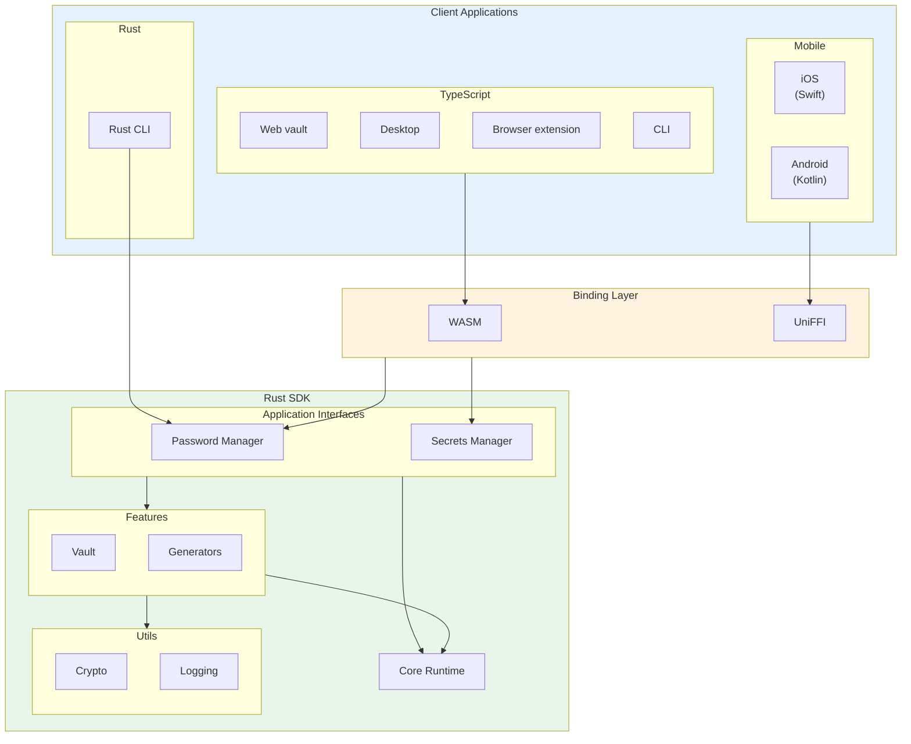

# SDK Architecture

The Bitwarden SDK is designed for internal use within Bitwarden and provides shared functionality
across all Bitwarden clients. It serves as the single source of truth for core business logic.
Written in Rust, the SDK is versatile and provides bindings for a variety of platforms, including
mobile clients (Kotlin and Swift) and web clients (JavaScript/TypeScript). The general aspiration is
to write as much code as possible once in the SDK and have it consumed by all clients, ensuring
feature parity and reducing duplication.

<Bitwarden>We have compiled a list of resources for learning Rust in a
[Confluence page](https://bitwarden.atlassian.net/wiki/spaces/DEV/pages/517898288/Rust+Learning+Resources).</Bitwarden>
For API documentation view the latest
[API documentation](https://sdk-api-docs.bitwarden.com/bitwarden/index.html) that also includes
internal private items.

## Architecture overview

## What belongs in the SDK

**The guiding principle: everything except presentational logic belongs in the SDK.**

The SDK should own all business logic that would otherwise be duplicated across clients. Client code
should be limited to UI rendering, platform-specific integrations, and calling SDK methods.

### SDK responsibility

| Layer             | Owned By | Examples                                     |
| ----------------- | -------- | -------------------------------------------- |
| Presentation      | Client   | UI components, navigation, platform gestures |
| Business Logic    | **SDK**  | Validation, transformations, calculations    |
| State Management  | **SDK**  | User state, vault data, sync coordination    |
| API Communication | **SDK**  | Request/response handling, serialization     |
| Cryptography      | **SDK**  | Encryption, decryption, key derivation       |
| Data Models       | **SDK**  | Domain objects, view models                  |

### Decision checklist

When implementing a feature, ask:

**Put it in the SDK if:**

- The logic will be used across multiple clients (web, mobile, desktop)
- It involves cryptographic operations or sensitive data handling
- It's business logic that should behave identically everywhere
- It doesn't depend on platform-specific UI frameworks

**Keep it in application code if:**

- It's purely presentational (rendering, animations, gestures)
- It requires platform-specific APIs with no cross-platform abstraction
