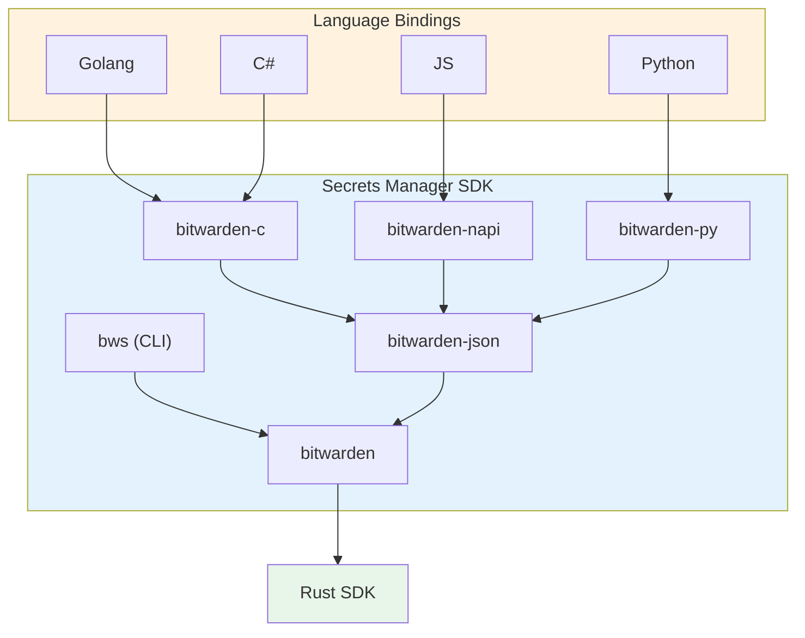

# Secrets Manager SDK

The [Secrets Manager SDK](https://github.com/bitwarden/sdk-sm) encompasses a sub-set of the
Bitwarden SDK designed for external use. The SDK is written in Rust and provides bindings for
multiple languages. For general binding concepts, see [Language bindings](language-bindings.md). For
getting started with the Secrets Manager SDK, see the
[setup guide](/getting-started/sdk/secrets-manager/).

The primary goal of the Secrets Manager SDK is to provide a **stable public API** that shields
external consumers from the churn of internal SDK APIs. While the internal SDK evolves rapidly to
support all Bitwarden clients, the SM SDK exposes a curated, backward-compatible surface.

## Architecture overview

## `bitwarden` crate

The [`bitwarden`](https://github.com/bitwarden/sdk-sm/tree/main/crates/bitwarden) crate is the entry
point for consumers and acts as a thin wrapper around the internal crates. It re-exports a curated
subset of functionality while containing very little logic itself. This indirection allows internal
APIs to change without breaking external consumers.

## Bindings

The Secrets Manager SDK provides bindings for multiple languages. Currently we utilize a mix of hand
written bindings for a C API, and generated bindings.

Many language bindings utilize the `bitwarden-c` crate that exposes a C API. This is then combined
with hand written bindings for the specific language. Since manually writing FFI bindings is time
consuming and difficult, a JSON-based API is provided by the `bitwarden-json` crate. This allows the
language bindings to simply contain three FFI functions, `init`, `run_command` and `free_memory`.
