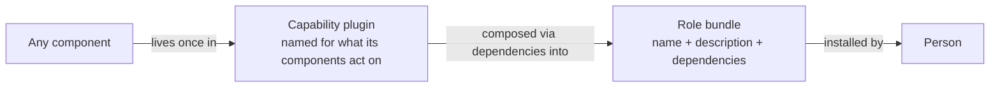
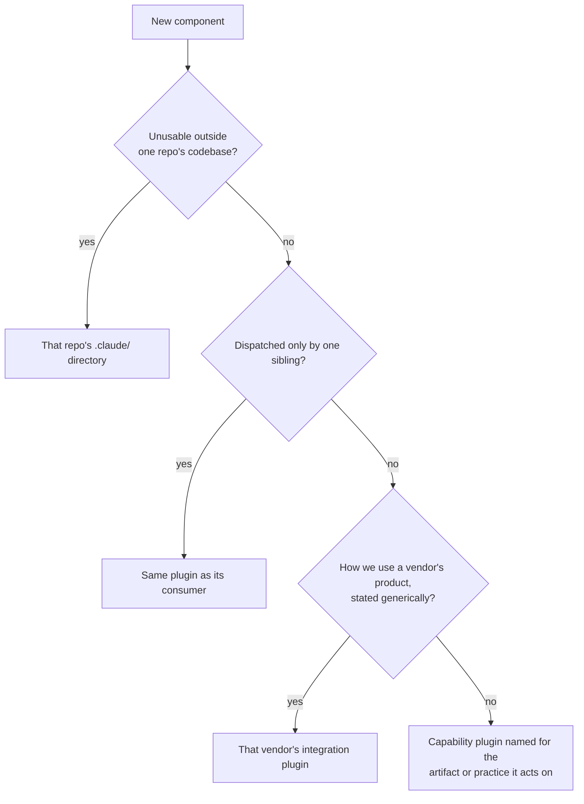

---
sidebar_custom_props:
  access: bitwarden
---

# Component placement

Every AI component, whether a skill, agent, command, hook, or prompt, lives in exactly one place. A
single home keeps knowledge single-sourced, so copies cannot drift apart, and role bundles still
give each person one install. The reasoning is recorded in
[ADR 0038](../../architecture/adr/0038-adopt-ai-component-taxonomy.md).

## Plugin layers

The [bitwarden/ai-plugins](https://github.com/bitwarden/ai-plugins) marketplace has two kinds of
plugin:

- **Capability plugins** carry components. Name one for what its components act on: an artifact, a
  practice, or an integration surface. The name should point to something a reviewer can find, such
  as a file, a Jira issue, or a vendor surface, or to a discipline with a Bitwarden standard behind
  it.
- **Role bundles** are what a person installs. Name one for the role. A bundle holds only a name, a
  description, and dependencies on capability plugins, never a component.

Never name a capability plugin for a job title, a seniority level, or a lifecycle phase. A name that
only says when work happens is a phase.

> _Perspective: A contributor learning the plugin model. How a component reaches the person who
> installs it. Omits dependencies between capability plugins._

## Place a component

Walk these checks in order and stop at the first match:

1. If the component is unusable outside one repository's codebase, keep it in that repository's
   `.claude/` directory.
2. If only one sibling component dispatches it, keep it in the same plugin as that consumer.
3. If it describes how we use a vendor's product, stated generically, put it in that vendor's
   integration plugin.
4. Otherwise, put it in the capability plugin named for the artifact or practice it acts on.

> _Perspective: A contributor placing a new component. The four checks above, walked in order. Omits
> the plugin description check that follows._

Then read the target plugin's description, which enumerates what the plugin provides. If your
component does not fit that list, either update the description deliberately in the same pull
request or place the component elsewhere.

A component that serves several roles still lives once. Add its capability plugin as a dependency of
each role bundle that needs it instead of copying the component.

## Agents

An agent is a component like any other. Name it for the work it does and place it in the capability
plugin that work belongs to.

- Keep an agent that other components dispatch, because its tools, model, and preloaded skills are
  what a skill cannot carry. Limit its prose to what those dispatchers need.
- Do not add a persona agent that only restates skills. Put anything it would say into the skill
  that owns that topic.

## Vendor integrations

A component that drives a workflow through a vendor's product composes that vendor's integration
plugin and hands it content. Keep the conventions for using the product in the integration plugin,
so specialized components carry none of them.

## Dependencies

A plugin may depend on another plugin at either layer.

1. Name the call before declaring a dependency: this skill in one plugin calls that skill in the
   other. Remove any dependency you cannot name that way.
2. Plan for a missing dependency. The platform has no optional dependencies, so a plugin whose
   dependency is missing does not load at all. If a component should work without a plugin it calls,
   say so in the component and keep it working when that plugin is absent.
