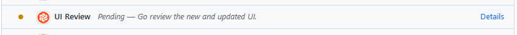

# Tailwind

We are currently in the middle of migrating our web based clients over to
[Tailwind](https://tailwindcss.com/). Currently on the [web vault](../../docs/clients/web-vault/index.mdx)
project is affected but the long term plan is to migrate desktop and browser as well.

Before starting working with Tailwind we recommend that you get familiar with
[Utility-First Fundamentals](https://tailwindcss.com/docs/utility-first). The blog article
[_CSS Utility Classes and "Separation of Concerns"_](https://adamwathan.me/css-utility-classes-and-separation-of-concerns/)
is also a good read to better understand the motivation and goals behind Utility first CSS
frameworks.

We also recommend using the search functionality of the
[tailwind documentation](https://tailwindcss.com/) to lookup classes and examples.

## Tailwind at Bitwarden

We have defined our own
[tailwind config](https://github.com/bitwarden/clients/blob/master/libs/components/tailwind.config.base.js),
which heavily restricts the color usage as a way to support multiple themes. To achieve this we use
[CSS variables](https://developer.mozilla.org/en-US/docs/Web/CSS/Using_CSS_custom_properties) in
combination with the tailwind config. This allows us to support more than the built in dark/light
support in Tailwind.

To this effort we heavily discourage the use of
[arbitrary values](https://tailwindcss.com/docs/adding-custom-styles#using-arbitrary-values) with
the only exception being to support existing Bootstrap styles. In which case it should be documented
and added as a tech debt to be tackled as part of the migration away from Bootstrap.

:::note

All Tailwind classes need to be prefixed by `tw-` as defined in the tailwind config.

Example usage: `
 ... 
`

:::

### Components

Since Tailwind is a Utility-First CSS framework to avoid code duplication which would make the
design difficult to maintain we make heavy use of Angular Components to encapsulate isolated design
blocks. In most cases these blocks are
[presentational components](https://angular-training-guide.rangle.io/state-management/ngrx/component_architecture).

### Component Library

One of the engineering initiatives at Bitwarden is the
[Component Library](https://github.com/bitwarden/clients/tree/master/libs/components) which aims to
encapsulate the most commonly used core components.

#### Storybook

We use [Storybook](https://storybook.js.org/) to develop components in isolation. To launch
storybook run the `npm run storybook` command in the root of `clients` repository.

#### Chromatic

:::note

This section applies to Bitwarden developers only.

:::

The changes to the Component Library has an additional review process where a designer needs to
approve the visual changes. We use a tool called
[Chromatic](https://www.chromatic.com/builds?appId=622b79f994de1f003a54ce6f) to track these changes
and members of the GitHub Bitwarden organization can login to Chromatic using GitHub to review
visual changes.

If you PR has **UI Review** check as pending or denied please reach out to Design to get your
changes approved.

