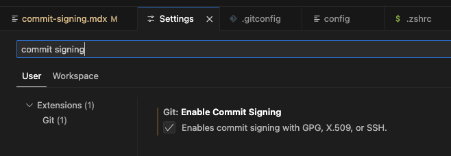

import Tabs from "@theme/Tabs";
import TabItem from "@theme/TabItem";

# Commit Signing

It's possible to configure git with any name and email, enabling bad actors to spoof commits and
impersonate whomever they want. GitHub supports several ways to digitally sign git commits,
verifying that they came from someone with access to a previously configured private key.

For example, on 3 August 2022, Stephen Lacy
[shared on Twitter](https://twitter.com/stephenlacy/status/1554697080718823424) how he uncovered a
massive malware attack on GitHub by noticing unverified commits (i.e. commits that were not
digitally signed).

To protect against commit spoofing, <strong>all Bitwarden contributors are encouraged to digitally
sign their commits</strong>.

## Setting up commit signing

GitHub supports [commit signing][github-verification] with SSH, GPG, and S/MIME.

:::tip

If you're unsure what to use, <strong>we recommend you create a commit signing key using SSH per
latest security best practices </strong> (see the
[PGP problem](https://www.latacora.com/blog/2019/07/16/the-pgp-problem/) for more details).

:::

### Standard SSH Key Configuration

1. Ensure you have globally configured your git email address:

   ```bash
   git config --global user.email "you@example.com"
   ```

2. Generate an SSH key for commit signing:

   ```bash
   # path to save your private signing key
   KEY_FILE=~/.ssh/bw-signing
   ssh-keygen -f $KEY_FILE -C "$(git config --global --get user.email)" -t ed25519
   ```

   :::tip

   Remember to protect the key with a [strong passphrase or password][password-generation].
   Alternatively set up your [yubikey as your signing key](#hardware-backed-ssh-key-configuration).

   :::

3. Configure git to sign using SSH.

   ```bash
   git config --global gpg.format ssh
   git config --global user.signingkey "${KEY_FILE}.pub"
   ```

4. Follow the
   [SSH GitHub documentation](https://docs.github.com/en/authentication/managing-commit-signature-verification/about-commit-signature-verification#ssh-commit-signature-verification)
   to configure commit signing

5. Configure your preferred git tool below ([CLI](#commit-signing-with-git-cli),
   [VS Code](#commit-signing-with-visual-studio-code),
   [SourceTree](#commit-signing-with-sourcetree))

6. Push a test commit to GitHub and ensure that the "Verified" badge appears next to the commit
   description:

   

7. (Optional) See
   [Avoiding SSH Key Passphrase Prompts Per Commit](#avoiding-ssh-key-passphrase-prompts-per-commit)
   below to avoid being prompted for your SSH key passphrase every time you sign a commit.

### Avoiding SSH Key Passphrase Prompts Per Commit

#### macOS

On macOS, you can use the built-in Keychain to store your SSH key passphrase so you don't have to
enter it every time you sign a commit.

1.  Add your SSH key to the ssh-agent and store your passphrase in the Keychain:

    ```bash
    ssh-add --apple-use-keychain ~/.ssh/bw-signing
    ssh-add -l # verify the key was added
    ```

2.  The above command will need to be run each time you restart your computer. If you would like to
    automate this process, then you can leverage
    [LaunchAgents](https://developer.apple.com/library/archive/documentation/MacOSX/Conceptual/BPSystemStartup/Chapters/CreatingLaunchdJobs.html#//apple_ref/doc/uid/10000172i-SW7-BCIEDDBJ)
    to run the command on startup.

        a. Ensure the LaunchAgents directory exists:

        ```bash
        mkdir -p ~/Library/LaunchAgents
        ```

        b. Create a new plist file for the LaunchAgent:

        ```bash
        USER_NAME=$(whoami)

        cat > ~/Library/LaunchAgents/com.ssh-add-bw-signing.plist <<PLIST

        <?xml version="1.0" encoding="UTF-8"?>

        <!DOCTYPE plist PUBLIC "-//Apple//DTD PLIST 1.0//EN" "http://www.apple.com/DTDs/PropertyList-1.0.dtd">

        <plist version="1.0">
          <dict>
            <key>Label</key>
            <string>com.ssh-add-bw-signing</string>
            <key>ProgramArguments</key>
            <array>
              <string>/usr/bin/ssh-add</string>
              <string>--apple-use-keychain</string>
              <string>/Users/${USER_NAME}/.ssh/bw-signing</string>
            </array>
            <key>RunAtLoad</key>
            <true />
          </dict>
        </plist>
        PLIST
        ```


        c. Validate that your plist is valid:

        ```bash
        plutil -lint ~/Library/LaunchAgents/com.ssh-add-bw-signing.plist
        # you should see: "OK"
        ```

        d. Configure launchctl to enable the new LaunchAgent for your next restart:

        ```bash
        launchctl bootstrap gui/$(id -u) ~/Library/LaunchAgents/com.ssh-add-bw-signing.plist
        launchctl enable gui/$(id -u)/com.ssh-add-bw-signing
        ```

        e. You can kickstart the LaunchAgent and confirm it will work by running (only works if you haven't loaded your key yet):

        ```bash
        launchctl kickstart -k gui/$(id -u)/com.ssh-add-bw-signing
        ssh-add -l # verify the key was added
        ```

        f. Restart your computer to verify that the LaunchAgent works as expected. After restarting, run `ssh-add -l` to verify that your key was added to the ssh-agent
        automatically.

### Hardware-backed SSH Key Configuration

For contributors who want maximum security, hardware-backed SSH keys using FIDO2/U2F security keys
(like YubiKeys) provide superior protection by storing private keys on hardware that cannot be
extracted or copied.

#### Benefits of Hardware-backed Keys

- **Physical presence required**: Each signing operation requires touching the hardware key
- **Locked private keys**: Private keys are generated on and never leave the hardware
- **Tamper-resistant**: Hardware provides protection against physical and software attacks
- **Multi-factor authentication**: Combines something you have (the key) with something you know
  (PIN)

#### Setting up sk-ed25519 Keys

:::note macOS Users

On macOS, you'll need to install OpenSSH via Homebrew as the system's built-in OpenSSH lacks proper
FIDO2 support:

```bash
brew install openssh
```

After installation, restart your terminal to ensure the Homebrew version is used. If it's not then
fully qualify the path to the homebrew version of ssh-keygen in the example, like
`/opt/homebrew/bin/ssh-keygen [everything else]`.

:::

1. Generate an sk-ed25519 key for commit signing:

   ```bash
   # Generate hardware-backed signing key
   ssh-keygen -t ed25519-sk -f ~/.ssh/bw-signing-sk -C "$(git config --global --get user.email)"
   ```

   :::note

   You'll need to touch your security key when prompted during key generation and each time you sign
   a commit.

   :::

2. Configure git to use your hardware-backed key:

   ```bash
   git config --global gpg.format ssh
   git config --global user.signingkey ~/.ssh/bw-signing-sk.pub
   git config --global commit.gpgSign true
   git config --global tag.gpgSign true
   ```

3. Add the public key to your GitHub account following the [GitHub
   documentation][github-verification]

#### Hardware Key Requirements

- **FIDO2/U2F compatible security key** (YubiKey 5 series, SoloKeys, etc.)
- **OpenSSH 8.2+** with FIDO2 support (on macOS, install via Homebrew: `brew install openssh`)
- **Physical access** to the security key for each signing operation

#### Fallback Strategy

:::caution

When going the YubiKey route it is important to make sure you have the infrastructure set up to
recover from the loss of a YubiKey. At least one backup plan should be set up. Some ideas:

- Create and configure multiple YubiKeys
- Generate both a hardware-backed key and a traditional SSH key:
  - Use the hardware-backed key for day-to-day development
  - Keep a traditional SSH key as a secure backup for emergency situations

:::

### Commit Signing with git CLI

- After configuring commit signing, you can sign a commit by using the `-S` flag:

  ```bash
  git commit -S
  ```

- To avoid using the `-S` flag every time, you can sign all commits and tags by default:

  ```bash
  git config --global commit.gpgSign true
  git config --global tag.gpgSign true
  ```

### Commit Signing with Visual Studio Code

1. Open **Preferences** → **Settings**
2. Search for **“commit signing”**
3. Enable commit signing

   

<details>
  <summary>macOS: GPG Key Passphrase Prompt Issue</summary>

Some macOS users have had issues with VS Code and the gpg-agent not prompting for the GPG Key
Passphrase in order to sign commits when using the VS Code git GUI. This is illustrated by VS Code
displaying an error popup message: `Git: gpg failed to sign the data`.

A [workaround](https://github.com/microsoft/vscode/issues/43809#issuecomment-828773909) for this
issue is to configure your gpg-agent to use
[pinentry](https://www.gnupg.org/related_software/pinentry/index.html) for macOS in order to force a
secure prompt. Run the following in a terminal of your choice:

1. Install pinentry-mac:

   ```bash
   brew install pinentry-mac
   ```

2. Configure gpg-agent to use pinentry-mac:

   ```bash
   echo "pinentry-program $(which pinentry-mac)" >> ~/.gnupg/gpg-agent.conf
   ```

3. Restart gpg-agent:

   ```bash
   killall gpg-agent
   ```

**Note**: Note: you might have to restart VS Code for this to take effect, but you should now be
prompted for your GPG Key Passphrase as needed. If this does not solve your issue, please follow the
[GPG Key Troubleshooting](#gpg-key-troubleshooting) guide below.

</details>

### Commit Signing with SourceTree

Refer to
[Setup GPG to sign commits within SourceTree](https://confluence.atlassian.com/sourcetreekb/setup-gpg-to-sign-commits-within-sourcetree-765397791.html).

## GPG Key Troubleshooting

If you see the following error:

```text
error: gpg failed to sign the data
```

Make sure you’ve added the following to your shell config:

```bash
export GPG_TTY=$(tty)
```

- For **zsh**, add it to `~/.zshrc`
- For **bash**, add it to `~/.bashrc`

After updating the file, restart your terminal for the change to take effect.

<details>
  <summary>More help with this error</summary>

See this
[troubleshooting guide](https://gist.github.com/paolocarrasco/18ca8fe6e63490ae1be23e84a7039374).

</details>

[password-generation]: https://bitwarden.com/help/generator/#password-types
[github-verification]:
  https://docs.github.com/en/authentication/managing-commit-signature-verification/about-commit-signature-verification
