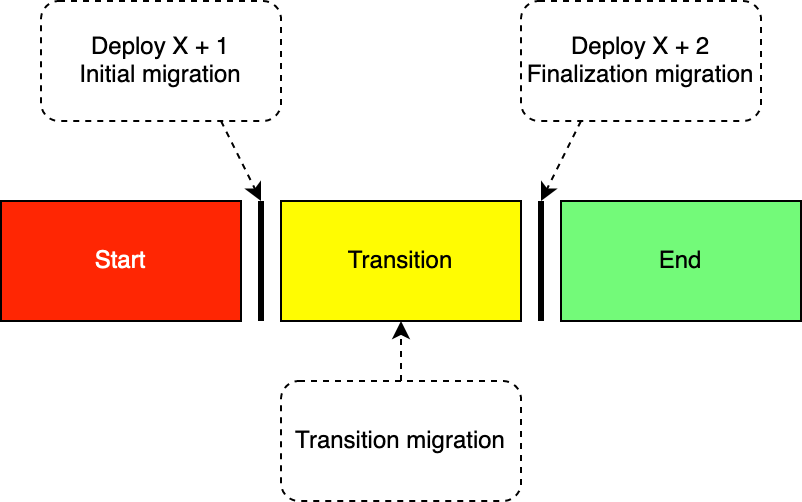
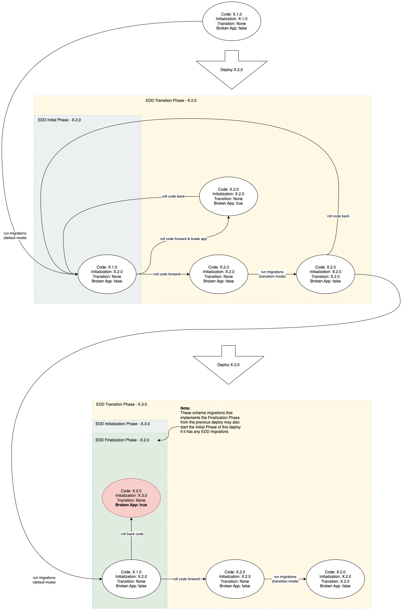

import Tabs from "@theme/Tabs";
import TabItem from "@theme/TabItem";

# Evolutionary database design

At Bitwarden we follow [Evolutionary Database Design (EDD)][edd-wiki]. EDD describes a process where
the database schema is continuously updated while still ensuring compatibility with older releases
by defining a database transition phases.

Bitwarden also needs to support:

- **Zero-downtime deployments**: Which means that multiple versions of the application will be
  running concurrently during the deployment window.
- **Code rollback**: Critical defects in code should be able to be rolled back to the previous
  version.

To fulfill these additional requirements the database schema **must** support the previous release
of the server.

<Bitwarden>

:::note

For background on this decision please see the [Evolutionary Database Design RFD][edd-rfd].

:::

</Bitwarden>

## Design

Database changes can be categorized into two categories: destructive and non-destructive changes
\[[1](./edd#further-reading)\]. A destructive change prevents existing functionality from working as
expected without an accompanying code change. A non-destructive change is the opposite: a database
change that does not require a code change to allow the non-application to continue working as
expected.

### Non-destructive changes

Many database changes can be designed in a backwards compatible manner by using a mix of nullable
fields and default values in the database tables, views, and stored procedures. This ensures that
the stored procedures can be called without the new columns and allow them to run with both the old
and new code.

### Destructive changes

Any change that cannot be done in a non-destructive manner is a destructive change. This can be as
simple as adding a non nullable column where the value needs to be computed from existing fields, or
renaming an existing column. To handle destructive changes it's necessary to break them up into
three phases: _Start_, _Transition_, and _End_ as shown in the diagram below.

<figure>



<figcaption>Refactoring Phases</figcaption>

</figure>

It's worth noting that the _Refactoring Phases_ are usually rolling, and the _End phase_ of one
refactor is the _Transition phase_ of another. The table below details which application releases
needs to be supported during which database phase.

| Database Phase | Release X | Release X+1 | Release X+2 |
| -------------- | --------- | ----------- | ----------- |
| Start          | ✅        | ❌          | ❌          |
| Transition     | ✅        | ✅          | ❌          |
| End            | ❌        | ✅          | ✅          |

### Migrations

The three different migrations described in the diagram above are, _Initial migration_, _Transition
migration_ and _Finalization migration_.

#### Initial migration

The initial migration runs before the code deployment, and its purpose is to add support for
_Release X+1_ without breaking support of _Release X_. The migration should execute quickly and not
contain any costly operations to ensure zero downtime.

#### Transition migration

The transition migration are run sometime during the transition phase, and provides an optional data
migration should it be too slow or put too much load on the database, or otherwise make it
unsuitable for the _Initial migration_.

- Compatible with _Release X_ **and** _Release X+1_ application.
- Only data population migrations may be run at this time, if they are needed
  - Must be run as a background task during the Transition phase.
  - Operation is batched or otherwise optimized to ensure the database stays responsive.
- Schema changes are NOT to be run during this phase.

#### Finalization migration

The finalization migration removes the temporary measurements that were needed to retain backwards
compatibility with _Release X_, and the database schema henceforth only supports _Release X+1_.
These migrations are run as part of the deployment of _Release X+2_.

### Example

Let's look at an example, the rename column refactor is shown in the image below.


In this refactor we rename the column `Fname` in the `Customer` table to `FirstName`. This could
easily be achieved using a regular `Alter Table` statement but that would break compatibility with
existing running code. Instead let's look at how we can incrementally refactor this table.

We will begin by creating a migration which adds the column `FirstName` to the `Customer` Table. At
the same time we will also update the Stored Procedures to sync the content between `FName` and
`FirstName` which ensures both the old and new server releases can run at the same time. The sync
code is highlighted in the code snippet below.

Afterwards the new server version will be deployed, once everything checks out the existing data
will be migrated using a _Data Migration_ script. Which essentially copies the `FName` to
`FirstName` columns.

Lastly the _Second Migration_ will be run which removes the old column and updates the Stored
Procedure to remove the synchronization logic.

#### Migrations

:::note

All database migrations should support being run multiple times; even if subsequent runs perform no
actions.

:::

<Tabs>
<TabItem value="first" label="Initial Migration" default>

```sql
-- Add Column
IF COL_LENGTH('[dbo].[Customer]', 'FirstName') IS NULL
BEGIN
    ALTER TABLE
        [dbo].[Customer]
    ADD
        [FirstName] NVARCHAR(MAX) NULL
END
GO

-- Drop existing SPROC
IF OBJECT_ID('[dbo].[Customer_Create]') IS NOT NULL
BEGIN
    DROP PROCEDURE [dbo].[Customer_Create]
END
GO

-- Create the new SPROC
CREATE PROCEDURE [dbo].[Customer_Create]
    @CustomerId UNIQUEIDENTIFIER OUTPUT,
    @FName NVARCHAR(MAX) = NULL, -- Deprecated as of YYYY-MM-DD
    @FirstName NVARCHAR(MAX) = NULL
AS
BEGIN
    SET NOCOUNT ON

    SET @FirstName = COALESCE(@FirstName, @FName);

    INSERT INTO [dbo].[Customer]
    (
        [CustomerId],
        [FName],
        [FirstName]
    )
    VALUES
    (
        @CustomerId,
        @FirstName,
        @FirstName
    )
END
```

</TabItem>
<TabItem value="data" label="Transition Migration">

```sql
UPDATE [dbo].Customer SET
    FirstName=FName
WHERE FirstName IS NULL
```

</TabItem>
<TabItem value="second" label="Finalization Migration">

```sql
-- Remove Column
IF COL_LENGTH('[dbo].[Customer]', 'FName') IS NOT NULL
BEGIN
    ALTER TABLE
        [dbo].[Customer]
    DROP COLUMN
        [FName]
END
GO

-- Drop existing SPROC
IF OBJECT_ID('[dbo].[Customer_Create]') IS NOT NULL
BEGIN
    DROP PROCEDURE [dbo].[Customer_Create]
END
GO

-- Create the new SPROC
CREATE PROCEDURE [dbo].[Customer_Create]
    @CustomerId UNIQUEIDENTIFIER OUTPUT,
    @FirstName NVARCHAR(MAX) = NULL
AS
BEGIN
    SET NOCOUNT ON

    INSERT INTO [dbo].[Customer]
    (
        [CustomerId],
        [FirstName]
    )
    VALUES
    (
        @CustomerId,
        @FirstName
    )
END
```

</TabItem>
</Tabs>

## Deployment orchestration

There are some important constraints to the implementation of the process:

- Bitwarden Production environments are required to be on at all times
- Self-host instances must support the same database change process; however, they do not have the
  same always-on application constraint
- Minimization of manual steps in the process

The process to support all of these constraints is a complex one. Below is an image of a state
machine that will hopefully help visualize the process and what it supports. It assumes that all
database changes follow the standards that are laid out in [Migrations](./).

---

 \[Open Image in a new tab for better
viewing\]

---

### Online environments

Schema migrations and data migrations as just migrations. The underlying implementation issue is
orchestrating the runtime constraints on the migration. Eventually, all migrations will end up in
`DbScripts`. However, to orchestrate the running of _Transition_ and associated _Finalization_
migrations, they are kept outside of `DbScripts` until the correct timing.

In environments with always-on applications, _Transition_ scripts must be run after the new code has
been rolled out. To execute a full deploy, all new migrations in `DbScripts` are run, the new code
is rolled out, and then all _Transition_ migrations in the `DbScripts_transition` directory are run
as soon as all of the new code services are online. In the case of a critical failure after the new
code is rolled out, a Rollback would be conducted (see Rollbacks below). _Finalization_ migrations
will not be run until the start of the next deploy when they are moved into `DbScripts`.

After this deploy, to prep for the next release, all migrations in `DbScripts_transition` are moved
to `DbScripts` and then all migrations in `DbScripts_finalization` are moved to `DbScripts`,
conserving their execution order for a clean install. For the current branching strategy, PRs will
be open against `main` when `rc` is cut to prep for this release. This PR automation will also
handle renaming the migration file and updating any reference of `[dbo_finalization]` to `[dbo]`.

The next deploy will pick up the newly added migrations in `DbScripts` and set the previously
repeatable _Transition_ migrations to no longer be repeatable, execute the _Finalization_
migrations, and then execute any new migrations associated with the code changes that are about to
go out.

The state of migrations in the different directories at any one time is is saved and versioned in
the Migrator Utility which supports the phased migration process in both types of environments.

### Offline environments

The process for offline environments is similar to the always-on ones. However, since they do not
have the constraint of always being on, the _Initial_ and _Transition_ migrations will be run one
after the other:

- Stop the Bitwarden stack as done today
- Start the database
- Run all new migrations in `DbScripts` (both _Finalization_ migrations from the last deploy and any
  _Initial_ migrations from the deploy currently going out)
- Run all _Transition_ migrations
- Restart the Bitwarden stack.

## Rollbacks

In the event the server release failed and needs to be rolled back, it should be as simple as just
re-deploying the previous version again. The database will **stay** in the transition phase until a
patch can be released, and the server can be updated. Once a patch is ready to go out, it is
deployed the _Transition_ migrations are rerun to verify that the DB is in the state that it is
required to be in.

Should a feature need to be completely pulled, a new migration needs to be written to undo the
database changes and the future migration will also need to be updated to work with the database
changes. This is generally not recommended since pending migrations (for other releases) will need
to be revisited.

## Testing

Prior to merging a PR please ensure that the database changes run well on the currently released
version. We currently do not have an automated test suite for this and it’s up to the developers to
ensure their database changes run correctly against the currently released version.

## EF-Only Databases with Code Migrations

For EF only databases that use code as migrations (self-host), migrations will run before new code is deployed and therefore before the model that EF works off of has changed, since that is in the code.

Columns that are referenced in queries in the database have to be deleted over 2 releases. Here's the process:

1. Before the first release, delete the property in the C# class.

2. Keep that column in as a shadow property. Shadow properties are properties that are defined only in the EF model but are not defined in the C# classes. This can be particularly useful when you're transitioning columns in the database schema without immediately reflecting those changes in the code.

3. Test creating EF migrations. They should be empty and then can be deleted.

4. Do a release.

5. That column should not be a part of any queries anymore.

6. Delete the shadow property configuration.

7. Create migrations that will drop that column.

## Further reading

1. [Evolutionary Database Design](https://martinfowler.com/articles/evodb.html) (Particularly
   [All database changes are database refactorings](https://martinfowler.com/articles/evodb.html#AllDatabaseChangesAreMigrations))
2. [The Agile Data (AD) Method](http://agiledata.org/) (Particularly
   [Catalog of Database Refactorings](http://agiledata.org/essays/databaseRefactoringCatalog.html))
3. [Refactoring Databases: Evolutionary Database](https://databaserefactoring.com/)
4. Refactoring Databases: Evolutionary Database Design (Addison-Wesley Signature Series (Fowler))
   ISBN-10: 0321774515

[edd-wiki]: https://en.wikipedia.org/wiki/Evolutionary_database_design
[edd-rfd]:
  https://bitwarden.atlassian.net/wiki/spaces/PIQ/pages/177701412/Adopt+Evolutionary+database+design
