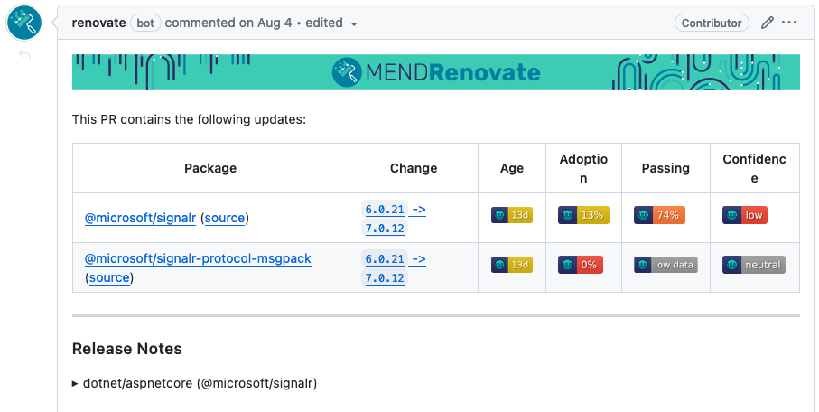
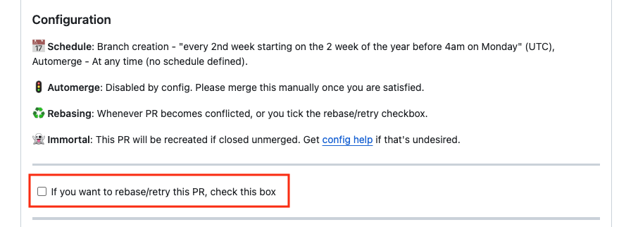

---
sidebar_custom_props:
  access: bitwarden
---

# Dependency Management

Bitwarden uses [Renovate](https://www.mend.io/renovate/) for automating dependency updates. Renovate
will automatically create pull requests for dependencies on a weekly cadence. Security updates will
generate pull requests immediately.

## Ownership

Bitwarden's repositories fall under two categories: team-owned and shared.

### Team-owned repositories

Team-owned repositories are "owned" by a single team from a dependency standpoint. The assigned team
is responsible for reviewing, approving, and merging dependency updates. Some reasons a repository
might be team-owned are that it's primarily developed by that team, or to balance out the number of
dependencies teams have to manage.

Some examples of team-owned repositories are [`directory-connector`][dc], which is owned by the
_Admin Console_ team, and [`key-connector`][kc], which is owned by the Auth team.

### Shared repositories

Shared repositories don't have any direct owner. Instead each dependency is allocated to a team. The
team assigned to a dependency is responsible for reviewing, approving, and merging that dependency.
For major upgrades the team is responsible for coordinating the upgrade with the other teams.

Examples of shared repositories are [`server`][server] and [`clients`][clients].

## Example PR

<figure>



<figcaption>Example Renovate PR</figcaption>

</figure>

Renovate PRs contain several areas of interest. The above example PR contains two grouped
dependencies. The PR proposes to upgrade the dependencies from `6.0.21` to `7.0.12`. The age of the
version is **13 days**, and **13%** of repositories have adopted this version. Renovate has seen a
**74%** test success rate across Renovate-managed repositories and has a low confidence in the
change. For more details read
[Renovate documentation about Merge Confidence](https://docs.renovatebot.com/merge-confidence/).

## Workflow

Renovate is currently scheduled to automatically create pull requests every 2 weeks. The goal of our
dependency management process is for the teams to review and merge the opened pull requests in the
same 2-week cadence. To avoid a large backlog of PRs and out-of-date packages accumulating.

:::info Major upgrades

Major upgrades are an exception to this time frame, as these can take longer to coordinate. The team
should make an effort to coordinate scheduled major updates and resolve deprecations in advance.

:::

A Renovate PR may contain a single dependency or a group of related dependencies. At Bitwarden, we
typically group dependencies we know are related and should be upgraded at the same time. We try to
keep groups as small as possible to minimize the impact and increase confidence in approving and
merging.

### Jira ticket

A Jira ticket will automatically be created for each Renovate PR that is opened. It will be assigned
to the appropriate team based on the dependency ownership.

The Jira ticket should be used to track the work through sprint planning, prioritization, review,
and testing.

### Review

A typical dependency workflow involves the following steps:

1. Move the Jira ticket to In Progress.
2. Read the proposed changes.
3. Review the release notes of each dependency, for each released version between the current and
   the proposed upgrade. Identify if there are any deprecations or breaking changes affecting our
   code.
   1. For **breaking changes**, either resolve them yourself, or for major changes, coordinate with
      the other teams.
   2. For **deprecations**, create high priority Jira tickets on the affected teams' backlogs with a
      due date at least one sprint before the next scheduled major release of the dependency.
4. Verify CI status.
5. If test coverage is lacking, check out locally and manually confirm a few key areas.
6. Review the proposed code changes and approve the PR.
7. Write a Jira ticket containing testing notes for QA.
   - Testing notes should include:
     - What areas of the codebase are affected by the dependency to help isolate future problems.
     - Recommendation for manual QA testing **only** if the developer identifies this as a high-risk
       update.
8. Merge the PR.
9. Assign the Jira ticket to QA.

#### Changing a generated PR

When reviewing the PR, you may rarely have to make changes to the branch yourself.

However, caution should be taken when doing so. If a non-Renovate user pushes changes to the
Renovate-generated PR, Renovate assumes that it is no longer responsible for maintaining the PR.
**This means that further updates to the package(s) included in the PR will be blocked until the
modified PR has been merged.**

What this means is that if you do need to make changes during review, you should maintain ownership
of the PR through the rest of the workflow and not leave the PR open for an extended period.

If you do want Renovate to take over managing the dependencies in the PR again, you can request that
by checking the



:::tip Type Definitions

Many of our client dependency packages have corresponding type definition dependencies (e.g.
`@types/jest` for our Jest dependencies). These packages do not contain any business logic.

In order to streamline the process and avoid unnecessary QA time, it is sufficient to handle these
by ensuring that all CI jobs pass successfully, merging the PR, and marking the ticket as Done.

:::

### QA testing

By default, dependency updates do **not** undergo individual testing by QA. However, we do want our
QA teams to be aware of the changes so that they can react appropriately if problems occur during
regression testing. For this reason, we assign each dependency ticket to our QA team for review,
along with a recommendation for manual testing when necessary.

If the QA engineer agrees that manual testing is not required, they will mark the ticket as `Done`.

If the QA engineer or the developer recommends manual testing, QA will perform the testing with the
scope defined in the testing notes, marking the ticket `Done` only when testing is successful.

### Reverting

In the event QA finds a regression, the developer is responsible for assessing the impact and either
immediately revert the update or resolve the regression in a new PR.

### Closing irrelevant PRs

Sometimes Renovate will create PRs for dependencies that we are currently unable to upgrade for
various reasons. For example, `contributing-docs` depends on `docusaurus`, which supports specific
versions of `react`. We cannot upgrade `react` until `docusaurus` supports it.

In those cases the team can comment on the PR with a reason for not yet upgrading and either close
or defer it until a later date. If a team closes a PR it is expected that its members monitor the
dependency and revisiting the upgrade in the future.

## Renovate configuration

Renovate is configured by a `.github/renovate.json` file in each repository. We follow an internal
template for consistency. The template is available at the
[template repository](https://github.com/bitwarden/template/blob/main/.github/renovate.json).

Renovate uses a concept called
[`PackageRules`](https://docs.renovatebot.com/configuration-options/#packagerules) that allows us to
specify ownership of dependencies and ensure the appropriate team is added as reviewers. Below is an
example assigning `@angular/core` to the Platform team.

```json
{
  "matchPackageNames": ["@angular/core"],
  "description": "Platform owned dependencies",
  "commitMessagePrefix": "[deps] Platform:",
  "reviewers": ["team:team-platform-dev"]
}
```

For repositories maintained by a single team there is no need to use `packageRules` to assign
ownership. Instead ensure appropriate code owners are set up.

[dc]: https://github.com/bitwarden/directory-connector
[kc]: https://github.com/bitwarden/key-connector/
[server]: https://github.com/bitwarden/server/
[clients]: https://github.com/bitwarden/clients/
