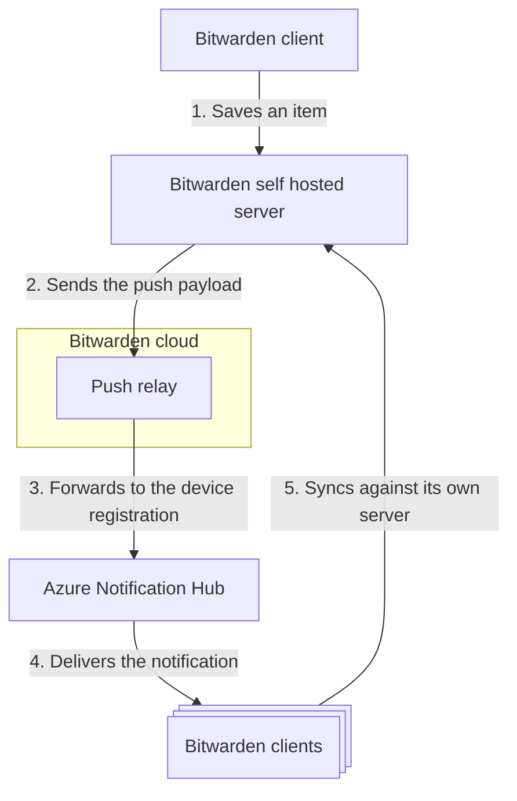

# Diagram standard

**Audience:** Bitwarden engineers, contributors, and AI agents authoring or reading diagrams
anywhere Bitwarden documents its systems.

## Notation

- The keywords MUST, MUST NOT, SHOULD, SHOULD NOT, and MAY are to be interpreted as described in
  [RFC 2119](https://www.rfc-editor.org/rfc/rfc2119).

## The standard

1. **Diagrams are Mermaid source text, nothing else.** As Mermaid code blocks, or, if in Confluence,
   via Macro Pack's Mermaid diagram in text-input mode.
2. **Any Mermaid diagram type that fits.**
3. **A diagram lives in the doc it illustrates,** not a separate file.
4. **Every diagram carries a perspective caption:** audience, intent, and scope.
5. **A diagram answers one question at one altitude.** Anything larger requires multiple diagrams.
6. **C4 is shared vocabulary only.** No C4 tooling is adopted.
7. **A diagram is owned by whoever owns the doc it lives in.**
8. **A diagram updates with the change it depicts.** AI instruction files carry the obligation of
   establishing a standing safeguard.

## Mermaid as text (rules 1 and 2)

Every doc host we use (except rustdoc) can render Mermaid and images cost AI readers tokens without
adding information. Use whatever Mermaid type communicates most clearly.

Diagrams on Confluence MUST use **Macro Pack's Mermaid diagram in text-input mode**, which stores
the source inline in the page storage format. (Test for any future replacement app:
`GET /wiki/api/v2/pages/{id}?body-format=storage` must return the raw Mermaid text.)

:::note[Note for AI agents]

The rendered/Markdown export of a Confluence page hides the body of Macro Pack's Mermaid diagram.
Fetch the **storage format** (`GET /wiki/api/v2/pages/{id}?body-format=storage`) and read the macro
body. Text-input mode carries the source inline.

:::

## Context (rules 3, 4, and 5)

A diagram communicates only in context. Rules 3, 4, and 5 establish that context: the doc supplies
the narrative, the caption states the perspective, and the one-question scope keeps the perspective
attainable.

A diagram lives inline in the doc it illustrates because the surrounding prose explains what the
reader is looking at and why it matters. A doc that is nothing but disparate diagrams illustrates
nothing, so a catch-all diagram page does not satisfy rule 3.

Every diagram is also a deliberate simplification: it serves an audience, answers a question, and
omits detail to stay readable. Make that simplification obvious rather than opaque with a
**perspective caption** that sits beside the diagram. Perspectives state:

1. **Audience:** who it is for.
2. **Intent:** the question it answers.
3. **Scope:** the altitude or boundary, naming only the omissions a reader would otherwise assume
   are covered. Never an exhaustive list of what is not shown.

The perspective attaches as an italic blockquote immediately below the diagram:

> _Perspective: Executive overview of Notification system, showing how a self-hosted instance sends
> a push notification. System context level. Omits the services obfuscated by Azure Notification Hub
> and push notifications handled by SignalR within the self host context._

A perspective is only statable when the diagram answers one question at one altitude, since a
diagram that answers several has no single audience, intent, or scope to name. Anything larger
splits into multiple diagrams. A single system, container, or component MAY warrant several diagrams
with different perspectives.

## C4 as shared vocabulary (rule 6)

For architecture diagrams, describe scope and altitude with the [C4 model](https://c4model.com/)'s
vocabulary. The example above is at context level.

| Level              | Question it answers                                                                                           | _Typical_ home                                          |
| ------------------ | ------------------------------------------------------------------------------------------------------------- | ------------------------------------------------------- |
| **System context** | How does a system fit among the users, Bitwarden-owned systems, and external systems around it?               | contributing.bitwarden.com › Architecture               |
| **Container**      | What deployable/runnable pieces make up one system (server, web vault, extension, SDK), and how do they talk? | contributing.bitwarden.com › Architecture               |
| **Component**      | What are the major parts inside one container?                                                                | The owning scope's `docs/` or README                    |
| **Code**           | Classes/functions                                                                                             | **Do not diagram.** The code and API reference cover it |

C4 is adopted as a **mental model only**. We are explicitly **NOT** adopting any C4 tooling/DSL.

## Ownership and currency (rules 7 and 8)

- The owner is CODEOWNERS for in-repo docs and the page's owning team on Confluence.
- Updates land in the same PR or page edit as the change the diagram depicts. A diagram known to be
  wrong is deleted or updated rather than left to mislead.
- Every repo's root `CLAUDE.md` MUST carry the base documentation obligations, which cover diagrams:
  when you change code that a diagram describes, update the diagram in the same change. The
  doc-currency plugin in [bitwarden/ai-plugins](https://github.com/bitwarden/ai-plugins) distributes
  the obligation and enforces it across every documented scope above a change. The plugin's own
  documentation owns the mechanism.
- Agent-authored diagrams follow the same rules. Generated diagrams MUST carry a perspective caption
  and MUST be verified against the code they depict before merge.

## Migration

Legacy diagrams convert when their docs are next touched: images and non-Mermaid sources in repos
become Mermaid code blocks, and Confluence attachments and images become Macro Pack's Mermaid
diagram in text-input mode.
