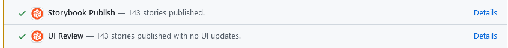

# UI Review - Chromatic

We use a tool called [Chromatic][chromatic] to run automated snapshot tests for all Storybook
stories. This allows us to quickly catch design regressions in an automated fashion. As part of this
we use Chromatic to also review and approve the visual changes. Members of the Bitwarden GitHub
organization can login to Chromatic using their GitHub account.

## Checks

Chromatic splits the review process into two parts, _UI Tests_ and _UI Review_. These appear as two
different checks on the PR and need to be handled differently. The expectations for handling each
one are broken down in detail below.

### UI Tests

> UI tests capture a visual snapshot of every story in a cloud browser environment. Whenever you
> push code, Chromatic generates a new set of snapshots and compares them against baselines. If
> there are visual changes, you verify if they’re intentional.
>
> <cite>https://www.chromatic.com/docs/test</cite>

### UI Review

> UI tests protect you from accidental regressions. But, before you ship, you’ll want to invite
> developers, designers, and PMs to review the UI to make sure it’s correct.
>
> UI Review creates a changeset of the exact visual changes introduced by a PR. You assign reviewers
> who can comment and request tweaks on changes that aren’t quite right. Think of it like a code
> review, but for your UI.
>
> <cite>https://www.chromatic.com/docs/review </cite>

## Reviewing

Chromatic will mark a pull request as pending if there are visual changes. Each pull request author
is responsible for reviewing the _UI Tests_ results in Chromatic and approve that the changes are
intentional.

The tests can easily be accessed by clicking on the **UI Tests** check in the pull request.

The action required for _UI Review_ depends on the failing stories:

- Component Library should be reviewed by the design department, which is done by requesting a
  review of `bitwarden/dept-design` in GitHub.
- Other changes should be reviewed by the reviewing developer(s).

The review can be accessed by clicking on the **UI Review** check.

It's also possible to browse the Storybook for the pull request by clicking on the **Storybook
Publish** check.

[chromatic]: https://www.chromatic.com/
