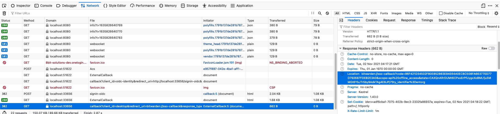

---
sidebar_custom_props:
  access: bitwarden
---

# Sign Sign-On (SSO)

## Setup and configuration

You can set up SSO for development using:

- [a local IdP](./local.md) (recommended)
- [Okta](./okta.mdx)

## Desktop client

:::note

This workaround may not be required - SSO may just work, even on a development build. Try it first!

:::

The desktop client opens a browser to complete the SSO authentication flow. After you have
authenticated with the IdP, your browser will redirect to a `bitwarden://` URI. This URI would
usually open the desktop client, however if your desktop client is not properly installed (e.g.
because you're running from source), this may not work. It will probably just open an empty Electron
window (or maybe the official release of the client if you have it installed).

You can work around this as follows:

1.  Navigate through the SSO flow until the browser window opens
2.  Open the developer tools and click on the "Network" tab
3.  Complete the sign on with the IdP
4.  When the Bitwarden client fails to launch, go back to the browser and click on the last network
    request. The request should have been made to `localhost` and start with
    `callback?client_id=desktop`...
5.  Copy the `location` URI from the Response Headers. It should start with
    `bitwarden://sso-callback?code=`. Here is an example:

1.  Go back to your desktop client and open the developer tools.
2.  Paste the following command into the console and press enter:
    `window.location.href = '<paste the URI here>'`
3.  Your desktop client should now complete the SSO login
