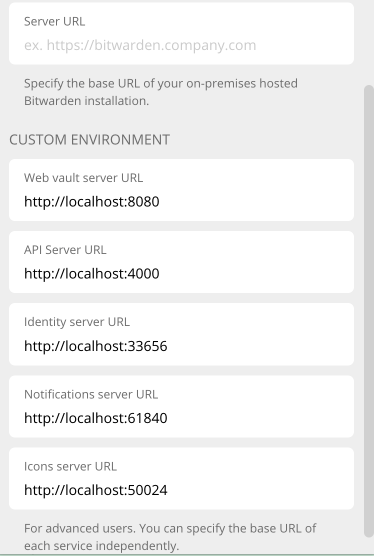
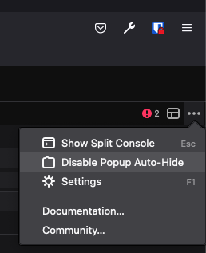

# Browser

## Requirements

Before you start, you must complete the [Clients repository setup instructions](../index.md).

## Build Instructions

1.  Build and run the extension:

    ```bash
    cd apps/browser
    npm run build:watch
    ```

    :::note

    The build commands use
    [Manifest v3](https://developer.chrome.com/docs/extensions/develop/migrate/what-is-mv3) by
    default. If you are building for a non-Chrome browser like Firefox or Safari, you should use the
    command `npm run build:watch:<browser client name>` instead.

    :::

2.  Load the unpacked browser extension in your browser using the instructions in the next section.

## Environment Setup

By default, the browser extension will run pointing to the production server endpoints. To override
this for local development and testing, there are several options.

### Using `managedEnvironment`

The browser extension has the concept of a "managed environment", which is JSON configuration stored
in
[`development.json`](https://github.com/bitwarden/clients/blob/main/apps/browser/config/development.json),
within the `devFlags` object.

The `managedEnvironment` setting allows the contributor to override any or all of the URLs for the
server. The `managedEnvironment` is read in the
[`BrowserEnvironmentService`](https://github.com/bitwarden/clients/blob/main/apps/browser/src/services/browser-environment.service.ts)
and overrides the default (production) settings for any supplied URLs.

There are two ways to use `managedEnvironment`, depending upon whether you will also be running the
web vault at the same time.

#### `managedEnvironment` with web vault running

If you are also running the web vault, you only need to set the `base` URL in the
`managedEnvironment`:

```json
{
   "devFlags":{
      "managedEnvironment":{
         "base":"https://localhost:8080"
      }
      ...
   }
   ...
}
```

This is because the web vault includes the `webpack-dev-server` package in its
[`webpack.config.js`](https://github.com/bitwarden/clients/blob/main/apps/web/webpack.config.js).
When it is running, it proxies each of the endpoints based on the settings configured in its _own_
[`development.json`](https://github.com/bitwarden/clients/blob/main/apps/web/config/development.json)
configuration file:

```json
  "dev": {
    "proxyApi": "http://localhost:4000",
    "proxyIdentity": "http://localhost:33656",
    "proxyEvents": "http://localhost:46273",
    "proxyNotifications": "http://localhost:61840"
  },
```

This means that when the web vault is running, the browser `managedEnvironment` does **not** need to
override each of the URLs individually. The browser will format each URL as `{base}/{endpoint}`,
such as http://localhost:8080/api, but the webpack DevServer will proxy that URL to the correct
port, like http://localhost:4000.

#### `managedEnvironment` without web vault running

If you are testing the browser extension _without_ the web vault running, you will not be able to
take advantage of the webpack DevServer to proxy the URLs. This means that your `managedEnvironment`
setting must explicitly override all of the URLs with which you are going to be communicating
locally.

```json
{
    "devFlags": {
        "managedEnvironment": {
            "webVault": "http://localhost:8080",
            "api": "http://localhost:4000",
            "identity": "http://localhost:33656",
            "notifications": "http://localhost:61840",
            "icons": "http://localhost:50024"
        }
        ...
    }
    ...
}
```

### Manually setting the Custom Environment URLs

You may want to adjust the server URLs to point to your local server once you have loaded the
extension instead of overriding them in `managedEnvironment`. You can change this through the
browser settings. You can see instructions on how to configure the URLs
[here](https://bitwarden.com/help/change-client-environment/).

Once configured, your local Custom Environment should look like this:



## Testing and Debugging

### Chrome and Chromium-based browsers

To load the browser extension build:

1. Build the extension for Chrome:

   ```bash
   npm run build:watch
   ```

2. Navigate to `chrome://extensions` in your address bar. This will open the extensions page
3. Enable “developer mode” (toggle switch)
4. Click the “Load unpacked” button
5. Open the `build` folder of your local repository and confirm your choice

You will now have your local build of the browser extension installed.

You can debug the background page of the browser extension by clicking “background.html” underneath
the Bitwarden heading in `chrome://extensions`. You can debug the popup by right-clicking it while
it is open and clicking “Inspect”.

### Firefox

To load the browser extension build:

1. Build the extension for Firefox:

   ```bash
   npm run build:watch:firefox
   ```

2. Navigate to `about:debugging` in your address bar. This will open the add-on debugging page
3. Click “This Firefox”
4. Click “Load Temporary Add-on”
5. Open the `build` folder of your local repository and open the `manifest.json` file

You will now have your local build of the browser extension installed.

The temporary add-on will only be installed for the current session. If you close and re-open
Firefox, you will have to load the temporary add-on again.

You can debug the background page of the browser extension by clicking the “Inspect” button next to
the Bitwarden heading in the Temporary Extensions page. To debug the popup:

1.  Inspect the background page using the instructions above
2.  Click the “three dots” in the top right-hand corner of the debugger and click “Disable Pop-up
    Auto-hide”

    

3.  Open the extension popup
4.  Click the “iframe” button (next to the “three dots”) and select “/popup/index.html”

### Safari

Safari WebExtensions must be distributed through the Mac App Store, bundled with a regular Mac App
Store application. Due to this the build and debug process is slightly different compared to the
other browsers.

#### Uninstall previous versions

If you’ve built, installed or ran the Desktop client before (including the official release), Safari
will most likely continue to load the official Browser extension and not the version you’ve built
from source.

To avoid this, follow the instructions below to uninstall the Safari extension:

1.  Open Safari
2.  Click “Settings” and then click the “Extensions” tab
3.  Click uninstall next to the Bitwarden extension
4.  Delete the Application with the extension.
5.  Reopen Safari and check Settings to confirm that there is no Bitwarden Browser extension
    installed. In case there still is a Bitwarden Extension please repeat step 3-4.
6.  Quit and completely close Safari

You may need to do this periodically if you are loading the Browser extension from different sources
(for example, switching between a local build and the official release).

#### Developing in Xcode

The easiest way to develop the extension is to build and debug it using Xcode.

1. Build the extension:

   ```bash
   npm run build:watch:safari
   ```

2. Open `src/safari/desktop.xcodeproj` in Xcode
3. Run the "desktop" target.

:::note

Please remember to re-run through Xcode whenever any changes are made to the source files. It will
not automatically reload.

:::

#### Production build

The other alternative is to use the "proper" build process through gulp. This method doesn't require
any manual processing of the output since gulp does it for us. However we have to completely rebuild
the extension for every change, which is slower.

1.  Build the extension for Safari

    ```bash
    npm run dist:safari
    ```

2.  Open Safari and check Settings to confirm that the extension is installed and enabled

:::caution

You may need to
[Configure Safari in macOS to Run Unsigned Extensions](https://developer.apple.com/documentation/safariservices/safari_web_extensions/running_your_safari_web_extension#3744467).

:::

To enable debugging:

1.  Click “Settings” and then click the “Advanced” tab
2.  Enable “Show Develop menu in menu bar”

You can debug the background page of the browser extension by clicking
`Develop -> Web Extension Background Pages` and then selecting Bitwarden. You can debug the popup by
right-clicking it while it is open and clicking "Inspect Element".

This should be enough for most debugging and testing, unless you're working in native code.

<Bitwarden>

:::info

[Deploying](https://bitwarden.atlassian.net/wiki/spaces/EN/pages/166396366/Deploying) has more
information about building, packing and signing the macOS Desktop client, including the Browser
extension. It may be useful for debugging if you’re having difficulty.

:::

</Bitwarden>
