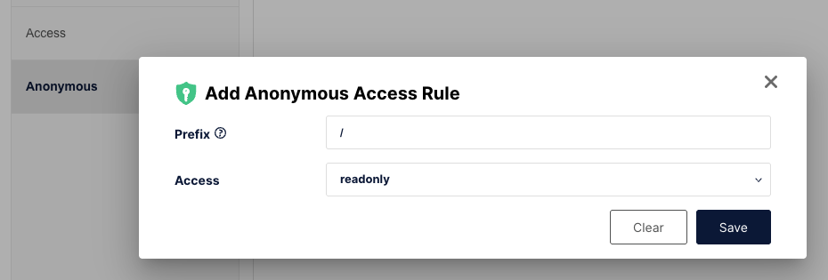

# Update testing

Sometimes it might be necessary to test the update flow of the desktop application. This document
will attempt to describe how to do so in detail.

The desktop applications are published to our GitHub page, which we can’t really do for development
purposes. To provide a fairly similar environment, we run a local S3 simulator which lets us
simulate a S3 provider environment.

While this is not identical to our scenarios it will still allow us to test the UI and updating
process without messing around in a GitHub repo.

## Preparation

1.  Start the minio docker container using `docker compose up` in `scripts/dev`.
2.  Add a read-only bucket called `update`, by going to `http://localhost:9001` and login using
    `minioadmin/minioadmin`, click `Create bucket` fill in the details. Then click `Manage`,
    `Access Rules` and fill in the following details.

    

3.  Modify the `electron-builder.json` with the following `publish` settings.

    ```json
    "publish" : {
        "provider": "s3",
        "endpoint": "http://127.0.0.1:9000",
        "bucket": "update"
    },
    ```

4.  Create `.aws/credentials` inside the Users home directory (Windows: C:\Users\username, Linux: ~/) with the following content

    ```bash
    [default]
    aws_access_key_id=minioadmin
    aws_secret_access_key=minioadmin
    ```

## Update

1.  Generate a local build using `npm run publish:win:dev`
2.  Install the build within `dist/nsis-web/Bitwarden-Installer-1.32.0.exe`
3.  Update the version number in `src/package.json`
4.  Publish the new version using: `npm run publish:win:dev`
5.  The app should now prompt for an update.

Note: This can also be done on Linux, just use `npm run publish:lin` for steps 1 and 4.

Related:
[https://www.electron.build/tutorials/test-update-on-s3-locally](https://www.electron.build/tutorials/test-update-on-s3-locally)
