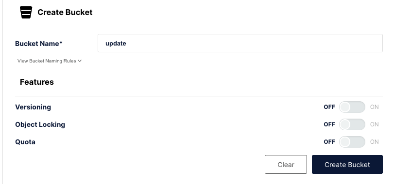
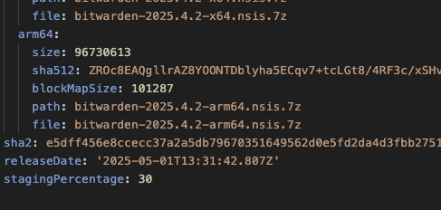

# Update testing

Sometimes it might be necessary to test the update flow of the desktop application. This document
will attempt to describe how to do so in detail.

The desktop applications are published to our GitHub page, which we can’t really do for development
purposes. To provide a fairly similar environment, we run a local S3 simulator which lets us
simulate a S3 provider environment.

While this is not identical to our scenarios it will still allow us to test the UI and updating
process without messing around in a GitHub repo.

## Preparation

1.  Start the minio docker container using `docker compose up` in `scripts/dev`.
2.  Add a read-only bucket called `update`, by going to `http://localhost:9001` and login using
    `minioadmin/minioadmin`, click `Create bucket` fill in the details.

    

3.  Click on the bucket then `Anonymous`, `Add Access Rule` and fill in the following details.

    

4.  Modify the `electron-builder.json` with the following `publish` settings.

    ```json
    "publish" : {
        "provider": "s3",
        "endpoint": "http://127.0.0.1:9000",
        "bucket": "update"
    },
    ```

5.  Create `.aws/credentials` inside the Users home directory (Windows: C:\Users\username, Linux:
    ~/) with the following content

    ```bash
    [default]
    aws_access_key_id=minioadmin
    aws_secret_access_key=minioadmin
    ```

## Update

1.  Generate a local build using `npm run publish:win:dev`
2.  Install the build within `dist/nsis-web/Bitwarden-Installer-1.32.0.exe`
3.  Update the version number in `src/package.json`
4.  Publish the new version using: `npm run publish:win:dev`
5.  The app should now prompt for an update.

Note: This can also be done on Mac and Linux, just use `npm run publish:mac` and
`npm run publish:lin` for steps 1 and 4.

## Staged rollouts

The process for testing staged rollouts is a bit cumbersome, as it requires updating the update
manifests and uploading them manually. The detailed steps on how to do a staged update are as
follows:

- Create and publish an update as mentioned in the previous section.
- Open the MinIO object browser and navigate to the bucket.
- Download the update manifest. This will be the file named
  `latest.yml`/`latest-mac.yml`/`latest-linux.yml`, depending on your platform.
- Open the file in your preferred editor, and add a line at the end in the format
  `stagingPercentage: X`, as shown in the image below.
  - `X` is the percentage of users that will get the update. It must be an integer greater than zero
    and equal or less than 100.
- Upload the file to the bucket again by drag-and-dropping it into the file list.

  

When checking updates using staged rollouts, `electron-updater` will use a random persistent
per-installation GUID and derive a rollout percentage from it. Then it will refuse to apply any
updates where the staging percentage in the downloaded update manifest is less than the
per-installation percentage. This randomness complicates testing, but it's possible to replace the
random GUID by a fixed one to guarantee reproducible tests:

- Navigate to the application's data folder. In Windows this is
  `C:\Users\<user>\AppData\Roaming\Bitwarden`
- Open the file called `.updaterId` in your favorite editor and replace the GUID inside by
  `c8beb766-67f5-4058-b6a1-7031fef1c31a`.
- This GUID has a rollout percentage of 99.5, which means that:
  - Using `stagingPercentage: 100` will guarantee the client is part of the staged rollout.
  - Using any other value will guarantee the client is NOT part of the rollout.

## Troubleshooting

### Issues when running the publishing command

If the publish command returns errors when uploading the artifacts, ensure the credentials were
created successfully as mentioned in step 5 of the preparation section. If the problem persists,
some other application on your system might have reserved port `9000` <Bitwarden>(On MacOS, ZScaler
tends to reserve ports in this range)</Bitwarden>. You can use the following command on UNIX systems
to check if this port is in use as well:

```sh
sudo lsof -nP -iTCP -sTCP:LISTEN | grep 9000
```

If that's the case you should update the port to a different value, for example `9002`:

- Update the `endpoint` URL in `electron-builder.json` to `http://127.0.0.1:9002`
- Update the `ports` section in the `scripts/dev/docker-compose.yml` file and replace the first line
  by ` - "9002:9000"`, then restart the docker container

Related:
[https://www.electron.build/tutorials/test-update-on-s3-locally](https://www.electron.build/tutorials/test-update-on-s3-locally)
