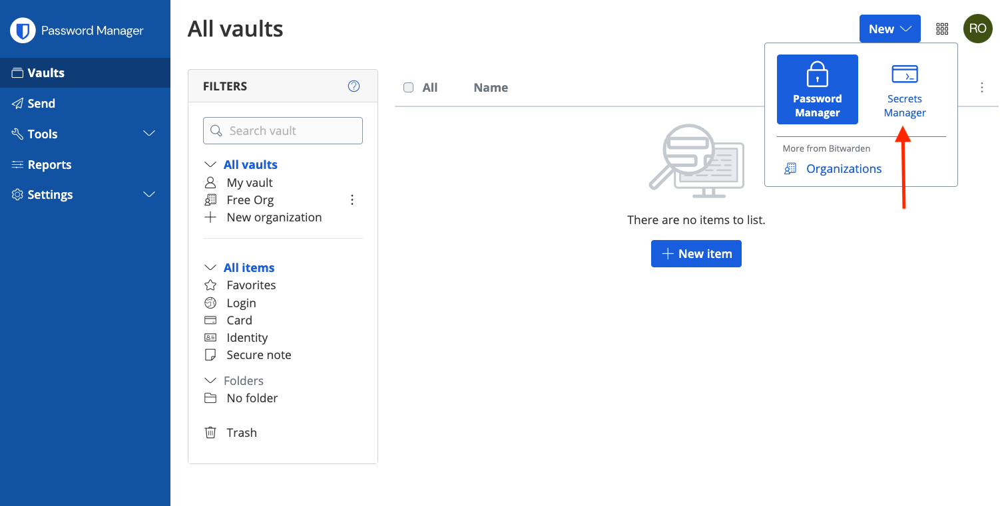
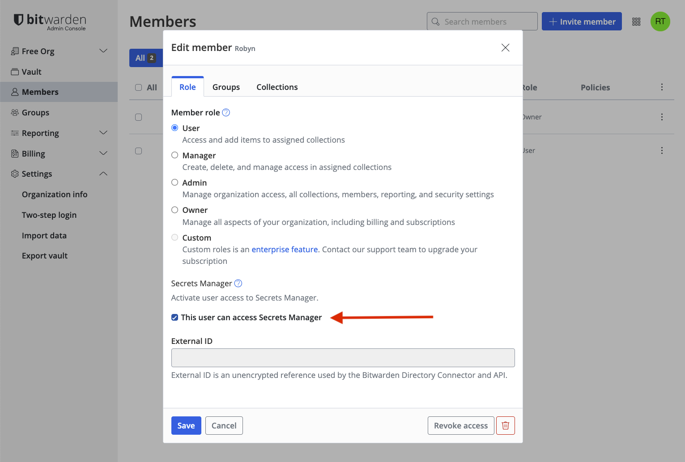

# Secrets Manager

This section contains development information for the Bitwarden Secrets Manager CLI, language
wrappers, and integrations based on the SDK.

## Web client

To start the web client, follow the
[Web Vault setup instructions](../../clients/web-vault/index.mdx) and create an organization with
Secrets Manager enabled. Then use the organization switcher to go to Secrets Manager.

:::info

If you have enabled Secrets Manager for your org and do not see Secrets Manager in the product
switcher, you may need to manually enable it for your user by going to **Admin Console** ->
**Members** -> check _"This user can access Secrets Manager"_ for your user.

::: 
