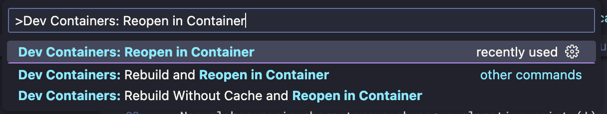
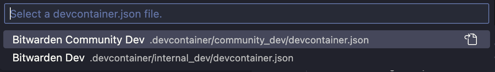

# VS Code Dev Containers

This page will show you how to set up a local Bitwarden server for development purposes utilizing
Visual Studio Code Dev Containers. You can read more about this in the
[Visual Studio Code Dev Containers documentation](https://code.visualstudio.com/docs/devcontainers/containers).

The Bitwarden server is comprised of several services that can run independently. For a basic
development setup, you will need the **Admin**, **Api**, and **Identity** services.

:::info

Before you start: make sure you’ve installed the recommended
[Tools and Libraries](../tools/index.md). Namely, the following:

- Docker Desktop
- [Visual Studio Code](https://code.visualstudio.com/)
- Azure Data Studio

:::

## Clone the repository

1.  Clone the Bitwarden Server project:

    ```bash
    git clone https://github.com/bitwarden/server.git
    ```

2.  Open a terminal and navigate to the root of the cloned repository.

:::caution

When first opening the repository in Visual Studio Code, you will be prompted to reopen the folder
in a Dev Container. If you have not completed the steps in the
[Configure Env File](#configure-env-file) section below, the creation of the Dev Container will
fail.

:::

## Configure Git

1. Configure Git to ignore the Prettier revision:

   ```bash
   git config blame.ignoreRevsFile .git-blame-ignore-revs
   ```

2. _(Optional)_ Set up the pre-commit `dotnet format` hook:

   ```bash
   git config --local core.hooksPath .git-hooks
   ```

   Formatting requires a full build, which may be too slow to do every commit. As an alternative,
   you can run `dotnet format` from the command line when convenient (e.g. before requesting a PR
   review).

## Configure Env File

The Dev Container will automatically load the environment variables from the values in `dev/.env`.
To get started, copy the example file:

1. ```bash
   cd dev
   cp .env.example .env
   ```

2. Open `.env` with your preferred editor.

3. Set the `MSSQL_SA_PASSWORD` variable. This will be the password for your MSSQL database server.

:::caution

Your MSSQL password must comply with the following
[password complexity guidelines](https://docs.microsoft.com/en-us/sql/relational-databases/security/password-policy?view=sql-server-ver15#password-complexity)

- It must be at least eight characters long.
- It must contain characters from three of the following four categories:
- Latin uppercase letters (A through Z)
- Latin lowercase letters (a through z)
- Base 10 digits (0 through 9)
- Non-alphanumeric characters such as: exclamation point (!), dollar sign ($), number sign (#), or
  percent (%).

:::

4.  You can change the other variables or use their default values. Save and quit this file.

### SQL Server

In order to support ARM based development environments such as the M1 Macs, we use the
[Azure SQL Edge](https://hub.docker.com/_/microsoft-azure-sql-edge) docker container instead of a
normal [Microsoft SQL Server](https://hub.docker.com/_/microsoft-mssql-server) container. It behaves
mostly identical to a regular SQL Server instance and runs on port 1433.

You can connect to it using Azure Data Studio using the following credentials:

- Server: localhost
- Username: sa
- Password: (the password you set in `dev/.env`)

### Mailcatcher

The server uses emails for many user interactions. We provide a pre-configured instance of
[MailCatcher](https://mailcatcher.me/), which catches any outbound email and prevents it from being
sent to real email addresses. You can open its web interface at
[http://localhost:1080](http://localhost:1080).

## Configure User Secrets

[User secrets](https://docs.microsoft.com/en-us/aspnet/core/security/app-secrets?view=aspnetcore-6.0)
are a method for managing application settings on a per-developer basis. They override the settings
in `appSettings.json` of each project. Your user secrets file should match the structure of the
`appSettings.json` file for the settings you intend to override.

We provide a helper script which simplifies setting user secrets for all projects in the server
repository.

1.  Get a template `secrets.json`. We need to get an initial version of `secrets.json`, which you
    will modify for your own secrets values.

    <bitwarden>

    - Copy the user secrets file from the shared Development collection into the `dev` folder.
    - If you don't have access to the Development collection, contact our IT Manager to arrange
      access. Make sure you have first set up a Bitwarden account using your company email address.
    - This `secrets.json` is configured to use the dockerized Azurite and MailCatcher instances and
      is recommended for this guide.

    </bitwarden>

2.  Update `secrets.json` with your own values:

    - `sqlServer` > `connectionString`: insert your password where indicated
    - `identityServer` > `certificateThumbprint`: insert your Identity certificate thumbprint from
      the previous step
    - `dataProtection` > `certificateThumbprint`: insert your Data Protection certificate thumbprint
      from the previous step

    <community>

    - `installation` > `id` and `key`:
      [request a hosting installation Id and Key](https://bitwarden.com/host/) and insert them here
    - `licenseDirectory`: set this to an empty directory, this is where uploaded license files will
      be stored.

    </community>

3.  Once you have your `secrets.json` complete, proceed to
    [Starting the Dev Container Environment](#starting-the-dev-container-environment).

## Starting the Dev Container Environment

You are now ready to build and run your development server.

1.  Start the Dev Container by opening the Command Palette (Ctrl/Command+Shift+P) and selecting
    **Dev Containers: Reopen in Container**:

    

2.  Select the appropriate dev container configuration:

    

3.  Wait for the container to build and start. The first time you open the container, it will take a
    few minutes to build.

4.  Once the container has finished building for the first time, you will be greeted with the
    `postCreateCommand` script, which will walk you through generating and applying any additional
    secrets or certificates required for the server to run.

5.  Follow the on-screen prompts to finish setting up the server. Then, proceed to
    [Build and Run the Server](#build-and-run-the-server).

## Build and Run the Server

You are now ready to build and run your development server.

1.  Open a new terminal window in the root of the repository.
2.  Restore the nuget packages required for the Identity service:

    ```bash
    cd src/Identity
    dotnet restore
    ```

3.  Start the Identity service:

    ```bash
    dotnet run
    ```

4.  Test that the Identity service is alive by navigating to
    [http://localhost:33656/.well-known/openid-configuration](http://localhost:33656/.well-known/openid-configuration)
5.  In another terminal window, restore the nuget packages required for the Api service:

    ```bash
    cd src/Api
    dotnet restore
    ```

6.  Start the Api Service:

    ```bash
    dotnet run
    ```

7.  Test that the Api service is alive by navigating to
    [http://localhost:4000/alive](http://localhost:4000/alive)
8.  Connect a client to your local server by configuring the client’s Api and Identity endpoints.
    Refer to
    [https://bitwarden.com/help/article/change-client-environment/](https://bitwarden.com/help/article/change-client-environment/)
    and the instructions for each client in the Contributing Documentation.

:::info

If you cannot connect to the Api or Identity projects, check the terminal output to confirm the
ports they are running on.

:::

:::note

We recommend continuing with the [Web Vault](../clients/web-vault) afterwards, since many
administrative operations can only be performed in it.

:::

## Debugging

You can use the debugger in Visual Studio Code to debug the server by following these steps:

1. Click the "Debug and Run" button in the left sidebar of Visual Studio Code.

2. Select the desired debug configuration from the dropdown menu.

3. Click the "Start Debugging" button to start the debugger.

## Managing and updating the Dev Containers

After you’ve run the deployed the Dev Containers, you can use the
[Docker Dashboard](https://docs.docker.com/desktop/dashboard/) or `docker` CLI to manage your
containers. You should see your containers running under the `bitwarden_common` group.

### Changing the DB Password

Changing `MSSQL_SA_PASSWORD` variable after first running the Dev Containers will require a
re-creation of the storage volume.

:::warning

**The following will delete your development database.**

To do this, stop any running server processes and run the following commands from the
`./.devcontainer/bitwarden_common` directory:

```bash
docker compose down
docker volume rm bitwarden_common-bitwarden_mssql-1
```

:::

After destroying the DB volume, you can rebuild the Dev Containers in Visual Studio Code and the
database using the VS Code Command Palette (Ctrl/Command+Shift+P) and selecting **Dev Containers:
Rebuild Container**.
