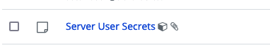

---
sidebar_custom_props:
  access: bitwarden
---

# Secrets.json

The server repository comes with it’s own `dev/secrets.json` file for community contributors.
Internal Bitwarden developers will need a different user secrets file in order to properly emulate
the cloud environment.

The user secrets file that we use for development can be found in the Development collection in the
Bitwarden app. If you don’t have access to this collection, please contact your manager.

This secure note has 2 attachments:

1.  `secrets.json` - the default recommended user secrets for development. This will use the local
    Docker services as outlined in the [Server Setup Guide](../guide.md) (e.g. MailCatcher and
    Azurite).
2.  `additional-keys-for-cloud-services.json` - these are optional keys you can add to your
    `secrets.json` if you want to enable test cloud services instead of the local Docker services.
    It is not a complete secrets file and cannot be used on its own.

## Updating the shared user secrets

If you need to update the shared user secrets, please follow these rules:

- new user secrets should go in one `.json` file only. We want to avoid duplicate keys across both
  files.
- avoid creating new `.json` files as a means of version control. Often the information (such as
  auth keys) can be retrieved from the original source if we need to roll back. If you feel that you
  must create a backup, mark it as "DEPRECATED" with the date. `secrets.json` and
  `additional-keys-for-cloud-services.json` should always contain the most up-to-date secrets.
- announce any updates in the `#team-eng` Slack channel so that everyone knows to update their local
  instance.
