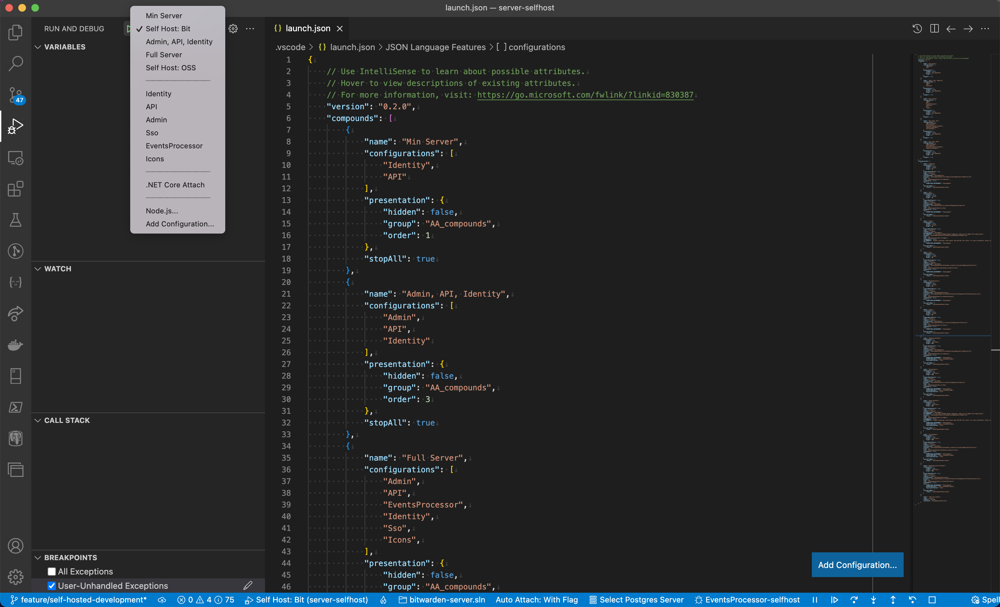

---
sidebar_custom_props:
  access: bitwarden
---

import Tabs from "@theme/Tabs";
import TabItem from "@theme/TabItem";

# Self-Hosted Guide

:::note

This page is only relevant to you if you need to test self-hosted features. It is **not** required
for most development work. If you just need a local server, go to the
[Server Setup Guide](../guide.md) instead.

:::

This page explains how to configure and run a self-hosted development server alongside a cloud
development server. This is useful if:

- you need to test how a self-hosted instance communicates with the cloud
- you need to develop self-hosted features without upsetting your normal development environment

In the most common configuration, both the cloud and self-hosted development servers will be running
with similar configuration:

- Services running on `http://localhost:{port}` (using different port numbers for cloud vs.
  self-hosted)
- Local SQL database (although using a different database for each server)

## Requirements

This guide assumes you have completed and are familiar with the techniques in
[Server Setup Guide](../guide.md). Please make sure you have a working development environment for a
cloud-configured server before worrying about getting a self-hosted instance connected to it.

### Generate Installation Id and Key

Every self-hosted instance is defined by an Installation Id and Key. These will be stored two
places:

- As user secrets in your self-hosted instance, and
- In the `Installations` table of your cloud-configured instance, so that it can authenticate
  requests from your self-hosted server

To get an Id and Key, it’s fine to either

- [request a host installation ID](https://bitwarden.com/host/), or
- generate a Guid (Id) and random alphanumeric string (key)

Record these for use in the next steps.

### Self-Hosted Secrets Configuration

:::tip

If you’re struggling to remember about user secrets, review
[User Secrets](../../../contributing/user-secrets.md).

:::

The `Dev:SelfHostOverride:GlobalSettings` section of the user secrets specifies setting overrides
for local self-hosted development instances. Anything in the override section will apply instead of
the value given in `GlobalSettings`. This allows you to have separate configuration (such as the
database connection string) for your cloud and self-hosted development servers.

:::warning

We configure these settings in the user secrets because we need to be able to define setting values
that true self-hosted instances are specifying in environment variables in their Docker containers.
We are using the secrets file do this instead of setting environment variables on our machine and
letting the build in .NET Core configuration build our settings for us.

Currently, we only override `GlobalSettings`. Any other user secret that needs overriding will
require a code change to do so. Check out `ServiceCollectionExtension.AddGlobalSettingsServices` in
the server repository to see how we’re doing it today
([fragile link to the code](https://github.com/bitwarden/server/blob/main/src/SharedWeb/Utilities/ServiceCollectionExtensions.cs#L448-L463)).

:::

The [internal user secrets](../secrets/index.md) contains a minimum override example. You will need
to update the following values in the `Dev:SelfHostOverride:GlobalSettings` section:

- Installation Id and Key, using the values you just generated
- A SQL Server password for a new SQL database we will be creating below. It can be copied from the
  cloud-configured settings already in your `secrets.json` (i.e. use the same password as your
  cloud-configured server) or a new one can be generated.
- any other blank values

After saving your changes to `secrets.json`, apply your changes by running the following command:

```bash
pwsh setup_secrets.ps1 -clear
```

You have now updated the user secrets for your self-hosted instance.

## Database Configuration

:::tip

Be sure that your Docker container is running before setting up the database.

:::

We will now create a second database for our self-hosted configuration, so that the cloud-configured
instance can have an independent data set for development.

If you followed [Server Setup Guide](../guide.md#create-database) when creating your
cloud-configured database, you just need to run the same PowerShell migration script with an
argument of `-selfhost`:

```bash
pwsh migrate.ps1 -selfhost
```

This will create a new database called `vault_dev_self_host` and/or run unknown migrations against
it.

You must call `migrate.ps1` with the `-selfhost` option in the future to keep your self-host
database up-to-date with any migrations.

### Define Installation Id and Key for Your Cloud Database

You need to manually add the Installation key to your cloud-configured instance, so that it knows
about your self-hosted instance and will allow access when API calls need to be made between the
two. Feel free to do this with any tool you like, Azure Data Studio, sqlcmd, or the below script

```bash
/opt/mssql-tools/bin/sqlcmd -S mssql -d vault_dev -U sa -P <<SA_PASSWORD>> -I -i <<SCRIPT_FILE>>
```

where `<<SA_PASSWORD>>` is your SQL SA password for your **cloud** database and `<<SCRIPT_FILE>>`
points to a file containing:

```sql
INSERT INTO [vault_dev].[dbo].[Installation]
(
    [Id]
    ,[Email]
    ,[Key]
    ,[Enabled]
    ,[CreationDate]
)
VALUES
(
    '<<YOUR_ID>>'
    ,'<<YOUR_DEV_EMAIL>>'
    ,'<<YOUR_KEY>>'
    ,1
    ,GETUTCDATE()
)
```

where `<<YOUR_ID>>` is your installation id, `<<YOUR_DEV_EMAIL>>` is your email address, and
`<<YOUR_KEY>>` is your installation key.

## Running

### Server

When running in a self-hosted configuration, services will by default be at +1 to the port number at
which they run in a cloud-configured instance.

Above, we set up a series of user secret overrides that will allow us to run our self-hosted
instance. We need to be sure we start up our server to use these settings. The server code will use
these settings if the following two conditions are met:

- Environment is Development
- `developSelfHosted` is `true`

We do this differently based on how you will be running the server. In your environment, the
self-hosted launch configurations (e.g. "Api-SelfHost") will set the Environment and
`developSelfHosted` flag for you.

<Tabs groupId="ide">
<TabItem value="vscode" label="Visual Studio Code" default>

We have a number of launch configurations as well as combined configurations to make launching the
services easy. By default, the individual self-host launches are hidden. Navigate to `launch.json`
to un-hide them.



</TabItem>
<TabItem value="visualstudio" label="Visual Studio / Rider">

Run configurations have been provided to start a given service in a self-hosted mode.


</TabItem>
<TabItem value="terminal" label="Terminal">

To run self-hosted from the CLI, you will need to:

1.  Open a new terminal window in the root of the server repository.
2.  Restore the nuget packages required for the Identity service:

    ```bash
    cd src/Identity
    dotnet restore
    ```

3.  Start the Identity service:

    ```bash
    dotnet run --launch-profile Identity-SelfHost
    ```

4.  Test that the Identity service is alive by navigating to
    [http://localhost:33657/.well-known/openid-configuration](http://localhost:33657/.well-known/openid-configuration)
5.  In another terminal window, restore the nuget packages required for the Api service:

    ```bash
    cd src/Api
    dotnet restore
    ```

6.  Start the Api Service:

    ```bash
    dotnet run --launch-profile Api-SelfHost
    ```

7.  Test that the Api service is alive by navigating to
    [http://localhost:4001/alive](http://localhost:4001/alive)

To start any other services, follow the same format, including `--launch-profile` with the
appropriate self-hosted launch configuration.

</TabItem>
</Tabs>

:::info

If you cannot connect to the Api or Identity projects, check the terminal output to confirm the
ports they are running on.

:::

### Web Client

From the `clients-selfhost/apps/web` directory, you can execute

- `npm run build:bit:selfhost:watch`
- `npm run build:oss:selfhost:watch`

to spin up a Bitwarden-licensed or OSS web server. The default port will be `8081`, so you can run
both a cloud-configured and self-hosted-configured web client at once. It is also configured to
point at the default `*-SelfHost` ports for the various server projects.

<details>

<summary>How the configuration sausage is made</summary>

Our web configurations live in `config/`. Each has a sub-object called `dev`. For this, the config
object have had the `dev` object re-defined to `dev: {cloud: {}, selfHosted: {}}`. In our webpack
config file, we are updating proxy and port settings based on these value.

This of the `dev` object as containing both the configuration for cloud and selfHosted development
environments.

</details>

## Licensed Features

If you need to develop against [licensed features](https://bitwarden.com/help/licensing-on-premise/)
on your self-hosted instance, you will need to unlock them with a license file that is registered in
your cloud-configured instance.

To do this, you should first start both your local cloud-configured and self-hosted web clients, as
both environments will be necessary to acquire and apply the license.

You can now choose which type of license you would like to apply. The instructions vary for each,
but the best resource is the Bitwarden Help Center documentation:

- [Individual license](https://bitwarden.com/help/licensing-on-premise/#individual-license)
- [Organization license through the web vault](https://bitwarden.com/help/licensing-on-premise/#organization-license)
- [Organization license through the Provider Portal](https://bitwarden.com/help/getting-started-providers/#enabling-the-self-hosted-instances)
